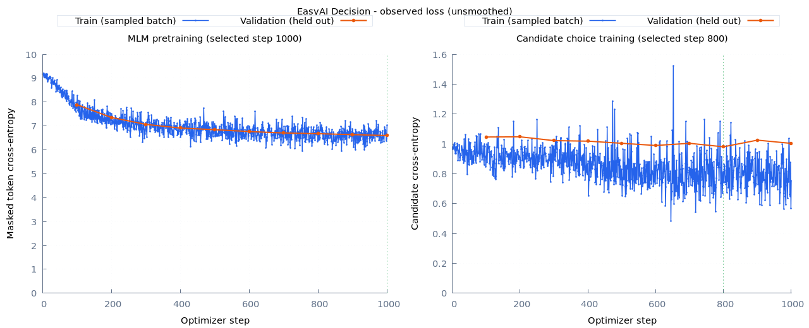
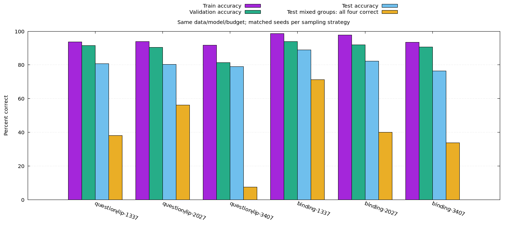
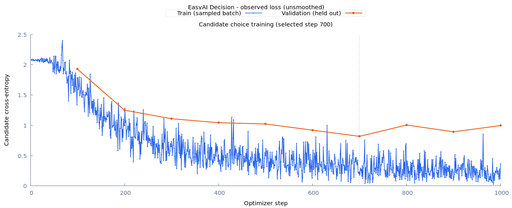
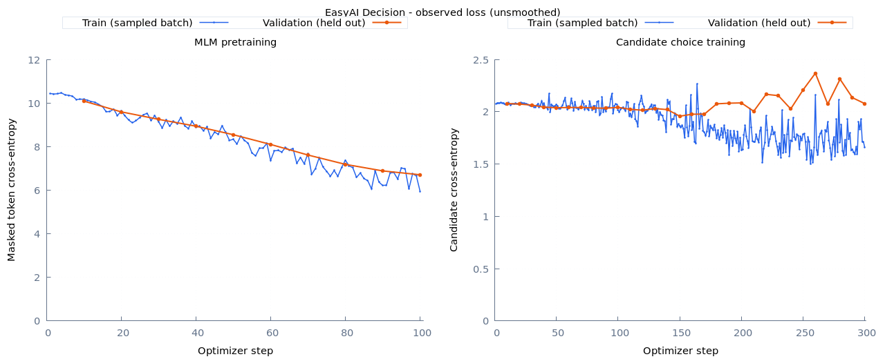
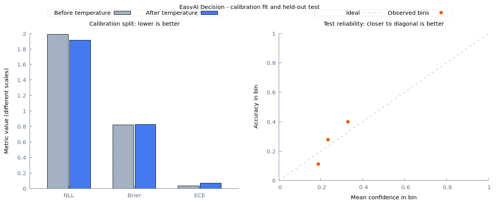

# easy_ai

用 Ruby 学习并实现神经网络。维护中的第一项能力是 **EasyAI::Decision**：给定状态、问题和多个候选，直接输出候选概率。算法、训练循环、分词和优化器可在仓库中阅读；张量计算与自动微分交给 Torch.rb / LibTorch，可使用 CUDA 或 CPU。

```text
state --------------------> shared bidirectional encoder ----> state memory
question + each option ---> shared bidirectional encoder ----> cross-attention
                                                               |
                                                   masked mean + scalar score
                                                               |
                                                   softmax(scores / temperature)
                                                               |
                                                   Ruby Hash -> JSON probabilities
```

默认 `small` 配置的参数层级（共享模块只计数一次）：

```text
ChoiceModel                                    11,484,929 params
|-- Shared Encoder                             10,826,240
|   |-- Token Embedding [32000, 256]             8,192,000
|   |-- Sinusoidal Positions + Dropout                  0
|   |-- Encoder Block x 4                       2,633,728
|   |   |-- LayerNorm x 2                           1,024 / block
|   |   |-- Self-Attention (4 heads x 64)          263,168 / block
|   |   `-- FFN (256 -> 768 -> 256)                394,240 / block
|   `-- Final LayerNorm                               512
|-- Interaction Block x 1                         658,432
|   |-- LayerNorm x 2                               1,024
|   |-- Cross-Attention (4 heads x 64)            263,168
|   `-- FFN (256 -> 768 -> 256)                    394,240
|-- Masked Mean Pooling                                 0
|-- Shared Score Linear (256 -> 1)                     257
`-- Temperature + Softmax                              0 network params
```

温度是独立校准得到的一个标量。MLM 输出使用 embedding 转置，不另建词表投影参数。`smoke` 使用 vocab 4096、hidden 32、encoder 2 层、FFN 64，共 156,801 参数，仅用于快速跑通流程。

改进后的 `massive.yml` 使用同一共享 encoder，增加输入 LayerNorm（512 参数）和显式状态匹配投影（262,400 参数），合计 **11,747,841 参数**：

```text
state -> encoder -> memory ---- masked mean -> s ---------+
                                                        |
question + option -> encoder -> cross-attention -> q ----+
                                                        |
                              [q, s, q*s, abs(q-s)] (1024)
                                                        |
                                   Linear(1024,256) + GELU
                                                        |
                                     Linear(256,1) -> softmax
```

旧权重继续使用原结构；新配置需要重新训练，结构变化不会靠加载旧文件自动生效。

目前完成了从公开数据准备、自训分词器、随机初始化 MLM 预训练、候选监督训练，到续训、校准、评估和推理的完整流程。已有本机 GPU 验收产物，但短程训练产物仅用于验证工程流程，不能当作具有通用判断能力的预训练模型。

```text
easy_ai/
|-- lib/easy_ai/
|   |-- decision/           # 正式维护的候选概率能力、数据、训练、推理、扩容
|   |-- nn/                 # attention、FFN、encoder block
|   |-- optim/              # 可保存状态的 Ruby AdamW
|   |-- runtime/            # GPU 优先、显存预算、CPU 回退
|   `-- tokenizers/         # 自写 byte BPE / Rust gem 后端
|-- learning/               # 独立 EasyAILearning 命名空间，原 GPT 教学实验
|-- test/                   # 正式库测试；learning/test 单独运行
|-- config/decision/        # small 正式起点 / smoke 流程验收
|-- examples/decision/      # 公共 API 示例、JSON 请求
|-- benchmarks/decision/    # 分词、实际训练、GPU 验证
|-- docs/decision/          # 架构、使用、验收记录
|-- data/                   # 下载、数据集、分词器（gitignored）
|   |-- learning/           # 原有 TXT 学习语料，教学训练默认目录
|   `-- decision/           # 候选概率模型的数据与分词器
`-- runs/                   # 权重、优化器、日志、校准结果（gitignored）
```

Ruby 3.4，Bundler，以及可用的 LibTorch 环境：

```bash
bundle install
bundle exec ruby bin/easy-ai --help
bundle exec rake test
bundle exec rake test:learning
bundle exec rake lint
```

本机已验证 Torch.rb 0.23.0 和 Quadro RTX 3000 6 GiB；安装 LibTorch 时需匹配 Torch.rb 的兼容版本及 CPU/CUDA 构建，参见 [Torch.rb 安装说明](https://github.com/ankane/torch-rb#installation)。仅安装 gem 不代表 CUDA 已可用。

## 一条命令完成 Decision 训练

当前按学习路线推进**从零训练**：新语义实验已准备 107094 条中英监督数据，模型 6,627,841 参数，不导入外部基础权重或教师输出。一条命令包含自训 MLM、候选监督、输入扰动诊断、校准和效果图：

```bash
bundle exec ruby bin/easy-ai semantic-pipeline
```

默认 MLM 1000 步 + 监督 1000 步；`--mlm-steps 0` 可运行从随机初始化直接监督的对照。已有本地数据会复用，缺失时才通过 Faraday 下载。每次输出到独立 `runs/decision/` 目录，有进度、日志、HTML/PNG/SVG 图表。公开数据的任务定义、许可、拆分、模型 ASCII 图与实测见[从零语义训练](docs/decision/semantics.md)。目前仍属学习实验，不能把这批短程权重视为已经掌握通用语义。

长文本验证曾发生显存持续累积，已通过限制临时张量生命周期与明确回收修复。候选/MLM 各连续 5 轮验证实测预热后显存稳定在 1178 MiB、无 CPU 回退，复现见[内存与显存回归](docs/decision/memory.md)。

本轮从零 MLM + 监督的实测曲线如下。相同 test 上，来源宏平均 accuracy 从直接监督的 57.56% 变成 55.11%；这个预算下 MLM 没有改善下游判断，迟到/否定探针仍有错误，详细对照和后续排查见上述语义训练说明。



针对否定错误，新增了中英关系学习对照：先验证 64 条样本能否完全拟合，再训练 13824 条可验证标签的关系数据，按人物/动作家庭与句式隔离评估。相同 663 万参数、1000 步预算下，v2 小样本实验的原位置编码 accuracy 为 75%，RoPE 为 100%；这是训练拟合结果，泛化需要另行评估。

完整数据进一步对照后，直接训练的三种子新句式 test 平均约 69.90%；先学小样本再训练完整数据的课程版约 80.03%，各次为 78.91%–80.78%。单独延长到 6000 步没有改善该种子的最佳验证结果。课程版有进展，但尚未达到每语言 95% 与成对反例门槛，仍不能视为通用语义模型。

```bash
bundle exec ruby benchmarks/decision/relations.rb --variants all,candidate,rotary --seeds 1337,2027,3407
```

这条命令包含进度、门槛检查、独立泛化训练与每轮 HTML/PNG/SVG 曲线；`--sanity-only` 可只做小样本排查。模型层级、数据拆分、成对反例及后续 scaling 策略见[关系学习实验](docs/decision/relations.md)。

复现本轮课程学习结果（仍然全部从零开始，不用外部权重）：

```bash
bundle exec ruby benchmarks/decision/relations.rb --variants rotary --seeds 1337,2027,3407 --curriculum --patience 0 --steps 2000
```

每个种子先训练 1000 步 sanity，再用这组自训权重训练完整数据 2000 步；总计 3000 步。报告同时列出完整训练集、验证集与两种测试句式的成绩，保留失败门槛，不自动推广为默认模型。

最新用户复测确认：两条“买票”例子已在训练集中，旧课程模型仍不能稳定判断谁买了票。现已完成主体/角色评估、四条成组采样及三种子对照：平均 test accuracy 从 **80.03% 到 82.55%**，混合真假四条组全对率从 **33.96% 到 48.33%**，但部分种子退步，仍未达标。扩大为 512 条代表性热身的后续试验也不稳定，完整结果、失败记录与可加载权重见[人物绑定对照](docs/decision/binding.md)。新关系训练与评估统一使用 v3 元数据，历史 v2 权重可在文本和 tokenizer 不变的 v3 数据上补测。接手入口为[开发交接记录](docs/decision/handover.md)。



原有 MASSIVE 多语言意图匹配实验保留：

```bash
bundle exec ruby bin/easy-ai pipeline --config config/decision/massive.yml --train-limit 2000 --backend native --vocab-size 8000 --mlm-steps 0 --choice-steps 1000 --eval-every 100
```

从随机权重开始监督训练，自训 native BPE；五语言共 10000 条训练行 / 2000 个源分组，其他 split 各保留 200 个源分组。
包含标签平衡、动态负候选、最佳 validation 权重选择、状态消融、独立校准与测试、进度和图表。
本机完整运行约 3.5 分钟。该任务训练意图选择，**还没有获得通用中文问答或否定语义判断能力**。

要学习包括 MLM 的原始小数据流程，仍可运行：

```bash
bundle exec ruby bin/easy-ai pipeline
```

自动执行：本地 MASSIVE 数据准备 → 自训 Ruby BPE → MLM 预训练 → 候选监督训练 → 独立温度校准 → test 评估 → 绘图。
默认使用 `small` 的约 1148 万参数模型、五种语言、每个 split 每种语言最多 200 条、每例 8 个候选，MLM 100 步、候选训练 300 步。
本地已有原始压缩包会直接复用；缺失时才下载。默认 GPU 优先，训练时显示 step、loss、最近验证 loss、设备及预计剩余时间。

每次创建独立的 `runs/decision/<时间>-<随机后缀>/`，控制台会打印路径；也可通过 `--output` 指定一个尚不存在的目录。
绘图使用本机已安装的 **gnuplot**，不依赖 Python；在新机器上需要先安装 gnuplot，缺失时会在训练前提示。

```text
runs/decision/<run>/
|-- pipeline.log              # 阶段进度、训练进度、错误信息
|-- train.log                 # 每次更新与验证的日志
|-- mlm/                      # 预训练 checkpoint、training.jsonl、metrics.jsonl
|-- choice/                   # 候选训练 checkpoint 与曲线原始数据
|-- calibrated/               # 校准后的推理 checkpoint
|-- stage-results/            # 校准与测试的完整 JSON 结果
`-- report/
    |-- index.html            # 浏览器打开：曲线、指标、按语言评估
    |-- loss.png / loss.svg   # MLM 与候选训练/验证 loss
    |-- evaluation.png / .svg # 校准指标与 test 可靠性图
    |-- memory.png / .svg     # 有 GPU 测量时：验证前后显存
    `-- loss.txt              # 终端 Unicode 曲线
```

训练 loss 是随机采样 batch 的交叉熵，验证 loss 来自独立数据；曲线没有平滑。它展示优化过程，不是梯度数值图，也不等于通用模型质量认证。
小数据实验应同时看验证曲线及 held-out test，不能只追求训练曲线下降。

更多选项、日志跟踪、报告重绘与中断恢复见[一键训练指南](docs/decision/usage.md#一键训练与效果图)。

- [使用指南](docs/decision/usage.md)：可复制的完整训练与推理命令、数据格式。
- [算法与设计](docs/decision/architecture.md)：模型选择、概率含义、缓存、扩层、资源策略。
- [本机验收](docs/decision/validation.md)：实际参数、时延、显存、测试与质量限制。
- [从零语义训练](docs/decision/semantics.md)：中英公开判断数据、MLM 对照、按任务诊断。
- [关系学习实验](docs/decision/relations.md)：否定绑定、位置编码对照、小样本拟合与独立泛化。
- [人物绑定对照](docs/decision/binding.md)：v3 数据、主体/角色评估、四条成组采样与实验入口。
- [迭代回顾与经验](docs/decision/retrospective.md)：从初版到 v3 的成功、失败、证据边界，以及从零训练与教师蒸馏的下一步取舍。
- [可复用蒸馏设计](docs/decision/distillation.md)：规划中的 `EasyAI::Distillation` 与 Decision 适配边界，尚未实现。
- [开发交接记录](docs/decision/handover.md)：当前权重、用户复测证据、下一轮任务与验收标准；接手入口。
- [内存与显存](docs/decision/memory.md)：长文本验证的资源管理修复与连续测量。
- [学习目录](learning/README.md)：原代码迁移位置和建议阅读顺序。

配置遵循每行一个参数、优先人类可读性的约定。风格参考 easy_biz 的 RuboCop 习惯，项目继续使用 Ruby 库的目录结构。下载档案、训练数据、tokenizer 文件、权重和缓存请放入上述忽略目录；`examples/` 和测试代码可以正常提交。

## Decision 本机训练效果

改进配置的实际结果（2026-09-28，八候选、五语言，test 各 200 条；与旧实验使用同一组验证、校准和测试数据）：

| 指标 | 原始小数据实验 | 改进配置 |
| --- | ---: | ---: |
| Test accuracy | 25.5% | **75.6%** |
| Test NLL | 1.95793 | **0.73891** |
| 中文 validation 原始状态 accuracy | 29.5% | **76.0%** |
| 中文 validation 打乱状态 accuracy | 29.5% | **21.5%** |

新实验使用更多训练数据、不同打分头与训练设置，不是单因素对照；这是采样八候选的结果，不是全 60 类 MASSIVE 官方成绩。
最佳验证权重在第 700 步，后续仍有过拟合，报告保留全部 1000 步曲线。详情见[诊断记录](docs/decision/diagnostics.md)。



完整报告：`runs/decision/expanded-matching/report/index.html`；可加载的本地权重：

```ruby
predictor = EasyAI::Decision::Predictor.load("runs/decision/expanded-matching/calibrated")
```

候选 ID 支持整数、有限浮点数和字符串，输出键统一为字符串；`1` 与 `"1"` 同时出现会报重复。
实际手工检查中，“明天七点叫我起床”选中 alarm_set，“播放音乐”选中 music_play；但“来不及了要迟到了 / 会迟到么 / 会、不会”仍选错。
这些例子未用于训练。当前改进证明了意图匹配中的状态依赖，不能宣称已解决一般否定语义。

GPU 吞吐也已调整：有效 batch 同为 32，`4×8` 累积改成 `32×1` 后，短程实测从约 84 增至 281 条/秒（3.35 倍）。
完整运行中一次采样的训练进程显存约 1.85 GiB；这不是峰值承诺。输入更长时会触发原有缩 batch / CPU 回退策略。

以下保留原始实验，便于对照。其约 1148 万参数，五语言，每个 split 1000 行（200 个原始分组），8 候选，MLM 100 步、候选训练 300 步，完整流程约 5 分钟。



MLM 的训练与验证 loss 都下降；候选训练后半段出现训练 loss 下降而验证 loss 波动上升，提示小数据过拟合。
本次最终 checkpoint 的 test accuracy 为 25.5%（采样八候选），NLL 为 1.95793；仅作为本地小规模实验记录，不代表通用判断能力。

后续状态依赖性检查发现：200 条中文 validation 中，打乱 state 或将其统一替换成“无上下文”，所有最终选择均保持不变。
这组旧权重尚未证明学会状态与候选的匹配；在这组 validation 上甚至未超过只看训练标签频率的基线。详见[候选学习诊断](docs/decision/diagnostics.md)。



本次温度拟合降低 calibration NLL，但 Brier 和 ECE 没有同时改善。报告保留原始曲线与指标，不筛选“好看”的点。
本机完整报告位于 `runs/decision/pipeline-showcase/report/index.html`；其他机器可执行一键命令生成自己的报告。
原始权重、语料和日志不随 Git 分发，README 的展示图单独保留在 `docs/images/`。

## Learning 训练效果展示（保留）

以下保留原 README 中的 GPT 教学实验曲线：历史运行使用宋词语料、Qwen tokenizer、200 次更新。
这是 learning 模块的历史示例，不是上述 Decision 模型的训练结果。当前脚本仍会在结束时打印训练 loss 曲线及生成示例。

```
                                        Training Loss
           ┌──────────────────────────────────────────────────────────────────────┐
        13 │                                                                      │
           │⠣⠤⠢⢄⣠⢀⣀                                                               │
           │     ⠈⠉⠈⠋⠋⠋⠲⢆⢀                                                        │
           │               ⠉⠉⠒⠦⡀⡄                                                 │
           │                   ⠙⠸⡰⣤⢄                                              │
   Loss    │                       ⠓⠖⡼⠶⣀⢴  ⡀                                      │
           │                            ⢄⠷⠻⡀⢀  ⡄  ⢀                               │
           │                              ⠓⠹⠋⢱⣆⢿⢰⣀⢸⡀                              │
           │                                ⠘⠹ ⠁⠉⠞⡷⢲⣤⡶⣇⣄⣤⣠⢰⣼⢰⡀ ⡀  ⡀⢀⢄⡄    ⢠⣤ ⡞⡆   │
           │                                          ⠘⠁⠁⠟⠛⠿⠛⡎⠛⠃⣧⢷⣧⣄⣰⢧⠎⠘⣷⣆⣶⣄⡸⠏⣿⡟ ⣇│
           │                                                    ⢿⠈⠃   ⡿⠉⠹   ⠇⠃  ⠘⢿│
         6 │                                                                      │
           └──────────────────────────────────────────────────────────────────────┘
           0                                                                    200
                                          Iteration
```

自训 byte BPE 的教学运行入口：

```bash
bundle exec ruby learning/transformer/train.rb --data data/learning/song.txt --tokenizer byte --iters 200
```

该命令使用不同 tokenizer，曲线不应与历史示例逐点对照；原始说明保留在 [learning/LEGACY_README.md](learning/LEGACY_README.md)。
