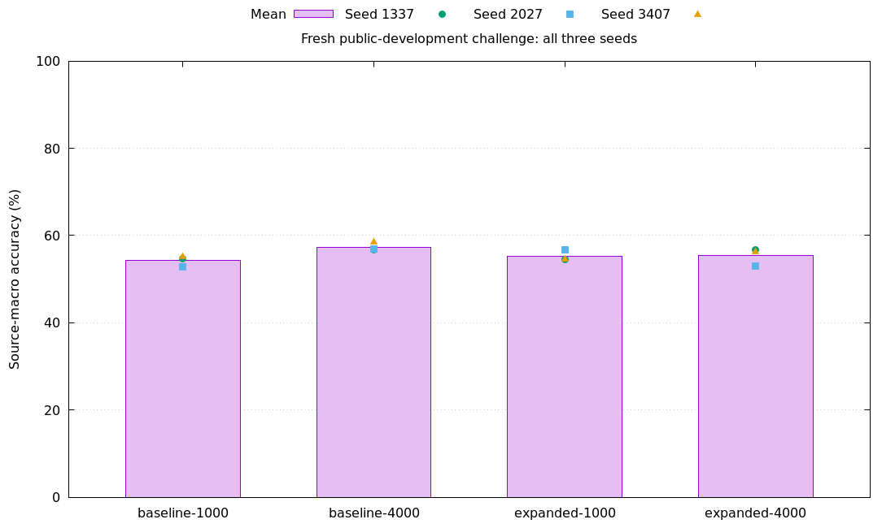
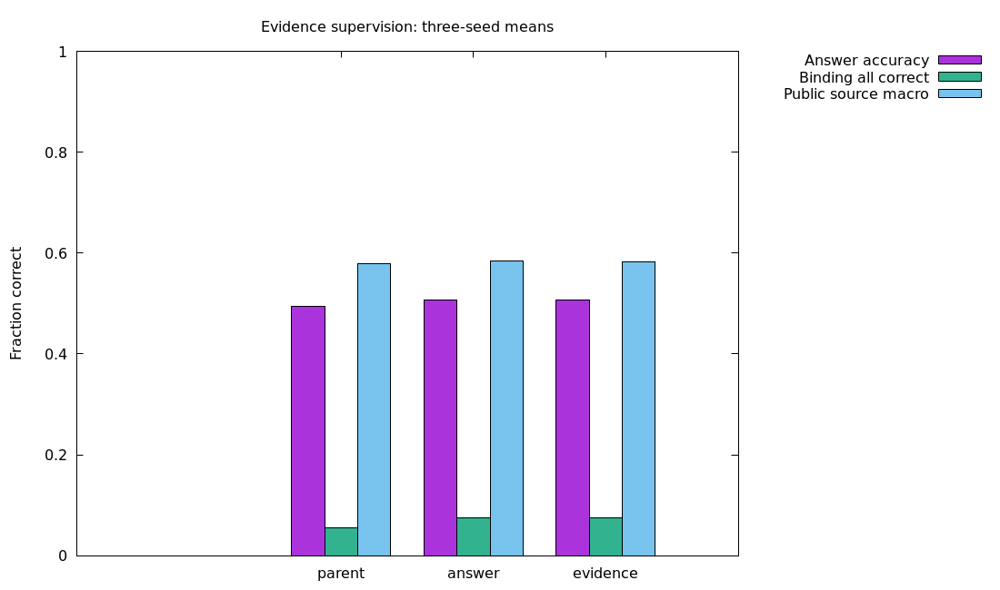
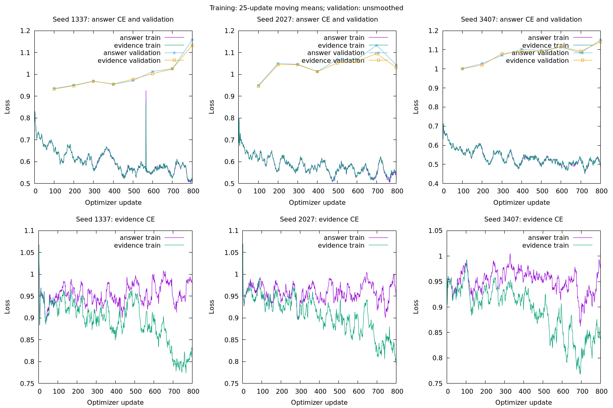

# easy_ai

**Language:** English | [简体中文](README.zh-CN.md)

**Online course: [Easy AI Learning](https://easy-ai-learning.code-li.com/)** — Follow the course sequence from neural network foundations to classic architectures, training methods and practical experiments.

Learn and implement neural networks in Ruby through a progressive curriculum and runnable model experiments. The algorithms, training loops, tokenizers and optimizers are readable in this repository; Torch.rb / LibTorch handles tensor computation and automatic differentiation on CUDA or CPU.

## Learning curriculum

Start with [the curriculum overview](learning/README.md), or read the [online course](https://easy-ai-learning.code-li.com/) with search, chapter navigation and links to source code. Chapters 00–16 progress from hand-calculable examples to complete Ruby/Torch.rb experiments. Later chapters reuse earlier implementations.

| Stage | Chapters and topics |
| --- | --- |
| Foundations and training | [00: Mathematics and data](learning/00_foundations/README.md), [01: Basic neural networks](learning/01_basic_nn/README.md), [02: SGD, AdamW and regularization](learning/02_training/README.md), [03: Weights, gradients and diagnostics](learning/03_diagnostics/README.md) |
| Representation and vision | [04: Autoencoders](learning/04_autoencoder/README.md), [05: CNNs](learning/05_cnn/README.md), [06: ResNet](learning/06_resnet/README.md) |
| Sequences | [07: Tokenizers](learning/07_tokenizers/README.md), [08: RNN/LSTM/GRU](learning/08_rnn/README.md), [09: Seq2Seq](learning/09_seq2seq/README.md) |
| Attention and language | [10: Attention and masks](learning/10_attention/README.md), [11: Transformers](learning/11_transformer/README.md), [12: GPT](learning/12_gpt/README.md) |
| Generation, transfer and interaction | [13: VAE/GAN/Diffusion](learning/13_generative/README.md), [14: Transfer learning and LoRA](learning/14_transfer_learning/README.md), [15: Reinforcement learning](learning/15_rl/README.md) |
| Complete experiment | [16: Capstone](learning/16_capstone/README.md) |

Complete 00–03 first, then choose the vision or language branch before studying generation, transfer or reinforcement learning. Each chapter includes documentation, data preparation, training, inference and recorded results. Core tests verify formulas, gradients, masks and parameter updates independently of training convergence.

- [Local reading guide](docs/learning-site.md): run the Ruby-based documentation site with cross-chapter navigation and search.
- [Compact printable course](docs/learning-course-print.md): core concepts, formulas and essential code (in Chinese).
- [Learning implementations](learning/lib/easy_ai_learning/): shared teaching components reused across chapters.

### Setup

Requirements: Ruby 3.4, Bundler and a working LibTorch installation.

```bash
bundle install
bundle exec rake test:learning
bundle exec rake lint
```

Local validation used Torch.rb 0.23.0 and a Quadro RTX 3000 with 6 GiB VRAM. Install a compatible LibTorch version and CPU/CUDA build for Torch.rb; see the [Torch.rb installation instructions](https://github.com/ankane/torch-rb#installation). Installing the gem alone does not make CUDA available.

### Basic neural network example

The most basic neural network training example requires neither a corpus nor a GPU:

```bash
bundle exec ruby learning/01_basic_nn/logic.rb
bundle exec ruby learning/01_basic_nn/train.rb
```

Train a neural network that computes XOR, printing progress, learned parameters and unicode_plot function plots. Output is saved in the ignored `runs/learning/basic_nn/logic-gates/` directory. With the default seed 1337, a CUDA run correctly classifies all four XOR inputs after 436 updates. See the [basic neural network guide](learning/01_basic_nn/README.md).

The basic neural network uses Torch.rb / CUDA by default, falling back to CPU when unavailable. The [README function plots](learning/01_basic_nn/README.md#observed-runs-and-plots) show two groups: fixed AND/OR/NAND/XOR logic functions; and the model's ReLU, training loss, score heatmap and 3D surface, and XOR prediction boundary. The terminal training report also retains a loss curve.

### Run the full course

```bash
bundle exec ruby learning/run_all.rb
bundle exec rake test:learning
```

The runner prepares data and executes experiments in chapter order. Neural training prefers CUDA and falls back to CPU when unavailable; `--device cpu` selects CPU explicitly. Artifacts are saved under the ignored `runs/learning/` directory. See the [curriculum overview](learning/README.md#an-executable-learning-path) for per-chapter commands and experiment settings.

## Implemented models: Decision

**EasyAI::Decision** takes a state, a question and multiple candidates, and returns candidate probabilities. The following sections describe its architecture, training workflow and measured results.

```bash
bundle exec ruby bin/easy-ai --help
bundle exec rake test
```

Decision v0.1 is delivered as a **model-only scoring preview** for Chinese/English request domains: `runs/decision/v0.1-preview`. Load it with `EasyAI::Decision::Release.load("runs/decision/v0.1-preview", device: "auto")`. The corrected model scores **78.25% English / 81.0% Chinese** overall, and **90.32% / 91.64%** on confident decisions at **77.5% / 80.75%** coverage. The 80% target is advisory for continued optimization; the original failed strict acceptance remains recorded. See [results, charts, inference and training commands](docs/decision/v01.md). General yes/no reasoning remains unvalidated; no business integration is included.

The completed [Decision v0.2 factual-scoring round](docs/decision/v02.md) uses 27,520 bilingual training rows, matched CE/margin budgets and 7,144 acceptance decisions. CE raises factual source/language-macro accuracy from **46.33% to 67.33%**; the margin reaches **66.47%**. CE complete-pair correctness is **64.53% English / 99.92% Chinese**, but English actor binding, Chinese missing-information handling and routing retention still fail. **v0.1 remains the delivered preview**; v0.2 weights are diagnostics. The document includes load paths, the completed training chart, exposure/provenance audits and next priorities.

The completed [Decision v0.3 round](docs/decision/v03.md) follows Path A with our own v0.1 weights, corrected actor/query/order supervision and explicit unknown exposure. Both arms finish 2,000 CUDA updates. On the same fresh panel, the candidate raises factual macro from **41.63% to 52.23%** and natural QA/NLI from **48.50% / 48.00% to 64.50% / 56.75%** (EN/ZH), but known judgments fall to **15.43% / 16.88%** and mixed-truth binding remains **0.72% / 0%**. Factual row accuracy falls; the aggregate gain is not useful factual reasoning. **No v0.3 promotion; v0.1 remains delivered.** The report includes a reviewed training chart, diagnostic load paths, verified exposure, runtime checks and failed lessons. The [executed plan](docs/decision/v03-plan.md) remains available for review.

The [completed v0.4 implementation](docs/decision/v04.md) adds reviewed supervision, complete counterfactual families, a staged CE trainer and class/group checks. Its isolated 128-row fit stops at 87.5%: different-event cases pass, but mixed actor cases remain at 50% even on training data. All 1,000 updates use CUDA; runtime/memory checks pass. Under the stop rule, pilots and acceptance remain unrun and v0.1 stays delivered. This training score is not a generalization result. [Plan and procedure](docs/decision/v04-plan.md).

The [v0.5 development plan](docs/decision/v05-plan.md) compares separate and joint relational encoding on the same reviewed core, verifies positions and weight transfer, and gates supervised generalization, unknown training and calibration on repeatable actor-binding learning. It is planned; implementation and training have not started.

`device:` accepts `:auto`, `:cpu`, `:cuda` and the equivalent strings in both `Release.load` and `Predictor.load`.
`Release#probabilities(state:, question:, options:, language: nil)` accepts multilingual text without a language argument. One tokenizer and one checkpoint are shared; `language:` only selects the evaluated routing confidence policy. `route` still requires a language for its predefined candidate descriptions.

```text
state --------------------> shared bidirectional encoder ----> state memory
question + each option ---> shared bidirectional encoder ----> cross-attention
                                                               |
                                                   masked mean + scalar score
                                                               |
                                                   softmax(scores / temperature)
                                                               |
                                                   Ruby Hash -> JSON probabilities
```

Semantic judgments come from the trained network, not keyword rules. Coverage auditing uses declared dataset metadata only. The tokenizer and inference interface accept multilingual text, but current Chinese/English experiments do not establish semantic ability in other languages. See the [coverage experiment and limitations](docs/decision/coverage.md).

Parameter hierarchy for the default `small` configuration (shared modules are counted once):

```text
ChoiceModel                                    11,484,929 params
|-- Shared Encoder                             10,826,240
|   |-- Token Embedding [32000, 256]             8,192,000
|   |-- Sinusoidal Positions + Dropout                  0
|   |-- Encoder Block x 4                       2,633,728
|   |   |-- LayerNorm x 2                           1,024 / block
|   |   |-- Self-Attention (4 heads x 64)          263,168 / block
|   |   `-- FFN (256 -> 768 -> 256)                394,240 / block
|   `-- Final LayerNorm                               512
|-- Interaction Block x 1                         658,432
|   |-- LayerNorm x 2                               1,024
|   |-- Cross-Attention (4 heads x 64)            263,168
|   `-- FFN (256 -> 768 -> 256)                    394,240
|-- Masked Mean Pooling                                 0
|-- Shared Score Linear (256 -> 1)                     257
`-- Temperature + Softmax                              0 network params
```

Temperature is a scalar fitted through independent calibration. MLM output uses the transposed embedding matrix, without separate vocabulary projection parameters. `smoke` uses a vocabulary of 4096, hidden size 32, two encoder layers and FFN size 64: 156,801 parameters in total, for quick pipeline checks only.

The improved `massive.yml` uses the same shared encoder, adding an input LayerNorm (512 parameters) and an explicit state-matching projection (262,400 parameters), for **11,747,841 parameters** in total:

```text
state -> encoder -> memory ---- masked mean -> s ---------+
                                                        |
question + option -> encoder -> cross-attention -> q ----+
                                                        |
                              [q, s, q*s, abs(q-s)] (1024)
                                                        |
                                   Linear(1024,256) + GELU
                                                        |
                                     Linear(256,1) -> softmax
```

Existing weights retain the original architecture. The new configuration requires retraining; loading an old file does not apply architecture changes automatically.

The complete workflow covers public data preparation, tokenizer training, randomly initialized MLM pretraining, supervised candidate training, training resumption, calibration, evaluation and inference. Local GPU validation artifacts are available, but short training runs verify the engineering workflow and do not constitute a pretrained model with general decision-making ability.

```text
easy_ai/
|-- lib/easy_ai/
|   |-- decision/           # Maintained candidate probabilities, data, training, inference and scaling
|   |-- distillation/       # Reusable teacher collection, artifacts and supervision losses
|   |-- nn/                 # Attention, FFN and encoder blocks
|   |-- optim/              # Ruby AdamW with serializable state
|   |-- runtime/            # GPU preference, VRAM budgets and CPU fallback
|   `-- tokenizers/         # Custom byte BPE / Rust gem backend
|-- learning/               # EasyAILearning: foundations -> training/diagnostics -> AE/CNN/ResNet -> sequences/GPT -> generation/transfer/RL
|-- test/                   # Library tests; learning/test runs separately
|-- config/decision/        # small starting configuration / smoke pipeline validation
|-- examples/decision/      # Public API examples and JSON requests
|-- benchmarks/decision/    # Tokenization, actual training and GPU validation
|-- docs/decision/          # Architecture, usage and validation records
|-- data/                   # Downloads, datasets and tokenizers (gitignored)
|   |-- learning/           # Legacy TXT learning corpus; default teaching data directory
|   `-- decision/           # Candidate probability model data and tokenizers
`-- runs/                   # Weights, optimizers, logs and calibration results (gitignored)
```

### Train Decision with one command

The learning path currently emphasizes **training from scratch**. The new semantic experiment prepares 107094 Chinese/English supervised examples for a model with 6,627,841 parameters, without importing external base weights or teacher outputs. One command runs MLM pretraining, candidate supervision, input-perturbation diagnostics, calibration and plotting:

```bash
bundle exec ruby bin/easy-ai semantic-pipeline
```

Defaults are 1000 MLM updates followed by 1000 supervised updates; `--mlm-steps 0` runs the direct-supervision control from random initialization. Existing local data is reused; Faraday downloads missing data only. Each run writes to a separate `runs/decision/` directory with progress, logs and HTML/PNG/SVG charts. Public dataset task definitions, licenses, splits, the model ASCII diagram and measured results are documented in [semantic training from scratch](docs/decision/semantics.md). These remain learning experiments; the short-run weights do not demonstrate general semantic understanding.

Long-text validation previously accumulated VRAM. Limiting temporary tensor lifetimes and explicitly reclaiming them fixed the issue. Five consecutive validation rounds for each of candidate training and MLM stabilized at 1178 MiB after warmup, without CPU fallback. See [memory and VRAM regression checks](docs/decision/memory.md) for reproduction.

The measured scratch MLM + supervision curves appear below. On the same test set, source-macro accuracy changed from 57.56% with direct supervision to 55.11%. MLM did not improve downstream decisions at this budget, and lateness/negation probes still fail. The semantic training document above records the comparison and follow-up diagnostics.


Latest controlled experiment (2026-09-29): extending gold-supervised training from 1k to 4k updates raises fresh-challenge source-macro accuracy from **54.31% to 57.36%** across three seeds, but raw NLL worsens. Adding task/candidate wording variants drops accuracy to **55.39%** and is rejected as an improvement. English negation and person binding still fail known probes. See the [complete results, training curves, checkpoint path and next experiment](docs/decision/coverage.md); these are experimental weights, not a reliable general semantic model.



2026-09-30 result: evidence supervision did not meaningfully improve novel-expression accuracy (50.71% vs 50.76%) or binding (both 7.60%). Broader natural-data and shared public-benchmark evaluations also expose weak transfer and input-limit failures. The 95% target is a narrow diagnostic, not the overall acceptance criterion. Benchmark tooling and reproducible downloads are now reviewed and tested. See the [handover](docs/decision/handover.md) and [next experiment protocol](docs/decision/next-experiment.md).





The completed [fitting diagnostic](docs/decision/fitting.md) compares sinusoidal positions and RoPE on 128 bilingual training examples. Our own parent reaches 100% with both (RoPE reaches the gate at update 1,000 vs 1,800); random starts finish at 75% / 87.5%. These are single-seed training-fit results, not generalization. No predictor is promoted.


The completed [natural-task pilot](docs/decision/natural.md) adds full-candidate AG News and bilingual MASSIVE supervision. Across the same fresh panel, main source-macro accuracy rises from **42.43%** for our own starting parent to **61.04% / 60.84%** (sinusoidal/RoPE). The gains concentrate in the trained news/domain tasks; withheld Emotion is only **6–7%** and binding groups pass **4.6–5.7%**. This is useful task learning, not general semantics or a demonstrated RoPE advantage. No predictor is promoted. The document records the one-command reproduction, experimental load paths, memory/exposure audits, failure distributions and next diagnostic.


The [evidence-supervision experiment](docs/decision/evidence.md) compares answer CE with answer + supporting-sentence CE using our own scratch-trained parents. It reserves 6,144 controlled Chinese/English test examples from 32 independent families plus a fresh 809-row public test. Lateness probes are informal checks, not acceptance criteria. The document includes the model ASCII diagram, a one-command reproduction, and published Jev/open-model comparisons; the 95% target is a narrow-task reliability gate, not a definition of general semantic understanding.

To investigate negation errors, a Chinese/English relation-learning comparison first checks whether 64 examples can be fitted completely, then trains on 13824 relation examples with verifiable labels, separating evaluation by person/action families and sentence templates. At the same 6.63-million-parameter size and 1000-update budget, the v2 small-sample experiment reaches 75% accuracy with the original positional encoding and 100% with RoPE. These are training-fit results; generalization requires separate evaluation.

In the full-data comparison, direct training averages about 69.90% on unseen test templates across three seeds. The curriculum variant, which learns the small sample before the full dataset, averages about 80.03%, with individual runs at 78.91%–80.78%. Extending one run to 6000 updates did not improve that seed's best validation result. Curriculum learning makes progress but still fails the 95%-per-language and paired-counterexample gates; it is not a general semantic model.

```bash
bundle exec ruby benchmarks/decision/relations.rb --variants all,candidate,rotary --seeds 1337,2027,3407
```

This command includes progress, gate checks, separate generalization training and HTML/PNG/SVG curves for each run; `--sanity-only` runs only the small-sample diagnostic. See the [relation-learning experiment](docs/decision/relations.md) for model hierarchy, data splits, paired counterexamples and the subsequent scaling strategy.

Reproduce this curriculum-learning round (still entirely from scratch, without external weights):

```bash
bundle exec ruby benchmarks/decision/relations.rb --variants rotary --seeds 1337,2027,3407 --curriculum --patience 0 --steps 2000
```

Each seed first runs 1000 sanity updates, then uses those self-trained weights for 2000 updates on the full dataset: 3000 updates in total. The report includes scores on the complete training set, validation set and two test template sets. Failed gates remain visible; the model is not automatically promoted to the default.

User retesting confirmed that both ticket-purchase examples already appeared in training, yet the old curriculum model could not reliably identify who bought the ticket. Actor/role evaluation, four-example grouped sampling and a three-seed comparison are now complete: average test accuracy rises from **80.03% to 82.55%**, and all-correct accuracy on mixed-truth groups rises from **33.96% to 48.33%**. Some seeds regress, and acceptance still fails. A follow-up with 512 representative warmup examples is also unstable. See the [actor-binding comparison](docs/decision/binding.md) for complete results, failures and loadable weights. New relation training and evaluation use v3 metadata; historical v2 weights can be reevaluated on v3 data when text and tokenization are unchanged. Start with the [development handover](docs/decision/handover.md).


The original MASSIVE multilingual intent-matching experiment remains available:

```bash
bundle exec ruby bin/easy-ai pipeline --config config/decision/massive.yml --train-limit 2000 --backend native --vocab-size 8000 --mlm-steps 0 --choice-steps 1000 --eval-every 100
```

Supervised training starts from random weights with a self-trained native BPE tokenizer: 10000 training rows across five languages / 2000 source groups, with 200 source groups retained in each other split.
It includes label balancing, dynamic negative candidates, best-validation checkpoint selection, state ablation, independent calibration and testing, progress and charts.
A complete local run takes about 3.5 minutes. This task learns intent selection; **general Chinese question answering and negation reasoning have not been achieved**.

To study the original small-data workflow including MLM, run:

```bash
bundle exec ruby bin/easy-ai pipeline
```

The pipeline automatically performs local MASSIVE data preparation -> Ruby BPE training -> MLM pretraining -> supervised candidate training -> independent temperature calibration -> test evaluation -> plotting.
Defaults use the `small` model with about 11.48 million parameters, five languages, at most 200 examples per language per split, eight candidates per example, 100 MLM updates and 300 candidate-training updates.
Existing local source archives are reused; missing ones are downloaded. GPU is preferred by default. Training displays the update, loss, latest validation loss, device and estimated remaining time.

Each run creates a separate `runs/decision/<timestamp>-<random-suffix>/` directory and prints its path. Alternatively, `--output` accepts a directory that does not yet exist.
Charts use the locally installed **gnuplot**, without Python. Install gnuplot on a new machine; if it is missing, the command reports this before training.

```text
runs/decision/<run>/
|-- pipeline.log              # Stage progress, training progress and errors
|-- train.log                 # Logs for each update and validation
|-- mlm/                      # Pretraining checkpoints, training.jsonl and metrics.jsonl
|-- choice/                   # Candidate-training checkpoints and raw curve data
|-- calibrated/               # Calibrated inference checkpoint
|-- stage-results/            # Complete calibration and test JSON results
`-- report/
    |-- index.html            # Browser report: curves, metrics and per-language evaluation
    |-- loss.png / loss.svg   # MLM and candidate training/validation loss
    |-- evaluation.png / .svg # Calibration metrics and test reliability plots
    |-- memory.png / .svg     # VRAM before/after validation when GPU measurements are available
    `-- loss.txt              # Terminal Unicode curves
```

Training loss is cross-entropy on randomly sampled batches; validation loss uses independent data. Curves are unsmoothed. They show optimization, rather than gradient values or proof of general model quality.
Small-data experiments should consider validation curves and held-out tests together, rather than pursuing decreasing training loss alone.

See the [one-command training guide](docs/decision/usage.md#%E4%B8%80%E9%94%AE%E8%AE%AD%E7%BB%83%E4%B8%8E%E6%95%88%E6%9E%9C%E5%9B%BE) for options, log monitoring, report regeneration and interruption recovery.

- [Usage guide](docs/decision/usage.md): complete, copyable training and inference commands, and data formats.
- [Algorithms and design](docs/decision/architecture.md): model choices, probability interpretation, caching, layer expansion and resource strategies.
- [Local validation](docs/decision/validation.md): measured parameters, latency, VRAM, tests and quality limits.
- [Semantic training from scratch](docs/decision/semantics.md): public Chinese/English decision data, MLM comparisons and per-task diagnostics.
- [Relation-learning experiment](docs/decision/relations.md): negation binding, positional encoding comparisons, small-sample fitting and independent generalization.
- [Actor-binding comparison](docs/decision/binding.md): v3 data, actor/role evaluation, grouped sampling of four examples and experiment entry points.
- [Iteration review and lessons](docs/decision/retrospective.md): successes, failures and evidence limits from the first version to v3, plus next-step tradeoffs between scratch training and teacher distillation.
- [Reusable distillation](docs/distillation/README.md): offline teacher content, pseudo-label export, candidate-level supervision and Decision integration; includes the original design link.
- [First Qwen teacher screening](docs/distillation/teacher-v1.md): fits the 6 GiB GPU, but fails the candidate-order stability gate; no student weights promoted.
- [Task-specific teacher comparison](docs/distillation/teacher-task-v1.md): explicit task definitions regressed order agreement (91.67% → 85.42%); includes reproducible comparison, both-correct metrics and lessons from the failed experiment.
- [Gold-supervised coverage round](docs/decision/coverage.md): completed six-run comparison; longer training gains 3.05 accuracy points but worsens raw probability metrics, while wording expansion loses 1.97 points. Includes exposure, memory recovery, failure probes and reproduction; no keyword-based semantic rules or pretrained LLM.
- [Development handover](docs/decision/handover.md): current weights, user-retest evidence, next-round tasks and acceptance criteria; the starting point for continued development.
- [Memory and VRAM](docs/decision/memory.md): resource-management fixes and consecutive measurements for long-text validation.

Configuration follows a one-parameter-per-line convention that prioritizes readability. Style follows the easy_biz RuboCop conventions, while the project retains a Ruby library layout. Store downloaded archives, training data, tokenizer files, weights and caches in the ignored directories above; `examples/` and test code can be committed normally.

### Local Decision training results

Measured results for the improved configuration (2026-09-28, eight candidates, five languages, 200 test examples each; using the same validation, calibration and test data as the old experiment):

| Metric | Original small-data experiment | Improved configuration |
| --- | ---: | ---: |
| Test accuracy | 25.5% | **75.6%** |
| Test NLL | 1.95793 | **0.73891** |
| Chinese validation accuracy, original state | 29.5% | **76.0%** |
| Chinese validation accuracy, shuffled state | 29.5% | **21.5%** |

The new experiment uses more training data, a different scoring head and different training settings, so it is not a single-factor comparison. These results use eight sampled candidates, rather than the official full 60-class MASSIVE evaluation.
The best validation checkpoint is at update 700; overfitting continues afterward. The report retains all 1000 updates. See the [diagnostic record](docs/decision/diagnostics.md).


Complete report: `runs/decision/expanded-matching/report/index.html`. Load the local weights with:

```ruby
predictor = EasyAI::Decision::Predictor.load("runs/decision/expanded-matching/calibrated")
```

Candidate IDs support integers, finite floating-point numbers and strings. Output keys are normalized to strings; providing both `1` and `"1"` raises a duplicate-ID error.
In manual checks, “Wake me up at seven tomorrow” selects alarm_set and “Play music” selects music_play, but “There is not enough time; I will be late / Will I be late? / Yes, No” still selects the wrong answer. The actual probes used Chinese text.
These examples were not used for training. The improvement demonstrates state dependence in intent matching, without establishing general negation understanding.

GPU throughput was also adjusted: keeping the effective batch size at 32, changing accumulation from `4×8` to `32×1` increased measured short-run throughput from about 84 to 281 examples/second (3.35×).
One sample during the full run measured about 1.85 GiB VRAM for the training process; this is not a peak-memory guarantee. Longer inputs trigger the existing batch-reduction / CPU-fallback strategy.

The original experiment is retained below for comparison: about 11.48 million parameters, five languages, 1000 rows per split (200 source groups), eight candidates, 100 MLM updates and 300 candidate-training updates. The complete pipeline takes about five minutes.


Both MLM training and validation loss decrease. In the second half of candidate training, training loss decreases while validation loss fluctuates upward, indicating small-data overfitting.
The final checkpoint reaches 25.5% test accuracy with eight sampled candidates and NLL 1.95793. This records a small local experiment and does not demonstrate general decision-making ability.

A subsequent state-dependence check found that all final choices remained unchanged across 200 Chinese validation examples when state was shuffled or replaced with a fixed no-context string.
These old weights have not demonstrated state-to-candidate matching; on this validation set, they do not even beat a baseline using training-label frequencies alone. See the [candidate-learning diagnostics](docs/decision/diagnostics.md).


Temperature fitting reduces calibration NLL, but Brier score and ECE do not both improve. The report retains the original curves and metrics without selecting only favorable points.
The complete local report is at `runs/decision/pipeline-showcase/report/index.html`. Run the one-command pipeline on another machine to generate your own report.
Raw weights, corpora and logs are not distributed through Git. README showcase images are retained separately in `docs/images/`.
