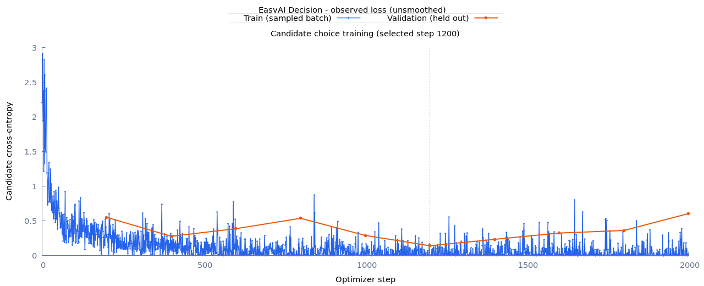

# 人物绑定：四条成组采样对照

本轮延续 [交接计划](handover.md) 的主体/角色评估与采样实验。保持 6,627,841 参数的 RoPE 模型、交叉熵、数据文本和优化预算不变，先比较采样方式。没有新增外部权重、蒸馏、RL 或推理规则。

## 数据版本与评估定义

按项目“向前迭代优先”的约定，新关系训练与评估统一使用 `data/decision/relations-v3/`。v2 目录、权重和历史报告留存，不增加旧数据评估分支；新评估器遇到旧元数据时，在模型计算前明确提示生成 v3。

本机逐行核对 train、sanity、validation、calibration、test、test-familiar：v3 与 v2 的 ID、group、文本、候选顺序、标签及行顺序完全相同；tokenizer fingerprint 仍是 `3e28d05d3a2711828a45a8c77994285b5350ecfb1bf248289f45aa182888fa3c`。因此可以直接用旧权重在 v3 上补测新指标。数据行 SHA256 会因新增元数据而变化，**旧 optimizer checkpoint 不能把 v3 当作原数据直接 resume**。

v3 不是新的独立测试集。本轮复用已查看的拆分做探索性对照；下一轮选方案后仍需新的隔离挑战集。新元数据只供采样、评估使用，不进入 tokenizer 的训练文本或神经网络输入。

```text
同一个语言 / 人物家庭 / 断言极性 / 句式 / 句序：

混合真假组                         问 A？    问 B？
A 买票，B 没买票                    成立     不成立
A 没买票，B 买票                    不成立   成立
                                  <---- 四条完整组 ---->

同真假组                           问 A？    问 B？
A 买票，B 买票                      成立     成立
A 没买票，B 没买票                  不成立   不成立

组采样 -> 单例交叉熵 -> 梯度累积 -> 一次 optimizer update
```

上图是肯定断言；否定断言也保留，标签相应改变。同真假和混合真假各占一半组，每组两条成立、两条不成立。采样先均匀选语言，再均匀选该语言的完整组，候选顺序继续使用原数据的确定性打乱。

这里没有跨样本的额外 loss，网络也不会同时读取其他样本来计算某一条的答案。每条仍独立计算候选交叉熵，再聚合梯度；成组方式改变了每次更新见到的反例组合与优化轨迹。它没有增加新知识，也不从数学上强制模型遵守主体切换规则，效果必须通过训练与泛化对照验证。

新增指标：

- `pairs.subject_switch`：同 state、同断言极性，切换被问人物。仅两人真假不同时答案翻转；另报告 `same_truth` / `mixed_truth`。
- `pairs.role_swap`：固定问题和句序，交换两人的真假事实。只评估混合真假，因为同真假交换不会形成不同输入。
- `groups.binding.all_correct`：四条全部正确的比例，另分同真假/混合真假。常量答案可以通过某些不变性检查，却不能通过四条全对检查。

原来的问题翻转、事实翻转、无关事实、句序检查及候选置换检查保留；各语言也独立报告新指标。完整泛化门槛为每语言 accuracy ≥95%、各类成对全对率 ≥90%，并且同真假、混合真假四条组全对率分别 ≥90%。已知用户探针单独记录，不能当作盲测。

## 命令与产物

准备新数据（输出目录必须不存在）：

```bash
bundle exec ruby bin/easy-ai prepare-relations --output data/decision/relations-v3 --vocab-size 400 --seed 1337
```

审计旧权重或任何使用相同 tokenizer 的新权重。包含 train / validation、买票与迟到的已知探针以及清缓存前后对照，不读取 test：

```bash
bundle exec ruby benchmarks/decision/binding_audit.rb --checkpoint runs/decision/relations-v2-curriculum/choice/best --output runs/decision/relations-v3-baseline-audit
```

三种子四条组训练，每个种子先从随机权重拟合 sanity 1000 步，再完整训练 2000 步；输出目录必须是新的：

```bash
bundle exec ruby benchmarks/decision/relations.rb --variants rotary --seeds 1337,2027,3407 --curriculum --patience 0 --steps 2000 --contrast-strategy binding --output runs/decision/relations-v3-binding
```

对照原两条问题翻转采样：

```bash
bundle exec ruby benchmarks/decision/relations.rb --variants rotary --seeds 1337,2027,3407 --curriculum --patience 0 --steps 2000 --contrast-strategy question_flip --output runs/decision/relations-v3-question-flip
```

两个策略的两阶段都使用对应采样方式，因此比较的是整套训练顺序，而不是只改变第二阶段。每个阶段配置写入 `config.yml`，有效策略保存在 checkpoint 中；验证集选择最佳权重，test 不参与 early stopping。

```text
runs/decision/relations-v3-binding/
|-- summary.json / comparison.tsv / index.html
`-- rotary-seed-<seed>/
    |-- sanity/fit.json
    `-- generalization/
        |-- config.yml / pipeline.log / train.log
        |-- choice/best/                # 验证选择的实验权重
        |-- train.json / validation.json / test.json
        `-- report/index.html           # 原始 loss、显存、PNG / SVG
```

配置使用 `paired_sampling: true` 与 `contrast_strategy: binding`；初始 microbatch 必须是 4 的倍数。显存容量不足时可以缩到 2 或 1，并增加梯度累积，保证每次 optimizer update 仍包含完整组。这是单例交叉熵的累积，不是必须同时把四条输入放进显存的成组损失。中断恢复保留实际 microbatch、累积数与采样策略。

两组实验完成后，生成汇总 HTML、PNG/SVG 对比图及全部种子指标：

```bash
bundle exec ruby benchmarks/decision/binding_report.rb --question-flip runs/decision/relations-v3-question-flip --binding runs/decision/relations-v3-binding --output runs/decision/relations-v3-comparison
```

## 固定旧权重的新增诊断

`relations-v2-curriculum/choice/best`（seed 1337，第 800 步）在 v3 上实测：

| 指标 | Train | Validation |
| --- | ---: | ---: |
| 单条 accuracy | 93.71% | 91.48% |
| 四条组全对率（全部） | 87.33% | 80.94% |
| 四条组全对率（混合真假） | 74.65% | 66.25% |
| 主体切换成对全对率（混合真假） | 74.91% | 69.38% |
| 角色互换成对全对率 | 75.55% | 69.38% |

总体准确率掩盖了混合真假时的绑定错误。买票探针完全复现先前输出：两条 P(成立) 为 0.3618226686 / 0.3933046863，清空缓存差值为零。审计产物在 `runs/decision/relations-v3-baseline-audit/`，包含数据与权重指纹；迟到例句仍有错误。

seed 1337 四条组实验的第二阶段原始曲线如下；此前另有 1000 步 sanity 训练。验证 loss 选中第 1200 步，后期训练 loss 更低但验证退化，不能用最后一步替代最佳验证权重。



## P1 三种子结果

两种策略均重新从随机权重运行 1000+2000 步，模型、数据、学习率和三个 seed 相同。模型选择仅使用 validation loss。

| seed | 两条采样 test | 四条采样 test | 两条采样混合组全对率 | 四条采样混合组全对率 |
| --- | ---: | ---: | ---: | ---: |
| 1337 | 80.78% | 88.91% | 38.13% | 71.25% |
| 2027 | 80.39% | 82.34% | 56.25% | 40.00% |
| 3407 | 78.91% | 76.41% | 7.50% | 33.75% |
| 平均 | 80.03% | 82.55% | 33.96% | 48.33% |

平均完整 train accuracy 为 93.09% → 96.60%，validation 为 87.73% → 92.16%。四条采样有优化收益，但**没有稳定解决绑定**：seed 2027 的混合组指标退步，seed 3407 的单条 test accuracy 退步，全部六次实验均未过泛化门槛。因此保留 `binding` 作为实验选项，默认 `question_flip` 不自动替换。


本机汇总：`runs/decision/relations-v3-comparison/index.html`，同目录包含 JSON、TSV、PNG/SVG 和可重绘的 gnuplot 脚本。报告校验两组数据 manifest、种子、步数及除采样策略外的有效配置一致。各 run 内保留完整训练与验证曲线、语言分项和失败样例。

用于复测买票问题的固定实验权重（seed 1337，最佳第二阶段第 1200 步）：

```ruby
predictor = EasyAI::Decision::Predictor.load(
  "runs/decision/relations-v3-binding/rotary-seed-1337/generalization/choice/best"
)
```

两条买票输入的 P(成立) 分别为 `0.0000087550` / `0.9990794132`，都判断正确，清缓存前后差值为零。它们属于原训练集的回归检查。中文“还早，不会迟到啦。”与英文 `Time is enough , I will not  be late` 仍然答错；概率未校准，不能把单个买票例子的高概率当作通用语义能力。审计在 `runs/decision/relations-v3-binding-audit/`。

## 实现与回归

- [relation_corpus.rb](../../lib/easy_ai/decision/data/relation_corpus.rb)：新增主体、角色和四条组定义，原有 family split 不变。
- [pair_sampler.rb](../../lib/easy_ai/decision/data/pair_sampler.rb)：两条/四条策略、组完整性和更新大小校验。
- [relation_evaluation.rb](../../lib/easy_ai/decision/relation_evaluation.rb)：新指标、分语言与真假模式、v3 输入检查。
- [binding_test.rb](../../test/easy_ai/decision/binding_test.rb)：布尔关系、分组平衡、元数据序列化、恒定答案反例与版本提示。
- [training_test.rb](../../test/easy_ai/decision/training_test.rb)：四条采样在缩批后中断恢复的参数一致性；原两条模式续训测试保留。

完整检查入口仍为 `bundle exec rake test`、`bundle exec rake test:learning`、`bundle exec rake lint`。数据、日志、下载及权重继续放在 Git 忽略目录；原 learning 展示图保留。

## P2 代表性热身与后续边界

P1 不够稳定，因此继续实施 P2 的代表性课程起点试验：从 train 内选覆盖全部 6 个动作、8 个人物的 8 个家庭，替换只有“小张/小赵带雨伞”的 64 条热身。新增 `prepare-relations --sanity-families N` 与实验入口同名选项，输出 manifest 记录实际家庭列表。选择保留原始第一个家庭，再按新增动作和人物覆盖贪心选择，不依据 validation/test 表现挑家庭。

准备出的 `data/decision/relations-v3-coverage/` 只有 sanity 内容改变（512 条）；完整 train、validation、calibration、test、test-familiar 和 tokenizer 与原 v3 逐字节相同。复现命令：

```bash
bundle exec ruby benchmarks/decision/relations.rb --variants rotary --seeds 1337,2027,3407 --curriculum --patience 0 --steps 2000 --contrast-strategy binding --sanity-families 8 --data data/decision/relations-v3-coverage --output runs/decision/relations-v3-coverage-reproduction
```

本机为缩短等待将三种子分别运行，产物为 `runs/decision/relations-v3-coverage-1337/`、`-2027/`、`-3407/`。每个种子仍使用 1000 步热身；未达到 99% 训练拟合门槛时会记录失败并跳过完整训练，不降低门槛强行继续。

P2 实测结果如下；全部未通过完整门槛，不对仅有 test 的两个种子计算一个掩盖热身失败的“三种子平均值”：

| seed | 512 条热身拟合 | 第二阶段最佳步 | 完整 train | validation | test | test 混合组全对率 |
| --- | ---: | ---: | ---: | ---: | ---: | ---: |
| 1337 | 93.55% | — | — | — | 未运行 | — |
| 2027 | 100% | 200 | 91.60% | 85.63% | 76.09% | 10.00% |
| 3407 | 100% | 1800 | 99.57% | 86.41% | 89.61% | 79.38% |

这不支持把“热身覆盖更多家庭”直接当成可靠修复。相同结构可以拟合 512 条任务，但不是所有初始化都在 1000 步内做到；完整训练还会出现明显泛化差距。下一轮先研究更平缓的课程推进（例如从已拟合的单家庭逐级增加家庭，并检查旧能力是否遗忘），再单独比较阶段学习率。若需给失败 seed 增加预算，应作为另一个明确标记的预算实验，不能覆写本轮失败。

完整跑完两阶段的每个种子热身采样 32000 行次，完整阶段采样 64000 行次，总计 96000 行次；P2 seed 1337 仅消耗热身的 32000 行次。最佳权重可能在预算结束前选出。这不等于相同数量的独立数据，也不代表不同策略消耗完全相同的 token 数或算力。后续应补充实际语言/真假模式采样量及 token 计数，并在扩大课程时记录这些差异。

本轮正式测试 **83 tests / 1071 assertions**、教学 **7 tests / 14 assertions**、RuboCop **98 files** 全部通过。八次完整训练的验证记录均使用 CUDA；预热后的进程显存大体位于 984–1034 MiB，没有持续累积到 CPU 回退。三个 P2 任务并行时一次整卡采样约 3407 MiB / 6144 MiB、利用率 70%；这是采样值，不是峰值保证。

接手时一并保留 `data/decision/relations-v3/`、`data/decision/relations-v3-coverage/` 及所需 `runs/decision/relations-v3-*` 目录；Git 中的文档和精选图不能代替未入库的权重、数据与原始报告。复测原诊断还需保留 v2 课程 checkpoint。

尚未完成：新的隔离挑战集、更细的多阶段课程、阶段学习率/衰减、辅助证据监督、公开语义混合及校准。本轮不把已知买票和迟到探针当作新的测试集，也不因为某个 seed 的输出正确而降低门槛。

后续关于“基础语义是否不足、是否引入 Qwen 教师”的综合分析见[迭代回顾第 7 节](retrospective.md#7-语义不足与-qwen-蒸馏下一步建议尚未实施)。建议给课程排查设置预算上限，并推进自然语义覆盖；这是下一轮策略建议，尚未新增教师或训练实验。
