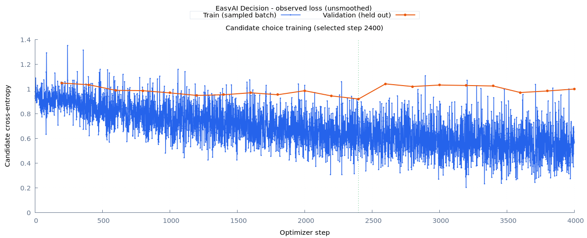

# Gold-supervised coverage experiment

This round returns to the existing from-scratch candidate model. It uses public gold labels and the existing student tokenizer. No pretrained LLM, GGUF runtime, teacher labeling, MLM stage, RL, curriculum change or model growth is involved.

Completed on 2026-09-29: all six training runs, twelve preserved-checkpoint evaluations, and aggregate HTML/PNG/SVG reports. Longer training narrowly passes the predeclared accuracy gate; wording expansion fails. Raw probability quality and the familiar binding/English-negation failures remain unresolved. No production-quality semantic model is claimed.

Implementation verification: 111 tests / 1549 assertions, learning 7 tests / 14 assertions, and RuboCop 119 files pass. Both a fixture smoke run and the real six-run comparison completed aggregate reporting and PNG/SVG generation. Coverage counters resume exactly without changing the model's learned parameters in the deterministic CPU regression; growth rollback preserves consumed exposure.

## Questions and fixed comparison

1. Does increasing supervised training from 1,000 to 4,000 updates improve the existing model?
2. At the same update budget, do additional task/question/candidate wording variants improve it further?

```text
Existing public gold train: 107,094 rows / 38,413 groups
                   |
         +---------+----------------------+
         |                                |
    Original data                  Original + 23,280
         |                         wording variants
         |                                |
    Random initialization, same architecture/tokenizer/loss
         |                                |
    Seeds 1337 / 2027 / 3407 for each arm
         |                                |
    Selected weights at budgets 1,000 and 4,000 updates
                   |
         Validation NLL selects weights
                   |
   Reserved public-dev challenge: 830 rows / 450 groups
                   |
   Accuracy, NLL, source/language metrics, candidate reversal
```

The model remains the public-semantic baseline: 12k vocabulary, width 256, four shared encoder blocks, four attention heads, FFN width 768, one interaction block, matching head, sinusoidal positions and dropout 0.1. This experiment deliberately retains that architecture, even though later relation experiments used RoPE. Changing both training budget and architecture would obscure attribution.

Training uses source balancing, effective batch 32 (microbatch 16 × accumulation 2), learning rate 0.0003, 100 warm-up updates and no early stopping. Validation is every 200 updates. Each seed's 1,000-update selection is preserved before continuing to 4,000; it is not reselected using later validation. This round has a 4,000-update cap per run, not an automatic extension to 8,000. Both arms and all three seeds are retained regardless of outcomes.

Runtime deviation: expanded-data seed 3407 encountered GPU capacity exhaustion while three jobs shared the local GPU. Checkpoint recovery reduced its microbatch to 8 and increased accumulation to 4, retaining effective batch 32 and CUDA execution. This changes dropout draws and floating-point accumulation, so that seed is not a strictly matched microbatch comparison. It remains in the results rather than being silently discarded. Aggregate resource records and each evaluated checkpoint's actual batching expose the deviation. Sequential reproduction avoids the three-job contention but is not promised to reproduce that recovered trajectory exactly.

Elapsed times are operational records, not a controlled throughput comparison: jobs overlapped, competed for resources, and one recovered with different batching. Token exposure counts also include repeated inputs; they are not unique-text counts or a language-model pretraining budget.

The improvement gate was fixed before training: mean challenge source-macro accuracy gain ≥3 percentage points, improvement in at least two of three seeds, and no mean source accuracy regression exceeding 3 points. Compare baseline 4k against baseline 1k for budget, then expanded 4k against baseline 4k for wording coverage. Report all outcomes; this decision rule is not a statistical confidence guarantee.

## Language-independent accounting, learned semantics

The user rejected keyword-based semantic categorization. `CoverageAudit` therefore reads only declared dataset source, language and gold-label metadata. It counts rows, source groups, sampling repetitions and observed coverage. It does not search for negation words, detect a language, infer a phenomenon or compute an answer. Japanese, Korean, Arabic and unspecified-language metadata use the same accounting path as Chinese and English.

An initial preparation used keyword-based selection. It was abandoned before any training, marked under `runs/decision/semantic-coverage-v1/ABANDONED.json`, and superseded by `semantic-coverage-v2`. No keyword-generated labels existed; nevertheless the selection bias was removed as requested. Do not use the abandoned directory.

The network remains responsible for interpreting text. Having a Unicode tokenizer and language-independent plumbing does not establish semantic ability in every language. This round's public data covers Chinese and English; broader language claims require appropriate training data and evaluation.

## What the extra rows mean

`SemanticExpansion` is a dataset adapter with explicitly defined task/candidate paraphrases for OCNLI, DuReader-YesNo and BoolQ. It preserves the original state, hypothesis content, candidate IDs, gold target and source group. It does not decide truth from text, flip negation or generate new facts. Selection is deterministic by ID hash, capped at 3,000 rows per declared source/language/gold-label stratum. Token-length checks reject overlong variants instead of truncating away content.

The expanded dataset has 130,374 rows and still 38,413 source groups. These are additional expressions, not 23,280 independent semantic facts. This is a limited first coverage experiment; it does not complete the larger proposal to acquire new natural-language examples for missing phenomena. The variants' lineage stays in JSONL, and no derivative crosses a split. Repeating wording templates alone cannot establish broad understanding.

The original 107,094 rows contain 107,094 distinct exact input keys after normalizing candidate order, with no conflicting gold targets for an identical source/state/question/candidate-text key. This structural check does not certify semantic annotation quality. Its record is `data-quality.json` in the run directory.

Both arms use the same tokenizer and update budget. Longer question/candidate wording changes tokens processed and compute cost; actual token exposure is reported so equal updates are not presented as equal computation.

Adding selected variants also changes within-source sampling frequencies and label proportions. This round tests that complete augmentation intervention. There is no duplicate-only control, so any improvement cannot be attributed exclusively to wording diversity; a duplicate-only control would be a subsequent experiment if the intervention helps.

## Exposure, recovery and evaluation

Opt-in `training.track_coverage` stores per-row visit counts and input-token totals in checkpoint state. Tokens count actual unpadded encoder inputs, including special tokens and repeated questions for each candidate. Only completed optimizer updates count. Validation and failed/retried work are excluded; these counters measure learning exposure, not total machine cost. GPU recovery restores counters with the committed checkpoint; rejected growth trials retain consumed exposure consistently with their step budget. Tracking does not change sampling or model arithmetic.

Only real candidates count toward token exposure; dummy candidates used for batch padding are excluded. Token counts are therefore not FLOP counts. At the 1,000-update baseline checkpoint, the first two seeds had seen approximately 22% of unique rows: about 83% of BoolQ, 14–15% of DuReader and 27% of OCNLI. Source balancing gives similarly many row occurrences to datasets of very different sizes. These observations establish uneven exposure, not that additional exposure will necessarily fix judgments.

Budget-end coverage measures the completed training trajectory. A selected earlier checkpoint has seen fewer updates and may have lower coverage; evaluation records its own `selected_checkpoint_coverage` separately. Do not assign the final 4,000-update exposure to weights selected at, for example, update 1,800.

The reserved challenge uses official public development groups omitted by the earlier 100-group evaluation cap. It is disjoint from the prior train/validation/calibration/test groups under the existing corpus grouping policy. The tokenizer is reused from the train-only public-semantic preparation. Selection uses source groups and deterministic hashes, not model mistakes. This is newly reserved project evaluation data, not a private benchmark or a guarantee of no semantic near-duplicates.

Final challenge evaluation is blocked until every planned arm/seed reaches both budget checkpoints. Checkpoint selection uses the existing validation NLL. Evaluation separately reports a fixed 300-row original training probe, validation, state/question shuffling, and challenge accuracy in original and reversed candidate orders. The probe is not full-training accuracy. Shuffle results measure sensitivity relative to original labels; changed inputs are not new gold examples.

Reports compare all seeds and source metrics. A favorable mean cannot hide two regressing seeds or a large source regression. The batched evaluator is tested against the public predictor and limits temporary tensor lifetime to individual batches. Probabilities in these comparisons are uncalibrated.

## Completed results

Fresh challenge: 830 rows in 450 source groups (BoolQ 168 rows, DuReader-YesNo 462, OCNLI 200). The table reports means across all three seeds. Accuracy is the macro average over sources; NLL, Brier and ECE are computed over challenge rows before averaging seeds. These are different aggregations, not source-macro probability metrics.

| Data / update budget | Source-macro accuracy | NLL ↓ | Brier ↓ | ECE ↓ |
| --- | ---: | ---: | ---: | ---: |
| Original / 1,000 | 54.31% | 0.85508 | 0.51695 | 0.06624 |
| Original / 4,000 | 57.36% | 0.88801 | 0.52266 | 0.08119 |
| Expanded / 1,000 | 55.29% | 0.86098 | 0.52143 | 0.05909 |
| Expanded / 4,000 | 55.39% | 0.87430 | 0.52411 | 0.07925 |

The longer-training comparison gains **3.05 percentage points**, with all three seeds improving and every source mean improving. It narrowly passes the 3-point accuracy gate. However, NLL worsens in every seed, and mean Brier/ECE also worsen. This is an accuracy improvement, not a demonstrated improvement in probability estimation or reliable semantics. The gate was not changed after seeing this disagreement between metrics.

Wording expansion at 4,000 updates loses **1.97 points** against original data. Only one seed improves, by just 0.075 points; all source means decline. It fails the gate and is not adopted as a quality improvement. Its mean NLL is lower than original/4k but higher than original/1k. The microbatch recovery caveat applies to expanded seed 3407; seed 2027 also regresses without that deviation, so the failure is not confined to the recovered run.

| Seed | Original 1k | Original 4k | Expanded 1k | Expanded 4k |
| --- | ---: | ---: | ---: | ---: |
| 1337 | 54.78% | 56.67% | 54.48% | 56.74% |
| 2027 | 52.84% | 56.85% | 56.67% | 53.09% |
| 3407 | 55.31% | 58.57% | 54.71% | 56.35% |


| Source | Original 1k | Original 4k | Expanded 4k | Training-majority diagnostic |
| --- | ---: | ---: | ---: | ---: |
| BoolQ | 55.95% | 60.32% | 58.73% | 61.31% |
| DuReader-YesNo | 66.81% | 68.11% | 66.45% | 46.97% |
| OCNLI | 40.17% | 43.67% | 41.00% | 37.50% |
| Source macro | 54.31% | 57.36% | 55.39% | 48.59% |

The majority diagnostic chooses each source's most frequent original-training label (`yes`, `yes`, `unknown` respectively). It uses no challenge labels to choose answers and is never used in neural inference. Overall performance exceeds this diagnostic, but BoolQ does not. Candidate reversal agreement is 100% for every checkpoint; the shared per-candidate scorer makes order consistency expected, and it does not establish correct semantics.

The fixed 300-row training probe rises from 60.22% to 69.56% source-macro accuracy with longer original-data training, while challenge accuracy reaches 57.36%. This is a limited probe, not full-training accuracy. On the smaller validation diagnostic subset, the original/4k means are:

| Source | Original inputs | Shuffled state | Shuffled question |
| --- | ---: | ---: | ---: |
| BoolQ | 48.59% | 50.28% | 49.72% |
| DuReader-YesNo | 68.50% | 38.85% | 70.08% |
| OCNLI | 48.62% | 47.47% | 32.64% |

These results support task-specific input dependence, not robust joint reasoning: DuReader uses the answer/state strongly, while OCNLI is much more sensitive to the hypothesis/question than to the premise/state. Hypothesis shortcuts are a plausible explanation to test, not a proven account of every error. The diagnostic subset differs from the challenge, and shuffled inputs retain old labels only to measure sensitivity.

At the end of 4,000 updates, original-data runs have visited 57.52–57.71% of unique rows and 76.96–77.15% of source groups, processing 13.01–13.02 million unpadded input tokens. Expanded runs visit 54.08–54.37% of their larger row set and 76.09–76.70% of the same source groups, processing 14.00–14.05 million tokens. Thus the variants add repeated expressions and roughly 8% more token work, without adding source groups or improving this comparison.

Original/4k weights were selected at steps 1,800 / 2,400 / 3,200, with actual selected-checkpoint row coverage 34.51% / 42.16% / 50.68%. Expanded weights were selected at 1,600 / 2,000 / 2,400. Every run finished on CUDA. There was one capacity recovery and no CPU fallback; validation memory measurements stabilized after allocation/recovery. The sampled process-memory ranges and before/after validation changes are retained in `comparison.json`; they are not continuous peak measurements.



The curve shows why lower sampled training loss alone is not the acceptance criterion. The selected original-data seed 2027 weights come from update 2,400, before later validation deterioration. These challenge results use a different evaluation set from the historical 57.56% public-semantic score; do not connect them into one cross-experiment improvement curve.

## Decision and next experiment

Keep actual exposure tracking and the bounded, validation-selected longer-training baseline. Retain wording expansion as a failed experiment rather than enabling it in the default pipeline. Do not extend this trajectory indefinitely or infer that increasing model width will fix the remaining errors.

The next useful data intervention is reviewed, task-aligned gold supervision in which the same question/hypothesis has different answers under different states, with source groups isolated across splits. Require premise/state sensitivity and paired correctness as well as aggregate accuracy. If phenomenon slices are needed, use explicit annotations; keyword presence must not define negation, binding, modality or language capability. New natural expressions and additional languages need actual examples and evaluation, rather than more copies of a task prefix. This work remains planned, not implemented by this wording experiment.

Probability quality also needs its own acceptance criterion. Fit any temperature on the separate calibration split and evaluate on new reserved data in the next round; temperature can change confidence but cannot repair an incorrect candidate ranking. The challenge used here is now observed development evidence and must not become a repeated tuning target described as fresh evaluation.

For local inspection, start a fresh Ruby process and load the original-data seed 2027 selection (chosen by lowest validation NLL among that arm's three seeds, not highest challenge accuracy):

```ruby
require "easy_ai"
predictor = EasyAI::Decision::Predictor.load(
  "runs/decision/semantic-coverage-v2/baseline-2027/selected-4000",
  device: "auto"
)
```

This is an experimental, uncalibrated checkpoint with the failures below. `selected-4000` is already the checkpoint directory; do not append `/best`. For exact training continuation, preserve the run's resumable `choice/` artifacts, not only the selected inference weights. Handover requires copying ignored data/run artifacts separately from Git.

Selected `weights.pt` SHA256: `1abdbe55932a44bebaff4d6ad49e8bb3901d2266bdc79f32e794744f3cc0c5ef`.

## Known development probes

These familiar examples are diagnostics, not the reserved challenge. Both columns use seed 2027 within the 4,000-update budget: original-data weights selected at update 2,400 and expanded-data weights at update 2,000.

| Input / question | Candidate shown | Original data | Expanded data | Observation |
| --- | --- | ---: | ---: | --- |
| `我要迟到了` / `会迟到么` | `会` | 85.97% | 88.34% | Both correct expression direction |
| `不会迟到了` / `会迟到么` | `会` | 3.28% | 1.87% | Both correct negative direction |
| `I will not be late` / `Will I be late?` | `yes` | 54.81% | 80.79% | Both incorrect; expansion increases confidence in the wrong answer |
| `小林买了票，小周没有买票。` / `以下说法成立吗：小周买了票。` | `成立` | 67.05% | 67.36% | Both incorrect |
| `小周买了票，小林没有买票。` / same question | `成立` | 67.13% | 68.60% | Both correct, but the subject swap has little effect |
| `明天七点叫我起床` / `Intent?` | `music play` | 92.88% | 68.38% | Both incorrect; intent classification is outside this round's training tasks |

The two ticket examples demonstrate that correct lateness predictions do not establish person–fact binding. The earlier relations training contained those ticket examples; neither exact state appears in this round's public training data (membership checked). They are therefore familiar development probes, not training-set failures for this run. `I think I will be late` also requires distinguishing an expressed belief from a guaranteed future fact. Neither a high raw probability nor one corrected example establishes calibration or broad understanding.

Raw development results are saved in `manual-probes.json` and `binding-probes.json` under each of `baseline-2027/` and `expanded-2027/` in the run root. They do not change the frozen budgets, challenge or acceptance criteria.

## Reproduce and inspect

Use a new output directory for a complete sequential run:

```bash
bundle exec ruby benchmarks/decision/semantic_coverage.rb \
  --output runs/decision/semantic-coverage-reproduction
```

Preparation reuses local files under `data/decision/semantic-public/` and `data/decision/downloads/semantics/`; it does not download model weights. The protocol records dataset, tokenizer and raw-source checksums. Missing source data should be prepared using the existing [public semantic-data workflow](semantics.md).

Individual phases are available for monitored execution:

```bash
bundle exec ruby benchmarks/decision/semantic_coverage.rb --phase prepare
bundle exec ruby benchmarks/decision/semantic_coverage.rb --phase train --arm baseline --seed 1337
# Run both arms (baseline, expanded) for all three seeds before evaluation.
bundle exec ruby benchmarks/decision/semantic_coverage.rb --phase evaluate --arm baseline --seed 1337 --budget 1000
# Evaluate each arm/seed at both 1000 and 4000, then:
bundle exec ruby benchmarks/decision/semantic_coverage.rb --phase report
# Optional descriptive summaries and training-majority diagnostic:
ruby benchmarks/decision/semantic_coverage_summary.rb runs/decision/semantic-coverage-v2
```

Default output: `runs/decision/semantic-coverage-v2/`. Each run contains per-step `choice/training.jsonl`, validation/memory `choice/metrics.jsonl`, `train.log`, coverage JSON at both budgets, preserved selected checkpoints and `report/index.html` with training charts. Final aggregate output is `index.html`, `comparison.json`, TSV, PNG/SVG and the gnuplot script. Data, downloads, weights and raw runs remain ignored by Git. Historical Learning charts and previous experiment weights remain intact.
