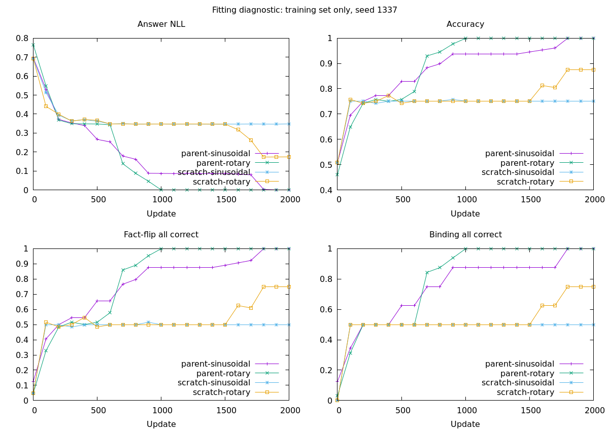

# Positional encoding and small-set fitting diagnostic

Completed 2026-10-01. This is a **training-set diagnostic**, not a new generalization benchmark or a promoted predictor. All four fixed 2,000-update budgets finished on CUDA.

The evidence round reached only about 75% answer accuracy on its 128-row sanity set after 300 updates. Earlier relationship experiments fit a different tiny set better with RoPE. This round tests whether that observation transfers to the current data/tokenizer, while separating parent continuation from random initialization.

```text
                       same tokenizer + 128 bilingual rows
                                      |
                 +--------------------+--------------------+
                 |                                         |
       own scratch-trained parent                   random initialization
                 |                                         |
          +------+-------+                          +------+-------+
          |              |                          |              |
       sinusoidal       RoPE                    sinusoidal        RoPE
          |              |                          |              |
          +---------- each: 2,000 updates, seed 1337 ---------------+
                                      |
                        training fit + fact-flip groups
                        gradients + state sensitivity
                        no held-out quality claim
```

Within each initialization pair, every starting parameter tensor is identical (asserted before GPU transfer). RoPE changes the positional computation; it introduces no new parameters. Switching a parent trained with sinusoidal positions to RoPE changes its representation, so parent continuation is not equivalent to pretraining with RoPE. The random-start pair provides a separate comparison without that transfer mismatch.

All fits reset the optimizer, disable dropout and the evidence head, use answer CE only and retain all candidate labels. Candidate order is shuffled reproducibly per microbatch; target IDs are preserved. Example schedules are deterministic and their complete row-visit counts must match across all four fits. No paired-group sampling, source balancing, extra loss, growth, calibration or early stopping is added. These changes relative to the previous evidence sanity run are shared controls; that historical run is not a matched comparator.

Configuration: four encoder layers, hidden size 256, four heads, FFN 768, one interaction block and matching scorer; 6,627,841 parameters. Microbatch 16, accumulation 2, learning rate 1e-4, warmup 50, gradient clip 1, weight decay 0.01, FP32, GPU-first with 4,096 MiB process budget. Inputs retain strict 256/128-token limits. The sinusoidal condition retains the parent's position scale 0.02.

The fixed seed is 1337. One seed can identify a fitting failure or suggest a remedy; it cannot establish seed stability. Evaluate the whole training set at step 0 and every 100 updates. The final step-2,000 weights are reported regardless of intermediate peaks. The diagnostic target is at least 99% training accuracy and 95% complete fact-flip correctness; passing does not imply generalization.

Measurements include answer NLL, Brier/ECE, all-correct fact-flip/binding groups, candidate margin variability and gradient norms grouped by encoder/interaction/matching/scorer. Norms are taken **after clipping and the optimizer update**, not before clipping, and indicate surviving gradient activity rather than gradient quality. Final checks reverse candidate order and shuffle state within each language. Shuffled inputs retain original labels; their accuracy is a sensitivity measurement, not accuracy on newly verified examples. Failures preserve original state/question/label and logits for inspection.

Preparation verifies the previous data checksums, preserves the tokenizer, records initial checkpoints and tensor hashes, and checks that states have distinct token sequences. A separate audit checks for identical model inputs with conflicting labels. Runs refuse to overwrite existing directories.

Reproduction in a new output directory:

```bash
bundle exec ruby benchmarks/decision/fitting.rb --phase all --output runs/decision/fitting-v1-reproduction
```

Existing local experiment: `runs/decision/fitting-v1`. Individual phases are `prepare`, `train` and `report`; training requires `--start parent|scratch --position sinusoidal|rotary`. Run GPU fits sequentially. A failed or interrupted run is preserved; this diagnostic runner does not automatically resume it.

```bash
tail -f runs/decision/fitting-v1/parent-sinusoidal/train.log
bundle exec ruby benchmarks/decision/fitting.rb --phase report --output runs/decision/fitting-v1
```

Ignored artifacts: protocol and tokenizer, copied data, initial checkpoints, four training directories with logs/checkpoints, per-100-update diagnostics, final summaries, original failing examples, report and chart. Existing public-test panels are not used for optimization or model selection in this diagnostic.

## Harness failure caught before the valid comparison

The first parent/sinusoidal attempt is preserved under `runs/decision/fitting-v1-invalid-evaluator/` with an `INVALID.txt` explanation. It is excluded from all comparisons. Per-100-step scores stayed byte-for-byte identical while live-model gradients grew, revealing stale optimizer references rather than a learning failure.

Torch.rb 0.23 `Module#to` creates replacement `Parameter` objects even for an unchanged device. `SemanticCoverageEvaluation` previously called it unconditionally. The new fitting harness evaluates an active training model, so that call detached the optimizer from the live parameters. The evaluator now preserves parameters when they are already on the requested device, including the `cuda`/`cuda:0` spelling difference. A regression verifies parameter identity and a subsequent optimizer update; a real CUDA check also confirmed a nonzero score-weight update.

The valid experiment restarted from its recorded initial tensors. Earlier evidence training used the trainer's own validation path, which does not invoke this evaluator during optimizer updates; this newly caught harness failure is not evidence that those historical fits were invalid.

## Results

All starting-tensor differences within positional pairs were zero; all four complete row-visit vectors match. Candidate reversal produced exactly zero logit error in every condition. The 128 model inputs are unique with no conflicting labels; they include 64 Chinese and 64 English rows, representing 32 distinct states/token sequences.

| Initialization / position | Final training accuracy | Chinese / English | Fact-flip all correct | Binding all correct | First evaluated fitting gate | Final NLL |
|---|---:|---:|---:|---:|---:|---:|
| Own parent / sinusoidal scale 0.02 | 100% | 100% / 100% | 100% | 100% | 1,800 | 0.00001783 |
| Own parent / RoPE | 100% | 100% / 100% | 100% | 100% | 1,000 | 0.00000298 |
| Random / sinusoidal scale 0.02 | 75% | 75% / 75% | 50% | 50% | Not reached | 0.34818 |
| Random / RoPE | 87.5% | 100% / 75% | 75% | 75% | Not reached | 0.17448 |



Metrics are evaluated every 100 updates: the first observed gate is not the exact update where the model first learned a case, and early improvements were not used to stop or select runs. The chart plots full-set answer NLL and group correctness, not a changing microbatch loss. It includes no validation or test curve because no held-out evaluation was performed.

All 32 random/sinusoidal errors occur in mixed-truth states, with 16 errors in each language. Random/RoPE retains 16 English errors, all in mixed-truth states. The explicit generator's world metadata supplies that audit; no keyword classifier assigns the phenomenon. This pattern is consistent with an unresolved binding weakness, but does not by itself reveal the internal mechanism.

Shuffling states within language gives 53.91%, 55.47%, 53.91% and 52.34% accuracy in the table's order. Those perturbations retain old labels and are sensitivity diagnostics, not new gold tests. High perturbed NLL (including 7.23/8.22 for the fully fitted parents) shows that confident training fit does not guarantee reliable uncertainty on altered inputs.

Live GPU process samples were 448 MiB during parent/sinusoidal and 478 MiB near the end of random/RoPE. They are isolated observations, not measured peaks. Every recorded training step used CUDA; no CPU fallback occurred.

## What to carry forward

- The existing 6.63M-parameter architecture **can fit** this set using our own previously scratch-trained parent. The old 300-update sanity failure is not proof of inadequate parameter capacity. The new conditions also disable dropout/evidence and permute candidates, so do not attribute the historical comparison solely to a longer budget.
- RoPE reaches the parent fitting gate earlier and improves random-start final fit by 12.5 percentage points in this seed. This supports carrying RoPE into a larger controlled experiment; it does not establish universal superiority over sinusoidal encodings, other position scales or other seeds.
- The parent has prior public-source training; random initialization does not. Both get the same **additional** budget, not equal total lifetime compute. Parent fitting is a continuation of our from-scratch learning path, not imported foundation weights.
- Random-start English binding remains unresolved. If investigating cold-start optimization next, keep these failures and compare an appropriate learning-rate/budget or grouped-counterexample change independently. Do not silently extend this finished run to manufacture a pass.
- Next priority is independent natural-task/relationship generalization from our own trained parent, with common validation/calibration, task/language reporting and a retained sinusoidal reference. No predictor is promoted and no global default is changed based on this tiny, single-seed result. See [next experiment](next-experiment.md).

Verification: full suite **142 tests / 1,918 assertions**, zero failures/errors; learning **7 tests / 14 assertions**, zero failures/errors; real CUDA parameter-reference/update regression passed. Final code/style checks are recorded in the handover.
