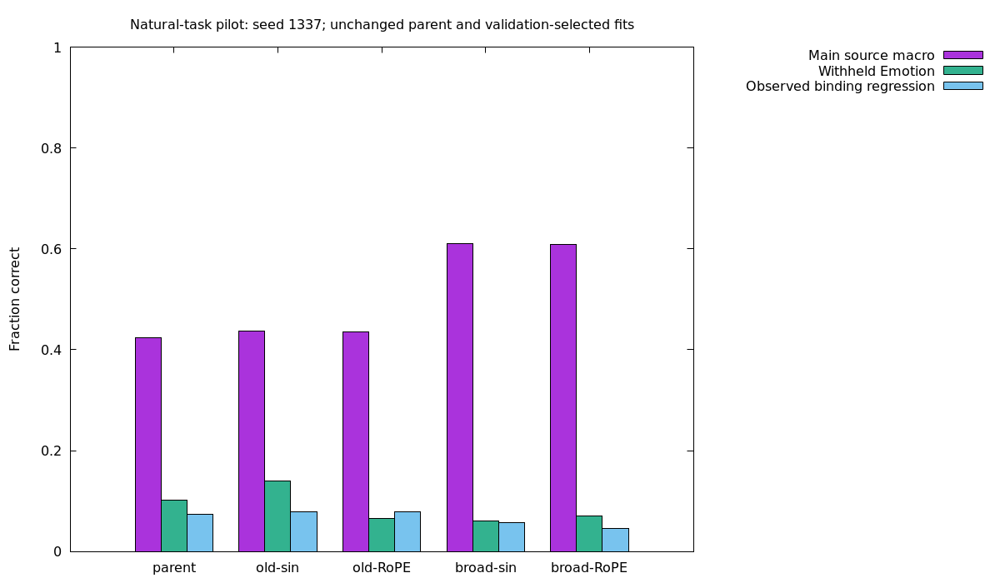
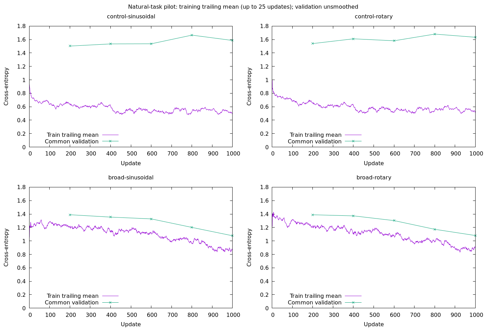

# Natural-task generalization pilot

Status: completed on 2026-10-01. No predictor is promoted as reliable. This follows the [fitting diagnostic](fitting.md), where our own previously trained parent could fit 128 bilingual examples. A training fit alone did not establish generalization.

## Question and controlled comparison

Does broader supervised task coverage improve held-out natural decisions, and does the positional encoding change that result? The single-seed pilot separates these effects:

```text
Own scratch-trained public parent (same tensors; frozen 12k tokenizer)
                           |
              +------------+-------------+
              |                          |
       old QA/NLI data             old QA/NLI + news
              |                    + en/zh request domains
       +------+------+              +------+------+
       |             |              |             |
   sinusoidal       RoPE        sinusoidal       RoPE
       |             |              |             |
       +-------------+--------------+-------------+
                           |
            common validation NLL selects checkpoint
                           |
               common calibration fits temperature
                           |
              fresh examples of trained task families
              + entirely withheld Emotion task
              + observed binding panel (regression only)
```

All four conditions start from `runs/decision/semantic-coverage-v2/baseline-1337/selected-4000`, not the tiny fitting checkpoint. Initial tensor equality is checked. This is continued training of our own model, with no external weights or teacher responses. Positional functions differ, parameter shapes do not.

Before opening fresh test results, the evaluation plan also reserves the unchanged own parent as a fifth reference (original sinusoidal positions; no additional training). Its temperature is fitted on the same common calibration panel after all four budgets finish. This distinguishes a broad-vs-control data effect from actual improvement over the starting model. It does not add a fifth training condition or alter the frozen training protocol.

Seed 1337; fixed 1,000 updates per condition; FP32; learning rate 1e-4; warmup 100; AdamW weight decay .01; gradient clipping 1; dropout .1; answer cross entropy only. Full candidate sets are deterministically permuted; no negative subsampling. Source-balanced sampling, microbatch 4, accumulation 8, effective batch 32. Early stopping, model growth and evidence supervision are off. Checkpoint selection uses the same 480-row validation panel every 200 updates. The shared 480-row calibration panel is separate. All four budgets must finish before test evaluation is allowed.

Candidate-count grouping avoids padding two-, three- and four-choice examples to eighteen choices. Each group contributes its example-count-weighted mean CE. A CPU regression verifies equal losses and parameter gradients with dropout disabled. With dropout enabled the random masks need not match an ungrouped implementation; grouping is used in every condition.

Instrumentation correction during the control runs: grouping initially left the collator's token count and the separate `choice_loss` trace component at the last subgroup. The total CE used for backpropagation, validation, checkpoint selection and loss charts was already correct. The corrected hook aggregates all groups; it adds no tensor/RNG operations. Both controls had already loaded the old instrumentation; broader runs use corrected instrumentation. Preserve raw counters and traces, and use `training_audit.reconstructed_input_tokens`, recomputed from frozen row visits and tokenizer, for every condition's exposure comparison. The first control recount is 3,255,350 tokens versus its raw 1,755,473. A regression checks loss/gradients, component aggregation, token aggregation and visit-weighted reconstruction.

The frozen manifest is `runs/decision/natural-v1-pilot/protocol.json`, containing configurations, source/data/checkpoint hashes, split counts, exclusions and GPU measurements. Equal maximum training budgets do **not** mean equal input tokens, FLOPs, or exposure to each task. Evaluated checkpoints can also have different selected steps; report their exposure separately from terminal-budget exposure. The source mixture is the intervention, including its changed allocation of task exposure and the resulting common-panel checkpoint selection. Report coverage and token counts rather than claim equal evaluated-weight compute.

## Data and independence

| Source / language | Broad training | Main test | Full candidates |
|---|---:|---:|---:|
| BoolQ / English | 6,107 | 166 | 2 |
| DuReader-YesNo / Chinese | 67,656 | 150 | 3 |
| OCNLI / Chinese | 33,331 | 185 | 3 |
| AG News / English | 101,343 | 256 | 4 |
| MASSIVE scenario / English | 9,338 | 256 | 18 |
| MASSIVE scenario / Chinese | 9,125 | 256 | 18 |

Control training retains the original 107,094 public rows. Broad training totals 226,900 rows. Main evaluation has 1,269 decisions; some QA groups contain multiple decisions, so rows are not all statistically independent. Emotion has 400 additional English decisions and six candidates; it is excluded from training, validation and calibration. Its labels are dataset annotations, not a claim that all natural emotions have one unambiguous true label.

AG News uses the official training CSV from a [commit-pinned mirror](https://github.com/mhjabreel/CharCnn_Keras/blob/555590db4219b1243abb1918effd6a7425a2d75f/data/ag_news_csv/train.csv), SHA-256 `76a0a2d2f92b286371fe4d4044640910a04a803fdd2538e0f3f29a5c6f6b672e`. MASSIVE 1.1 uses cached official train/dev partitions; original test rows never enter preparation. Hash splits reserve news training groups and MASSIVE train/dev groups for evaluation. Parallel en/zh original IDs and identical normalized material are connected before splitting, so one translation cannot train while another tests. Original dev material never trains.

The current parent's public training material and recorded historical evaluation panels are blocked when building new panels; the exact exclusion files and hashes are listed in the manifest. This is not a claim to track every informal IRB input or all earlier models' training text. Normalized text hashes are a leakage control, not semantic inference or labels. Conflicting duplicate inputs are excluded as entire connected components. Test rows are selected by ID/group hashes, independently of target. Unsupported lengths are excluded and counted; results apply to supported inputs, not the full unrestricted benchmark.

Fresh QA/NLI decisions come from unused groups in the cached public development sources. Fresh Emotion rows come from the unused portion of the cached official test snapshot, after excluding all historical material. The attempted separate Emotion validation download returned HTTP 403; the cache-only alternative was frozen before training or model evaluation. Cached response bytes are SHA-pinned, not a claimed immutable upstream dataset revision.

The first preparation was rejected by the stricter material-only leakage guard: eight old validation and eleven old calibration short answers also occurred in old training under different questions. That attempt is preserved in `runs/decision/natural-v1-pilot-rejected-overlap/`. Current common panels filter training material, and calibration additionally excludes validation material. This strengthens this experiment's split rule; it does not by itself invalidate historical question-conditioned evaluations.

Sources retain their individual licenses: MASSIVE CC-BY-4.0; BoolQ CC-BY-SA-3.0; OCNLI CC-BY-NC-2.0; DuReader's research/noncommercial terms. AG News and Emotion cards do not establish unrestricted commercial licensing. Treat the combined experiment as a noncommercial learning artifact; do not infer one blanket license from the adapter code.

## Memory and reproducibility

The synthetic dense batch uses the pilot's maximum candidate count (18), state limit 256 and candidate length limit 128. Eighteen is a dataset bound, not a universal API limit. Microbatch 16 hit CUDA OOM; eight exceeded the 4,096 MiB process budget at 5,104 MiB; four settled at 2,914 MiB across repeated backward/validation boundaries. These are process-memory observations, **not allocator peak measurements**. Runtime validation traces must also be inspected for continuing growth. The successful profile is included in the frozen manifest.

From the repository root, with the earlier semantic/MASSIVE/Emotion caches and own parent available:

```bash
bundle install
# Optional for downloads: export https_proxy=http://127.0.0.1:20122
bundle exec ruby benchmarks/decision/natural.rb --phase all --output runs/decision/natural-v1-reproduce
```

The command verifies/downloads pinned AG News, profiles CUDA in a separate process, prepares immutable panels, trains four subprocesses, calibrates/evaluates and writes charts. An existing output directory is rejected. Profiling requires an accessible NVIDIA GPU; training retains the existing GPU-first device policy and budget enforcement. Existing caches are prerequisites, not silently downloaded substitutes. Use a new directory for reruns.

For prepared data, run one condition with `--phase train --mixture broad --position rotary --output runs/decision/natural-v1-pilot`. Run `benchmarks/decision/natural_evaluation.rb --phase all` after all four conditions finish. Logs show step, loss, device, elapsed time and ETA. Artifacts remain gitignored.

Permanent code:

- `lib/easy_ai/decision/data/natural_adapter.rb`: dataset schemas and full candidate definitions.
- `lib/easy_ai/decision/data/natural_corpus.rb`: grouping, split/overlap checks and input limits.
- `benchmarks/decision/natural.rb`: experiment, candidate grouping and orchestration.
- `benchmarks/decision/natural_memory_profile.rb`: dense CUDA boundary profiling.
- `benchmarks/decision/natural_evaluation.rb`: calibration, metrics, diagnostics and comparison plot.
- `lib/easy_ai/decision/training_report.rb`: standard loss/memory PNG, SVG, console and HTML reports; the existing learning gradient-descent illustrations remain unchanged.

Each condition gets `report/loss.{png,svg,txt}` and `report/index.html`; memory charts use recorded validation boundaries. The evaluation runner writes `comparison.png`, `summary.txt`, `report.json` and per-condition calibrated checkpoints.

Training loss and common validation NLL have different task mixtures in the old-data control. Their gap alone is not a clean measure of overfitting; validation includes tasks the control was not trained on. Loss magnitudes between old/broad mixtures also reflect different candidate counts.

## Interpretation rule

Main accuracy is an equal-source macro, averaging en/zh within MASSIVE first. Also report each source/language cell, per-label recall, majority/chance baselines, NLL, Brier and calibration error. Missing test labels are explicit; observed-label balanced accuracy does not imply evaluation of absent labels. State/question perturbations on QA/NLI measure sensitivity while retaining original targets; they are not new gold tasks.

Old fact-flip/binding tests are observed regression diagnostics. Better news/domain accuracy demonstrates improvement on trained task families, not general reasoning. Their fixed label descriptions also do not establish robustness to arbitrary candidate wording or unseen candidate concepts. Withheld Emotion tests one English task family only, not all-domain or all-language transfer. A single seed and 1,000-update pilot cannot establish robust architectural superiority. The larger multi-seed round remains conditional on useful pilot evidence; no new global default is selected here.

## Completed results (2026-10-01)

All four 1,000-update fits completed on CUDA, with no CPU fallback, before any fresh test was evaluated. The unchanged own parent was evaluated as an additional reference. No external weights, teacher outputs, RL, growth or inference word rules were introduced.

| Condition | Selected update | Main source-macro accuracy | Withheld Emotion | Binding groups all correct | Calibrated main macro NLL |
|---|---:|---:|---:|---:|---:|
| parent-sinusoidal | unchanged parent | 42.43% | 10.25% | 7.36% | 1.3625 |
| control-sinusoidal | 200 | 43.65% | 14.00% | 7.94% | 1.3530 |
| control-rotary | 200 | 43.54% | 6.50% | 7.81% | 1.3635 |
| broad-sinusoidal | 1000 | 61.04% | 6.00% | 5.73% | 0.9777 |
| broad-rotary | 1000 | 60.84% | 7.00% | 4.56% | 0.9679 |



The following accuracy percentages use the same frozen fresh source/language cells. Main macro averages languages within MASSIVE, then weights five sources equally.

| Source / language | Parent | Old sinusoidal | Old RoPE | Broad sinusoidal | Broad RoPE |
|---|---:|---:|---:|---:|---:|
| OCNLI/zh-CN | 42.16 | 46.49 | 47.57 | 46.49 | 42.16 |
| DuReader-YesNo/zh-CN | 75.33 | 71.33 | 70.00 | 70.67 | 70.67 |
| BoolQ/en-US | 60.84 | 65.06 | 68.67 | 63.25 | 63.86 |
| AG-News/en-US | 29.69 | 31.25 | 26.95 | 75.78 | 79.30 |
| MASSIVE-Scenario/en-US | 5.47 | 5.86 | 5.47 | 50.78 | 48.83 |
| MASSIVE-Scenario/zh-CN | 2.73 | 2.34 | 3.52 | 47.27 | 47.66 |

Broader data improves main macro by **17.40 / 17.31 percentage points** versus the positional controls. Versus the unchanged parent, the gains are **18.61 / 18.42 points**. The effect is concentrated in news and request-domain classification. It is not a uniform semantic improvement: BoolQ falls 1.81 / 4.82 points versus controls; broad sinusoidal DuReader is 4.67 points below the unchanged parent; broad RoPE OCNLI is 5.41 points below its control. A positive aggregate does not pass a per-task preservation gate.

Withheld Emotion is below its 16.67% uniform-choice and 30.5% majority baselines in every condition. Broad sinusoidal/RoPE predict `surprise` for **326 / 301 of 400** rows (81.5% / 75.25%), while only **11** rows have that gold label (2.75%). `report.json` includes a post-hoc choice-distribution audit from stored logits. This supports investigating unknown-option score priors; it does not prove the network completely ignores states or establish the exact cause. Do not improve the headline by quietly adding this test family to training or reusing it as fresh acceptance.

Binding groups pass only 5.73% / 4.56% in broad models versus the parent's 7.36%. These are observed diagnostics, not fresh generalization scores. Broad MASSIVE observed-label balanced accuracy is only about 32–36% despite 47–51% raw accuracy; rare-domain performance still matters. All six source/language cells represent every label in this frozen sample.

Broader calibrated macro NLL improves to .9777 / .9679 from the parent's 1.3625, but probability quality is not uniformly preserved. Broad BoolQ NLL worsens to .7321 / .7063 from .6596, and ECE is about .147 / .127. Per-cell raw/calibrated NLL, Brier, ECE, recalls, baselines and reliability bins remain in evaluation JSON; one global temperature does not certify arbitrary user decisions.

**RoPE has no demonstrated generalization advantage in this pilot.** Main accuracy is 61.04% versus 60.84%, while final validation NLL is 1.0764 versus 1.0801 (sinusoidal/RoPE). These tiny differences from one seed are not an architecture ranking. Retain the existing sinusoidal default; neither checkpoint is promoted as a reliable general predictor.



Both broader validation curves are still improving at the final update. Thus this pilot does not establish convergence or a capacity ceiling. Old-data checkpoints select update 200; broad checkpoints select 1,000. Their selected weights have **6,400 versus 32,000 additional example visits**, respectively. Terminal allocated budgets are equal, evaluated-weight exposure is not. The main effect includes the predefined common validation selection, not a strictly equal-step evaluated-weight ablation.

Full-budget visits are identical within each positional pair. Corrected/reconstructed input tokens are **3,255,350** for each control and **4,939,843** for each broad fit. Selected-control exposure is 640,992 tokens; selected-broad exposure is 4,939,843. Broad training sees 27,549 unique rows, including only **6,325 of 101,343** news training rows. Its visit counts are BoolQ 6,371; DuReader 6,381; OCNLI 6,374; news 6,537; MASSIVE en/zh 3,260/3,077. Corpus size is not consumed training volume. Use `training_audit` rather than the preserved undercounted raw control counters.

Validation boundary memory stabilizes at **570 / 598 / 692 / 726 MiB** for old-sinusoidal / old-RoPE / broad-sinusoidal / broad-RoPE. Later validation boundaries show no continuing growth. These are actual-run boundary observations, not peak memory claims. The dense 18-candidate profile still determines the conservative microbatch.

## Next decision and handover

Keep the useful broader data/adapters and both positional references. The immediate diagnostic is **candidate-prior versus state-dependent scoring on unseen options**, using unchanged checkpoints, candidate-only/neutral-state probes and existing observed panels. Treat the dominant Emotion choice as a hypothesis to test, not a linguistic rule to code into inference. Audit plain-word candidate variants separately from fixed class names.

The larger training experiment should include per-source/language preservation and probability-quality checks, not only a rising overall macro. More CE updates are justified by falling broad validation NLL, but their likely benefit is trained-task learning; no evidence here guarantees unseen-task semantics. Before a costly multi-seed capacity expansion, compare a controlled train-only MLM warm-up plus the same supervised mixture against CE continuation from identical own weights. This is a proposed foundation-learning ablation, not a proven fix or a return to teacher distillation. Reserve a new independent task family before training; this round's Emotion/main panels are now observed diagnostics. Keep model size and positional default fixed until the hypothesis is isolated. Do not automatically launch the previous larger three-seed proposal as though this pilot passed all preservation/transfer gates.

Experimental load paths (selection used validation only; no production promotion):

```ruby
predictor = EasyAI::Decision::Predictor.load(
  "runs/decision/natural-v1-pilot/broad-sinusoidal/calibrated"
)
# The positional comparison is broad-rotary/calibrated.
```

`calibrated` means fitted on the 480-row common panel, not reliable on every task. Predictions, logits, probabilities, protocol/data hashes, coverage, temperature, source-level exposure and failure distributions are all retained under the ignored run root. The comparison and loss charts above are tracked, reviewed copies. The original learning gradient-descent illustrations remain in README.

Final provenance/verification: `provenance-supplement.json` checks all six raw semantic files against the older parent source manifest and rebuilds all 501 fresh public rows identically. The original pilot protocol is unchanged; future preparation records/checks these raw sources and the pinned news checksum explicitly. Tests: 156 / 2067, learning 7 / 14; final lint and whitespace review logged under `tmp/natural-*.log`.
