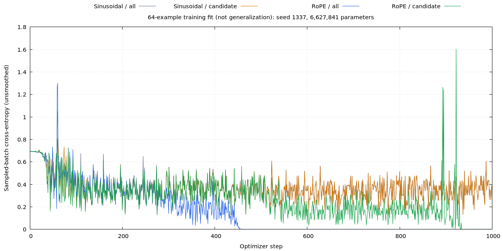
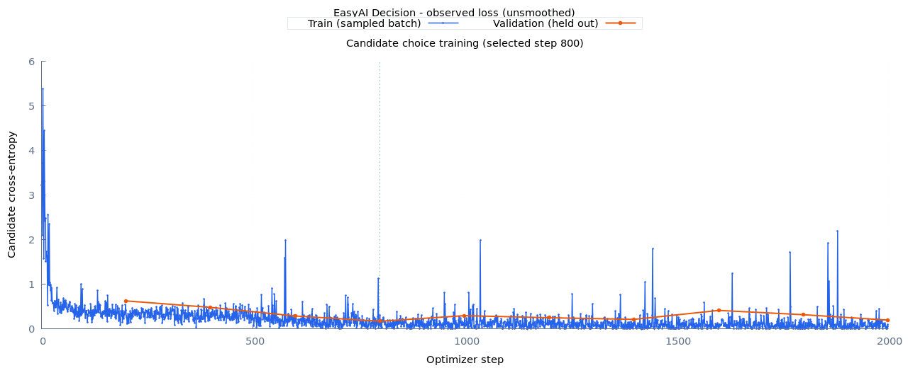

# 从否定错误到关系学习实验

公开语义数据上的短程训练仍会判断错否定句。本轮先检查一个更小、标签可严格验证的能力：给定两个人的明确事实，判断关于其中一人的肯定或否定断言是否成立。它是排查工具，不是通用语义模型，也没有把用户的“迟到”探针加入训练集。

最新诊断（2026-09-28）：用户的两条买票例子都存在于 train，课程模型仍没有稳定区分小林与小周。GPU 复测中四条 state 编码互不相同，清空缓存前后输出一致，因此不能只归因于没见过表达。现有采样只明确绑定 `question_flip` 两条反例，下一轮优先增加主体切换/角色互换评估与成组采样对照。完整证据、固定权重与交接待办见[开发交接记录](handover.md)；新评估和采样尚未实现，下文保留历史实验结果。

## 为什么先不扩大模型

训练 loss 平稳，不一定表示容量已用尽；也可能是优化停滞、输入表示丢失关系、标签或评估有问题。先要求模型在 64 条训练样本上达到至少 99% accuracy，再考察独立验证。训练集拟合不佳时直接扩大数据，无法区分这些原因。

最初实验发现：中文短句被小语料 BPE 合并成几乎一个 token；英文中出现一人肯定、一人否定时，模型常分不清否定属于谁。候选池化和联合编码都没有单独解决这个现象。v2 把专用 tokenizer 限制为 400 个 token，保留较细的子词；每次采样同时包含断言翻转的两个样本。所有 v2 对照共用这个设置。

## 数据和标签

```text
事实 A: 小林买了票       -> true
事实 B: 小周没有买票     -> false
问题:   小周没有买票？   -> assertion = false
目标:   facts[subject] == assertion
                       -> 成立

事实 + 问题 + 候选文本 -> 神经网络 -> 每候选 score
                                      |
                                  softmax
                                      |
                       Ruby 按候选 ID 组装 Hash / JSON
```

生成器中的布尔逻辑只负责生成训练标签和检查评估数据，不参与模型推理；模型只接收文本和候选。概率来自交叉熵学习后的 softmax，无须每条数据附带人工概率。这里未做温度校准，输出不代表已验证的真实世界置信度。

8 个人物、6 个动作、每组两个人，共 168 个语义家庭。一个家庭包括全部事实组合、肯定/否定问题、中英翻译、句序变体，并整体进入一个 split，防止成对样本分散到训练与测试。人物和动作的组成元素可以在训练中出现，测试的是新组合，不是新词识别。

| 文件 | 行数 | 家庭数 | 用途 |
| --- | ---: | ---: | --- |
| train | 13824 | 108 | 两种句式、从零训练 |
| sanity | 64 | 1 | train 的子集，只验证能否记住 |
| validation | 1280 | 20 | 新家庭、句式 2，选择 checkpoint |
| calibration | 1280 | 20 | 留给校准，本轮不用 |
| test | 1280 | 20 | 新家庭、句式 3 |
| test-familiar | 1280 | 同 test | 同一批测试家庭，使用训练句式 |

最后两个测试集相关，不能当成两份独立证据。样本数也不等于独立事实数。生成结果、tokenizer、权重和日志都在被忽略的 `data/`、`runs/` 下；manifest 保存版本、拆分说明和指纹。

评估同时报告单条 accuracy、NLL、中英分项，以及四种成对行为：

- 翻转问题中的断言，答案应翻转。
- 翻转被问人物的事实，答案应翻转。
- 改变无关人物的事实，答案应不变。
- 改变两个事实的顺序，答案应不变。

每组同时看 `both_correct`（两条全对）与 `expected_relation_rate`（答案之间的关系符合预期）。始终回答同一个选项也能满足“不变”，所以不能只看一致率。另测候选排列不变性、删除状态/删除问题后的表现。平衡的闭合任务中，删除任一必要输入应退回约 50%。

`by_fact_pattern` 区分两人事实真假相同与一真一假的情况。如果模型只会前者，后者只能随机猜，整体 accuracy 就是 `0.5 * 1 + 0.5 * 0.5 = 75%`，理想化 NLL 是 `0.5 * log(2) ≈ 0.3466`。这与观察到的平台非常接近，但仍应以分项实测验证，不能仅凭 loss 数值断定原因。

## 模型对照

```text
shared encoder                                 5,706,752 parameters
|-- Embedding [12000,256]                       3,072,000
|-- Embedding LayerNorm                              512
|-- Transformer x4                             2,633,728
|   `-- 4 heads, head width 64, FFN 256->768->256
`-- Final LayerNorm                                 512
cross-attention + FFN                             658,432
matching Linear [1024,256] + GELU                  262,400
score Linear [256,1]                                  257
---------------------------------------------
total                                          6,627,841
```

模型总量与实测 `ChoiceModel#parameter_count` 一致。实验保留 12000 行 embedding 表以匹配公开语义配置，专用 tokenizer 实际只用 400 个 token，不把未使用行解释为额外语言知识。

`all` 使用全序列池化；`candidate` 只池化候选内容，但问题仍参与 attention。`joint` 把状态、问题和候选拼接后共同编码，取消独立交互层，不再支持状态前缀缓存，且参数量较少，因此它是诊断性结构对照。

`rotary` / `rotary-candidate` 在共享 encoder 的 self-attention 中，对 Q/K 使用 RoPE，分别配全序列/候选池化；不增加可训练参数。跨状态/问题的 cross-attention 保持原样，因为两条独立序列没有共享的绝对位置坐标。RoPE 配置不再叠加原 sinusoidal 输入位置向量，`position_scale` 对它无效。旧 checkpoint 默认仍用 sinusoidal。

RoPE 的实现由 Ruby 描述旋转、attention 和梯度流程，张量运算交给 LibTorch/CUDA。测试验证旋转保范数、共同平移位置后的 attention 点积不变、梯度、候选排列、分块推理及训练续跑一致性。[RoFormer 原论文](https://arxiv.org/abs/2104.09864)提供相对位置构造，它本身不保证学会否定语义。

## 本机实验结果

本机 v2 小样本实测（seed 1337，1000 steps，batch 32，学习率 0.0003，dropout 0，均从随机权重开始）：

| 位置编码 / 池化 | 中文 fit | 英文 fit | 全部 NLL |
| --- | ---: | ---: | ---: |
| sinusoidal / all | 75% | 75% | 0.346924 |
| sinusoidal / candidate | 75% | 75% | 0.346596 |
| RoPE / all | 100% | 100% | 0.00000165 |
| RoPE / candidate | 100% | 100% | 0.00000466 |

RoPE 两个设置的四类成对样本全部正确、候选排列 logit 误差为零。删除状态或问题后 accuracy 都回到 50%；但 NLL 大幅升高，说明模型遇到这种分布外输入仍可能过度自信。不能把 softmax 数值直接当成可靠的未知问题置信度。

原始结果分别保存在 `runs/decision/relations-v2-sanity/` 与 `runs/decision/relations-v2-rotary/`。这些数字只说明修复了这个训练集上的拟合障碍；尚不能推导出中文用户任意提问都会正确。

四组参数初始权重逐项核对相同（最大差值 0），RoPE 的参数量没有变化。下图保留原始 batch loss，不做平滑，展示的是 64 条训练样本的拟合过程。



完整 train 的 RoPE / all 三种子结果（最多 2000 步，patience 4；每次重新随机初始化，没有继承 sanity 权重）：

| seed | 最佳 validation 步 | validation | 熟悉句式 test | 新句式 test |
| --- | ---: | ---: | ---: | ---: |
| 1337 | 1200 | 75.16% | 75.16% | 72.11% |
| 2027 | 600 | 75.00% | 75.08% | 62.58% |
| 3407 | 600 | 75.08% | 74.92% | 75.00% |

三个种子的 sanity 都是 100%，但完整任务**均未达到泛化门槛**（每语言 accuracy ≥95%、各类成对全对率 ≥90%）。第三个种子在新句式 test 上，两人真假相同的 640 条全对，真假不同的 640 条只有 50%；这支持“没有学会人物绑定”的诊断。前两个种子的英文新句式还会进一步退化。

结果保存在 `runs/decision/relations-v2-generalization/`，包括 `comparison.txt`、`comparison.tsv`、完整 JSON 及各次曲线。模型选择只依赖 validation，本轮结果仍是探索性实验；不要选择表现最好的一次 seed 就称为通过。

进一步实测没有支持直接扩参数：

- **增加训练到 6000 步并关闭早停**：seed 1337 的最佳 validation 仍在第 1200 步，测试仍为 72.11%。后期 loss 没有稳定改善，产物在 `runs/decision/relations-v2-budget6000/`。
- **RoPE 联合编码**：5,707,009 参数，sanity 100%，完整训练 2000 步；最佳 validation 72.42%、新句式 test 74.22%，仍有绑定错误。产物在 `runs/decision/relations-v2-joint/`。没有理由为这个结果牺牲状态缓存并替换默认结构。
- **课程学习**：沿用本轮自训 sanity 权重再训练完整数据，三个种子均有改善，结果如下。没有导入任何外部权重。

| seed | 第二阶段最佳步 | 完整 train | validation | 熟悉句式 test | 新句式 test |
| --- | ---: | ---: | ---: | ---: | ---: |
| 1337 | 800 | 93.71% | 91.48% | 90.55% | 80.78% |
| 2027 | 1200 | 93.88% | 90.39% | 91.64% | 80.39% |
| 3407 | 400 | 91.69% | 81.33% | 89.61% | 78.91% |

课程版新句式测试的三种子平均值约 **80.03%**，直接训练约 **69.90%**。这是同一固定拆分上的三次训练结果，不是独立测试样本量扩大三倍，也不是通用语义成绩。课程版总优化步数 3000，直接训练有早停、实际步数较少；6000 步无早停对照是单个种子，帮助排查预算因素，但不能把这组研究称为完全匹配计算量的因果证明。

课程产物：`runs/decision/relations-v2-curriculum/`、`runs/decision/relations-v2-curriculum-2027/`、`runs/decision/relations-v2-curriculum-3407/`。`train.json` 是最佳 validation 权重在全部 13824 条训练样本上的评估；另保留 `latest-train.json`、`latest-validation.json` 检查最后权重。seed 1337 的最后权重训练 accuracy 96.39%，validation 却降为 90.47%，说明不能用最后一步训练 loss 选模型。

本轮汇总入口为 `runs/decision/relations-v2-comparison/index.html`，同目录提供 `summary.json`、`comparison.tsv`、各结果文件指纹和小样本对比图；页面链接到每个完整训练报告。

下图是课程版 seed 1337 的**第二阶段**曲线；它之前还有 1000 步 sanity 训练。曲线保留 loss 尖峰，不平滑。



目前三个课程种子**仍未通过泛化门槛**，所以没有把这些权重提升为通用语义默认模型，也没有声称修复用户的任意“迟到”判断。结合最新训练内失败，下一步先补主体/角色评估与采样对照，再把课程起点从单个人物/动作家庭扩大到覆盖全部动作的少量家庭，逐级增加干扰事实和句式；增加真正不同的语义与表达覆盖，检查语言最弱项，再接入公开语义混合训练。具体顺序与验收见[交接待办](handover.md)。新测试集继续隔离，避免把已检查的错误逐条写入训练后当成泛化进步。

本机训练均使用 CUDA：长预算实验验证后的进程显存从预热后的 1028 MiB 保持到 6000 步，联合编码采样约 1142 MiB。三个短配置并行时一次整卡采样为 3573/6144 MiB、利用率 74%；这些是采样占用，不是瞬时峰值保证。新的重复评估内存测试、RoPE 数学性质、续训与分块一致性等已通过；全库 71 tests / 640 assertions，教学 7 tests，RuboCop 95 files。

## 一条命令复现

```bash
bundle exec ruby benchmarks/decision/relations.rb --variants all,candidate,rotary --seeds 1337,2027,3407
```

数据不存在时本地生成，不用下载或教师模型。每个设置先从零训练 sanity 1000 步；通过 99% 门槛后，另起随机初始化权重，训练完整 train 最多 2000 步。validation 选权重，test 不参与早停。训练使用 GPU 优先与 4096 MiB 进程显存预算。

`--sanity-only` 只跑小样本检查；`--steps N` 修改完整训练预算；`--patience 0` 禁用早停以检查较长平台期后是否仍能优化（仍保存最佳 validation 权重）；`--output PATH` 指定不存在的新目录。默认仍包含原始两种池化对照，要明确传入 `--variants rotary` 才只运行新位置编码。

另有课程学习对照：

```bash
bundle exec ruby benchmarks/decision/relations.rb --variants rotary --seeds 1337,2027,3407 --curriculum --patience 0 --steps 2000
```

先从随机权重训练 sanity 1000 步，通过后沿用这组自训权重，再训练完整 train 2000 步；第二阶段重置优化器和 warmup，保留数据分组来源。总预算是 1000+2000 步，不能写成“只训练 2000 步”，也不是外部预训练或蒸馏。课程实验关闭早停，以免把训练顺序与早停效应混淆；与无课程版本比较时仍应匹配预算，结合 6000 步无早停对照判断。

`config.yml` 记录实际阶段步数。早期本轮运行的配置快照已依据 checkpoint 补齐 CLI 步数覆盖值，原副本保留为 `specified-config.yml`，修正来源记录在 `config-reconciliation.json`；权重和训练轨迹未改写。

完整阶段另评估 `train.json`，用于区分欠拟合与泛化差距，不把训练指标当测试成绩。`--evaluation-batch-size 64` 是实验脚本默认的评估批大小；单独使用 `bin/easy-ai evaluate-relations --batch-size 128 ...` 可加快短文本批量核对，容量不足时评估器会缩小批次。

```text
runs/decision/relations-.../
|-- summary.json / comparison.tsv / comparison.txt
|-- index.html                    # 各次实验指标和曲线入口
`-- rotary-seed-1337/
    |-- sanity/
    |   |-- choice/                # 可加载权重、训练轨迹
    |   |-- fit.json               # 全 64 条训练集评估
    |   `-- report/                # HTML / PNG / SVG / 终端曲线
    `-- generalization/
        |-- pipeline.log / config.yml
        |-- choice/                # latest / best checkpoint
        |-- validation.json / test.json / test-familiar.json
        `-- report/
```

实验脚本放在 `benchmarks/decision/`；可复用的模型、数据生成、成对采样、评估放在正式 `lib/easy_ai/`。原 `learning/` 教学代码与 README 梯度下降展示保留。

## 扩展策略

通过小样本优化检查后，联合考察数据、参数和训练预算。先固定模型提高有效数据覆盖和训练步数；出现明显训练/验证差距时增加独立语义家庭和真实语料，而不只复制模板。充分优化后，训练和验证仍同时受限，才比较更宽/更深的模型，记录参数量、实际 token 数、步数、时间与显存。

[Chinchilla](https://arxiv.org/abs/2203.15556)支持在固定计算预算下联合考虑模型与训练数据规模，但其生成式语言模型实验不能直接给本项目的候选分类器套一个 token/参数比例。动态加层也应作为独立对照，用 validation 决定是否保留，不以 loss 停滞自动判断缺容量。

合成任务达标后，才扩大公开语义训练：保持公开数据独立测试不变，加入更丰富的绑定/否定对照，用同一个训练集 tokenizer 从零训练，比较相同预算下的新旧位置编码。不同 tokenizer 的 token ID 不同，不能把这里的 400-token checkpoint 直接当作 12000-token 公共语义模型继续加载。情态、条件句、未知事实、现实常识和多步骤流程仍需要各自的数据和评估，RL 暂不加入。

行为评估设计参考 [CheckList](https://aclanthology.org/2020.acl-main.442/) 与 [HANS](https://aclanthology.org/P19-1334/)：不只看总体准确率，还验证输入变化是否引起合理变化。
