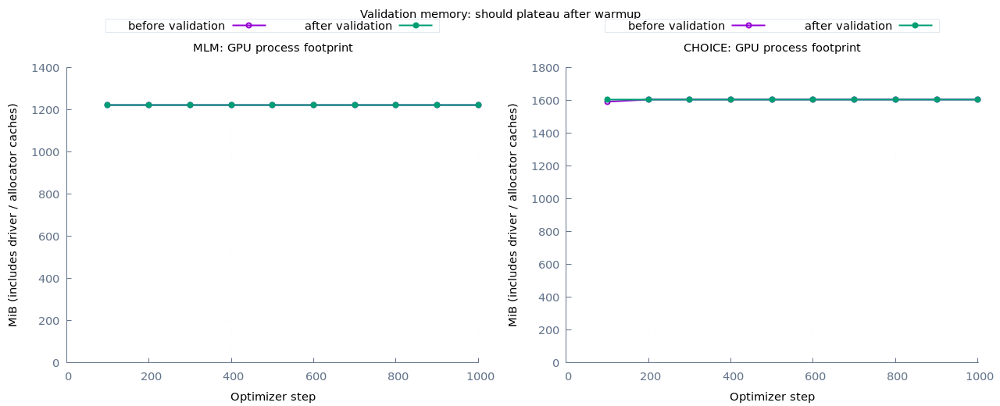

# 从零训练语义候选模型

当前路线以学习完整实现为优先：随机初始化，自己训练 tokenizer、MLM 和候选打分器，暂不使用 Qwen 等模型的基础权重或教师输出。张量计算用 Torch.rb/LibTorch，数据处理与训练循环用 Ruby；native BPE 使用 Rust gem 提升公开数据准备效率，自写 byte BPE 仍可阅读和独立使用。

## 数据和监督信号

本轮把意图选择扩展到语义相关任务，使用公开的人类标注：

| 来源 | 语言 | state | question | 候选/标签 |
| --- | --- | --- | --- | --- |
| [OCNLI](https://github.com/CLUEbenchmark/OCNLI) | 中文 | premise | hypothesis 是否成立 | 成立 / 不成立 / 信息不足 |
| [DuReader-YesNo](https://github.com/baidu/DuReader) | 中文 | 已标注的 answer | 原始 question | 是 / 否 / 视情况而定 |
| [BoolQ](https://github.com/google-research-datasets/boolean-questions) | 英文 | passage | 原始 question | yes / no |

DuReader 这里学习的是给定答案文本相对于问题的立场，不是从检索文档生成答案。`Depends` 不合并到 No；OCNLI 的 neutral 不等于 contradiction。公开无标注 test 不参与训练。

这些数据并非都能直接用于商用：OCNLI 标注 CC BY-NC 2.0；DuReader 压缩包中的 `License.pdf` 是 LUGE 数据参赛/使用协议，限定非商业研究和学术使用，不能套用代码的 Apache 许可证；BoolQ 标注 CC BY-SA 3.0。当前实验用于本地学习。下载来源、校验值和许可提示写入 `sources.json`，数据与权重均被 gitignore。

模型训练并不要求数据里给出小数概率。例如一条监督记录的形状为：

```json
{"id":"demo","group_id":"demo","source":"illustration","language":"zh-CN","state":"盒子里放着一支红笔。","question":"盒子里有笔吗？","options":[{"id":"yes","text":"是"},{"id":"no","text":"否"}],"target":"yes"}
```

这是格式示例，不会自动加入训练。网络输出候选分数，softmax 得到概率；交叉熵 `-log p(target)` 让正确候选的概率增加。`corpus.jsonl` 只给 MLM 学 token 的上下文关系；`train.jsonl` 才是 state + question + options + target 的判断监督。校准使用另外一份数据，无法纠正没有学到的语义。

## 拆分与长度

相同来源材料、相同长文本通过连通分量聚合；重复 premise、passage、question 的相关记录不跨 split。短而常见的答案按 `(state, question)` 匹配，避免所有“是”连成一个巨大分组。涉及官方 dev 的分组保留为本地 test，其中碰到的 train 记录舍弃。其余分组按固定 hash 分成 train / validation / calibration。

准备后的实际数量：

| 来源 | train | validation | calibration | test |
| --- | ---: | ---: | ---: | ---: |
| BoolQ | 6107 | 109 | 113 | 112 |
| DuReader-YesNo | 67656 | 272 | 225 | 263 |
| OCNLI | 33331 | 634 | 639 | 140 |
| 合计 | **107094** | **1015** | **977** | **515** |

held-out 各来源最多选 100 个分组，相关行全部保留，所以不是各 100 行。训练、验证、校准、测试互斥。抽样后的 test 不能冒充完整官方 benchmark。

12k BPE 只使用被分到训练区域的文本，训练 tokenizer 发生在长度过滤和可选 `train-limit` 之前，不读取验证/校准/测试文本。监督样本超过 state 256 或 question+option 128 token 就过滤并在 manifest 记数，不盲目截掉句尾否定词。MLM 使用随机文本窗口。训练每步先均匀选择来源，再在来源内采样语言与样本，避免大来源吞没小来源；这不等于穷举一个 epoch。

本轮语义数据是中英双语；旧意图实验的日语、西语、阿语能力不能当成此新权重已有的能力。

## 模型与实验

```text
Random initialization                         6,627,841 parameters
  |
  +-- shared encoder
  |     token embedding 12000 x 256
  |     input LayerNorm + scaled sinusoidal positions
  |     4 x [self-attention (4 heads) + FFN 256->768->256]
  |     final LayerNorm
  |
  +-- MLM: selected masked positions -> tied embedding projection
  |                                          |
  |                                    token cross-entropy
  |
  +-- Choice:
        state -> shared encoder -> memory -> pooled s ------+
        question + option -> shared encoder                 |
                    -> cross-attention(memory) -> pooled q -+
                                                            |
                                  [q, s, q*s, abs(q-s)] -> MLP -> scalar
                                                            |
                                       softmax over supplied candidates
                                                            |
                                    Ruby id/probability Hash -> JSON
```

JSON 结构由 Ruby API 保证，网络只算分数。每个候选 ID 可为数字或字符串，最终 JSON key 规范成字符串；冲突的 ID 拒绝输入。

一条命令跑完数据检查、从零 MLM 1000 步、候选监督 1000 步、独立校准、评估和图表：

```bash
bundle exec ruby bin/easy-ai semantic-pipeline
```

本地数据位于 `data/decision/semantic-public/`，存在时复用；缺失时才下载和准备。跨境网络需要代理时：

```bash
https_proxy=http://127.0.0.1:20122 http_proxy=http://127.0.0.1:20122 bundle exec ruby bin/easy-ai semantic-pipeline
```

下载使用 Faraday 流式写入、HTTPS、大小上限、SHA256 校验、失败清理 `.part`；解包读取固定成员，不把任意压缩包路径写入工作区。输出目录必须是新目录。需要重建数据时显式给不同的 `--data` 路径，现有数据不会因改变 `--limit` 自动重建。

对照实验跳过 MLM，其余监督配置相同：

```bash
bundle exec ruby bin/easy-ai semantic-pipeline --mlm-steps 0
```

两种实验都从随机网络权重开始；MLM 版本的 choice 从本项目自训的 MLM 权重开始。比较的是额外 MLM 阶段的作用，不是相同总算力的比较。

每个 run 下保留 `pipeline.log`、`train.log`、`choice/metrics.jsonl`、最佳/最新 checkpoint、`calibrated/`、`report/index.html`、PNG/SVG 和终端曲线。最佳权重由 validation loss 选择；校准只拟合全局温度，分任务校准误差仍需单独看。`stage-results/semantic-diagnostic.json` 逐来源对比原始输入、打乱 state、打乱 question、标签频率基线。只有输入改变引起输出变化，还不足以证明理解正确。

训练 microbatch 16、累积 2，等效 batch 32。6 GiB GPU 优先，预算 4096 MiB；[显存累积修复及实测](memory.md)区分正常分配器缓存、临时张量未回收和单 batch 容量不足。

## 当前监督基线

`runs/decision/semantic-supervised-v2/` 在 CUDA 上完成 1000 次更新，最佳 validation 在第 800 步：loss 从第 100 步的 1.0412 降至 0.9681。校准后 test：

| 任务 | 行数 | Accuracy |
| --- | ---: | ---: |
| BoolQ | 112 | 63.39% |
| DuReader-YesNo | 263 | 70.72% |
| OCNLI | 140 | 38.57% |
| 按来源宏平均 | — | 57.56% |

整体 NLL 0.81873、ECE 0.03832。任务与样本难度不同，不宜拿这些数字直接比较旧意图实验的 75.6%。尤其 OCNLI 仍很弱；小样本上的低 ECE 也不能说明泛化可靠。1000 步只采样约 32000 行次，少于训练集大小，且来源均衡会重复抽样。

另取 validation 每来源前 50 个分组，检查状态与问题依赖（与上表不是同一批评估样本）：

| 任务 | 原始 accuracy | 打乱 state | 打乱 question | 标签频率基线 |
| --- | ---: | ---: | ---: | ---: |
| BoolQ | 45.76% | 44.07% | 40.68% | 40.68% |
| DuReader-YesNo | 69.29% | 41.73% | 67.72% | 46.46% |
| OCNLI | 41.03% | 41.38% | 36.55% | 34.48% |

DuReader 对 state 敏感、对 question 较不敏感，可能依靠答案文本中的立场词；OCNLI 的原始 state 未带来清晰优势。手工迟到正反例仍有错误，英文正例答对也不能抵消英文否定句答错。这些结果比汇总 accuracy 更直接指出下一轮要解决的输入关系学习问题。

后续根据原始/扰动验证、MLM 对照和手工成对探针决定是否增加训练预算、补充否定/条件句监督，或调整候选表示。保留用户迟到例句作为手工检查，不能往训练集补这几句就宣布问题解决。暂不做 RL、自动扩层或蒸馏，先确认监督目标、输入依赖和泛化行为。

## 本轮 MLM 对照结果

`runs/decision/semantic-mlm-v1/` 完成 MLM 1000 步 + 候选 1000 步，MLM 最佳在第 1000 步，候选最佳在第 800 步。数据、tokenizer、候选监督采样种子和监督预算与基线一致；多出的成本是 MLM 阶段。MLM validation loss 从第 100 步的 7.8895 降至 6.5975。

| 同一批 test | 直接监督 | MLM 后监督 |
| --- | ---: | ---: |
| BoolQ accuracy | 63.39% | 62.50% |
| DuReader-YesNo accuracy | 70.72% | 69.96% |
| OCNLI accuracy | 38.57% | 32.86% |
| 来源宏平均 accuracy | 57.56% | 55.11% |
| 整体 NLL | 0.81873 | 0.83251 |
| 整体 ECE | 0.03832 | 0.03385 |

这一次短程 MLM **没有改善下游判断**；单次、小 test 不能推断 MLM 普遍无效。中文迟到正反例和英文否定句仍有错误。低 ECE、下降的 MLM loss 都不能替代对输入关系的学习。`semantic-pipeline` 的默认 MLM 阶段保留为学习完整流程，而非质量最优配置。




后续已实现[中英关系学习实验](relations.md)：固定 state 改 question、固定 question 改相关事实、改变无关事实与句序，均有成对评估。v2 的同预算小样本对照中，两种池化的原位置编码都只有 75% 训练 accuracy；RoPE 两种池化均达到 100%。这暂时支持继续检验位置表示，未证明是池化稀释导致错误，也未证明已解决真实公开数据和迟到探针。独立家庭/句式泛化与后续数据、计算、模型规模扩展见实验记录。

完整关系任务进一步验证了优化顺序的影响：先学小样本的课程版，新句式测试三种子平均约 80.03%，直接训练约 69.90%；单个种子直接增加到 6000 步没有改善最佳验证结果。课程版仍未达到门槛，因此本轮保留公开语义训练的已有对照，不把专用合成任务权重当成新的通用基础模型。

最新用户复测还发现课程权重会错在已有训练样本上：交换“小林/小周买票”的事实后，模型仍偏向“不成立”。这与迟到表达的任务覆盖不足须分开诊断，不能统称为数据量不够。下一轮先验证主体绑定、成组采样与课程覆盖，再决定扩数据或模型；已核实证据、当前权重、复现命令和开发顺序集中在[开发交接记录](handover.md)。
