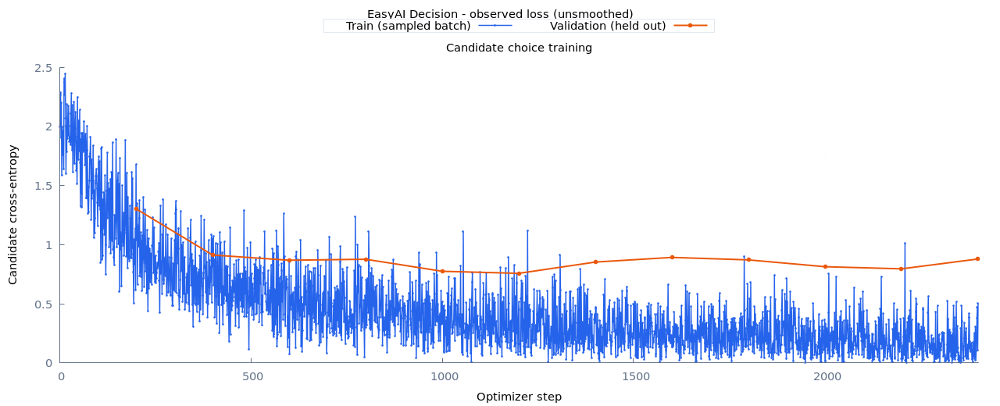
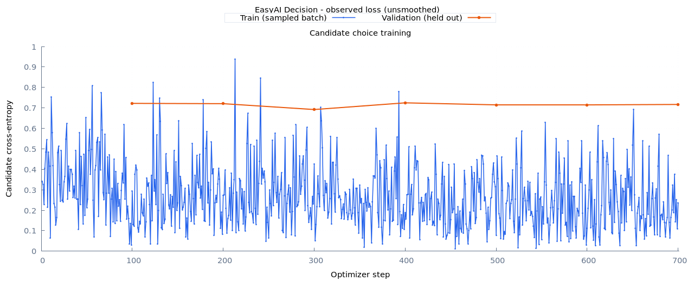

# Decision v0.1 delivery

Status: the focused fit and bounded correction are complete. The user approved delivering a **v0.1 scoring preview**, clarifying that 80% is a soft improvement direction rather than a release blocker. The local portable bundle is `runs/decision/v0.1-preview`. No easy_biz or other business integration is included. The historical strict acceptance report remains unchanged (`passed: false`); preview status is explicit in bundle metadata and inference responses.

## Measured result and use

The released model has 6,627,841 parameters, our own trained weights, and temperature 1.513142313469446. Selected checkpoint: corrective update 300, validation NLL 0.691998. Training stopped at 700 updates.

| Fresh independent panel | English | Chinese |
| --- | ---: | ---: |
| Examples | 400 | 400 |
| Full 18-candidate accuracy | 78.25% | 81.00% |
| Mean per-domain recall | 73.18% | 76.66% |
| Confidence-selected accuracy | 90.32% | 91.64% |
| Selected coverage | 77.50% | 80.75% |
| Selected accuracy, Wilson 95% lower bound | 86.52% | 88.11% |

Confidence cutoffs were fixed on separate calibration data: English 0.69, Chinese 0.64. These are dataset measurements, not guarantees for new inputs. Some domain recalls remain weak; general yes/no reasoning, other languages, and unseen option descriptions are unvalidated. Confidence alone cannot detect out-of-distribution inputs.

```ruby
require "easy_ai"
model = EasyAI::Decision::Release.load("runs/decision/v0.1-preview", device: "auto")
result = model.route(state: "明天七点叫我起床", language: "zh-CN")
puts JSON.pretty_generate(result)
# probabilities, suggested_option, supported_profile, review_required,
# release: "0.1", release_status: "preview"

# Arbitrary questions/options remain available, but outside the validated profile:
result = model.probabilities(
  state: "我要迟到了", question: "会迟到么？",
  options: [{ id: 0, text: "会" }, { id: 1, text: "不会" }],
  language: "zh-CN"
)
# supported_profile: false, review_required: true; IDs become JSON string keys.
```

The generic underlying predictor is `model.predictor`. `review_required: false` only means the supported profile's calibrated confidence cutoff was met. The API scores options and executes no business actions. CUDA is preferred with CPU recovery; the published inference chunk holds all 18 candidates. CPU/CUDA probability agreement and candidate-order invariance pass. The released wrapper smoke test correctly scores Chinese “明天七点叫我起床” as alarm (about 95.66%), but English “Wake me up at seven tomorrow” incorrectly prefers calendar (about 50.53%) and flags review. This is a concrete regression case for the next iteration, not a semantic pass disguised as a runtime check. Warm two-example timing and boundary memory are saved in the bundle's `runtime.json`; they are smoke observations rather than a broad benchmark.

## Completed optimization and learning

First fit: own broad sinusoidal initializer, 18,377 training rows, label/language-balanced sampling, LR 0.0003, at most 2,500 updates. It stopped at 2,400 and selected update 1,200. The 800-per-language independent official-test panel scored 79.50%/82.625% overall but only 87.46%/88.83% confidence-selected accuracy. Training loss fell while held-out NLL eventually rose.

Bounded correction: same training/validation/calibration material, natural sampling within each language instead of class oversampling, LR 0.00005, at most 800 updates, own first selected tensors as initializer. A conservative calibration guard (94% point accuracy and 90% Wilson lower bound) was frozen before evaluation. Its fresh panel reserved 400 bilingual groups from previously unused official TRAIN material, excluding all historically prepared material and parallel translations. Raw rows 408/402 reduce to 400 independent units each; original source partitions are retained in records. Development/calibration reuse is not claimed untouched.

The two acceptance panels differ: their raw accuracies are not a paired comparison. Both opened panels are now regression data. Future optimization should use validation to choose changes, report per-domain/language results and coverage, and prospectively reserve another independent panel. The 80% direction is advisory; improving generalization and usefulness matters more than crossing a single observed percentage.





Loss plots are produced by `lib/easy_ai/decision/training_report.rb`; original learning gradient-descent illustrations remain in README.


## Scope and contract

The first supported profile is Chinese/English request-domain scoring across the full 18 MASSIVE scenarios. This is a model-only scope assumption made after presenting routing as the recommended initial capability. It does not turn the general decision API into a fixed-class architecture: the neural scorer still accepts `state`, `question` and supplied `options`, including numeric or string IDs. Other domains and candidate phrasings remain unvalidated until measured. General yes/no reasoning is not a supported v0.1 claim.

```text
state ----------------------------------+
                                        |
question + each candidate text ---------+--> own multilingual BPE (12k)
                                               |
                                    shared Transformer encoder
                                  4 layers, hidden 256, 4 heads
                                  FFN 768, sinusoidal positions
                                               |
                                   candidate/state interaction
                                            1 layer
                                               |
                                        matching score
                                               |
                                    softmax / temperature
                                               |
                              Ruby probability mapping --> JSON
                                               |
                            independently calibrated confidence
                         + supported-profile check --> review status
```

The existing model has approximately 6.63 million parameters. JSON structure is enforced by Ruby, not learned as generated text. No external pretrained weights, teacher outputs, RL, or semantic keyword rules are introduced. The initializer is our own scratch-trained broad sinusoidal checkpoint; the release fit resets optimizer state and trains on request-domain data. Retaining architecture does not imply arbitrary-candidate generalization.

## Historical strict acceptance fixed before evaluation

The original strict publication path requires both languages to satisfy the following. These diagnostics remain frozen for review; the approved preview does not require every target to pass:

| Statistic | Minimum |
| --- | ---: |
| Independent examples | 300 |
| Full 18-candidate accuracy | 80% |
| Mean recall across target classes | 70% |
| Confidence-selected coverage | 30% |
| Confidence-selected examples | 100 |
| Confidence-selected accuracy | 90% |
| Wilson 95% lower bound on selected accuracy | 85% |

Every target class must be represented; missing classes fail rather than inflate mean recall. These were the original delivery criteria, not forecasts; the user subsequently approved preview delivery with transparent measurements. Calibration thresholds are selected on separate calibration examples, before acceptance labels are evaluated. Reject-all has zero coverage and no selected accuracy, so it cannot pass. Confidence-based selection is a statistical policy, not a semantic rule or an out-of-distribution detector. Passing MASSIVE alone would establish this profile's dataset performance, not reliability across every real-world application.

## Procedure

1. Verify the cached MASSIVE 1.1 archive and the existing own checkpoint. Read previously prepared corpora into a historical material exclusion inventory.
2. Connect parallel original IDs and duplicate normalized utterances. Use eligible official training examples only. Official development groups excluding historical training and initializer selection/calibration material supply selection/calibration; historical development diagnostics are not claimed fresh. Unused official test groups supply acceptance, excluding ALL historical prepared material. An observed translation excludes the entire corresponding component. Record supported-length and conflict exclusions. Freeze input/checkpoint hashes, counts, config and requirements in `protocol.json`.
3. Train one sinusoidal candidate scorer for at most 2,500 updates, with full 18-option sets, random candidate order, language/label-balanced sampling, microbatch four and accumulation eight. GPU first with the existing 4,096 MiB process budget and runtime recovery. Select by validation NLL, evaluate every 200 updates, and stop after six evaluations without improvement. Training logs and loss charts are retained.
4. Fit scalar temperature and per-language confidence policies on the calibration split. Freeze `policy.json` and an inference checkpoint without optimizer tensors.
5. Mark acceptance opened before evaluation, preserve logits/probabilities, and report each language's gates. If a model fails, retain the failure and do not publish it as a passed v0.1. Previously opened tests become regression data; any subsequent retuning needs a new prospectively reserved acceptance panel.
6. Package an explicitly marked preview after CPU/CUDA/candidate-order checks, preserving failed acceptance. Strict stable packaging still requires acceptance. Synchronize README, handover, model limitations and reviewed charts.

The first fit is deliberately focused. It is not another positional-encoding or model-size sweep. If validation reveals a fixable failure, use that evidence to choose a bounded correction; do not silently lower the gates after seeing test results.

## Commands and files

```bash
# Requires local MASSIVE archive and our completed natural-v1-pilot artifacts.
# Output must be new; downloaded data and trained weights remain gitignored.
bundle exec ruby benchmarks/decision/release.rb --phase all \
  --output runs/decision/release-v01-routing
```

Publish the completed correction without retraining or reopening acceptance:

```bash
bundle exec ruby benchmarks/decision/release.rb --phase preview \
  --output runs/decision/release-v01-corrective
```

The destination must not exist. Already published? Load it using the Ruby example above. Phases can also be run individually: `prepare`, `baseline`, `train`, `calibrate`, `acceptance`, `package`, `preview`. Successful packaging creates `runs/decision/v0.1`; failed acceptance prevents publication. Acceptance refuses a second opening in the same run, including after an interrupted evaluation. Preserve the opening marker and diagnose the interruption; do not delete it to disguise repeated test use.

Frozen first-fit counts: training en/zh 9,289/9,088; validation 400/400; calibration 603/602; acceptance 803/800. The initial overstrict development exclusion failure is preserved in `tmp/release-v01-prepare-rejected-history.log`; no test results were opened to change that policy.

Strict stable usage, only if a future checkpoint passes its frozen requirements:

```ruby
require "easy_ai"
model = EasyAI::Decision::Release.load("runs/decision/v0.1", device: "auto")
result = model.route(state: "明天七点叫我起床", language: "zh-CN")
# probabilities + suggested_option + supported_profile + review_required
# General probabilities(state:, question:, options:, language:) remains available.
```

Only the evaluated question template and full candidate-description set qualify for supported-profile confidence selection. Numeric/string IDs and option reordering are allowed. Other candidate sets/questions still return probabilities, with `supported_profile: false` and `review_required: true`. This avoids claiming untested arbitrary-candidate semantics. Confidence does not detect every out-of-distribution input. Dataset licensing remains source-specific: the own initializer inherits prior public-data conditions, including the restrictions described in [natural.md](natural.md); MASSIVE's CC-BY-4.0 alone does not determine the entire model's license.

```text
lib/easy_ai/decision/
  candidate_trainer.rb       formal full-candidate training
  release_metrics.rb        correctness, coverage, recall, uncertainty
  release_policy.rb         calibration selection and fixed release gates
  release.rb                portable verified bundle and local inference wrapper
  data/routing_corpus.rb    grouped official-partition preparation
benchmarks/decision/
  release.rb                reproducible delivery orchestration
runs/decision/release-v01-routing/   [ignored]
  protocol.json, data/, initial/
  choice/, selected/, summary.json, train.log
  calibrated/, policy.json
  acceptance-opened.json, acceptance.json, acceptance-predictions.jsonl
  report/loss.png, report/loss.svg, report/index.html
```

The original learning gradient-descent illustrations and earlier successful/failed experiment reports remain available.

## Final delivery verification

Published preview load checked on CPU and automatic CUDA selection, including JSON normalization, numeric IDs and reversed candidate order. Full suite: 177 tests / 2,134 assertions; learning suite: 7 / 14; RuboCop: 152 files clean. Staged and unstaged whitespace checks pass. Artifacts, source data and logs remain gitignored; documentation and learning figures remain versionable. No commit was requested for this delivery.
