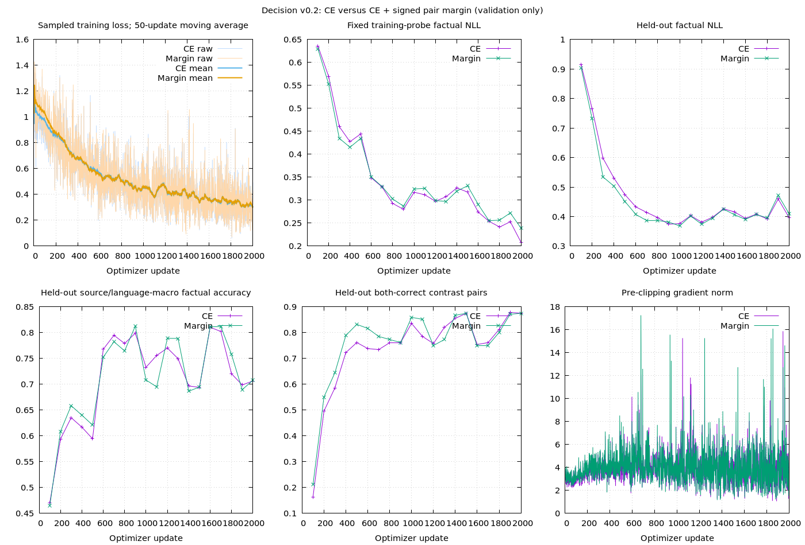

# Decision v0.2: bounded factual-scoring iteration

Status: **completed bounded iteration, 2026-10-02**. This round implements [the accepted plan](v02-plan.md). Factual supervision improves controlled judgments; the pair-margin objective does not warrant adoption. No checkpoint meets the predeclared retention criteria, so **v0.1 remains the delivered preview**. New weights are available for diagnosis, not a promoted general semantic model. No business integration, external weights, teacher outputs, RL or architecture expansion.

## Procedure and frozen artifacts

```text
Own v0.1 / own broad parent
            |
     Train-only diagnostic --> choose one initializer
            |
      128-row fitting check
            |
  Matched rows, RNG, candidate permutations, optimizer, 2,000 updates
            +-------------------------+
            |                         |
         Answer CE             Answer CE + pair margin
            |                         |
       Validation checkpoint selection with routing-preservation guard
            |
   Conditional seed-2027 confirmation on validation improvement
            |
   Separate calibration --> open final evaluation once --> measured report
            |
   Publish factual preview only if useful gains/preservation are demonstrated
```

Runner: `benchmarks/decision/factual.rb`; local output: `runs/decision/factual-v02-r2/`. The `protocol.json` freezes dataset/tokenizer fingerprints, source history, selection, confirmation and publication rules before pilot training. A rejected first preparation applied group caps and admitted 62,903 rows; it failed the 20k–40k budget check before any fit. Preserved as `runs/decision/factual-v02-rejected-budget/`. Corrected row caps produce 27,520 rows; rejected reserved material is conservatively excluded from subsequent natural acceptance selection.

Sources are existing public BoolQ, OCNLI and DuReader-YesNo caches, with existing checksums/licensing provenance. Their eligible official train components supply 4,000 rows each. The original preparation excludes historically prepared state text; the subsequent whole-component audit below corrects its freshness claim for calibration and acceptance. Original IDs and shared-material components retain the `SemanticCorpus` grouping. No label-dependent sampling chooses held-out material. A source component is assigned to one split; row caps may retain only part of its natural examples, but never move another part to another split.

| Material | Train | Validation | Calibration | Final evaluation |
| --- | ---: | ---: | ---: | ---: |
| Natural QA/NLI, three sources | 12,000 | 192 | 180 | 574 |
| Explicit-fact yes/no contrasts, English/Chinese | 10,240 | 512 | 512 | 5,120 |
| Missing-information facts, English/Chinese | 1,280 | 64 | 64 | 640 |
| Routing replay/regression | 4,000 | 128 | 128 | 810 |

The eight training event domains are transport, shopping, work, education, household, delivery, leisure and communication. Library, garden, sports and finance events are withheld from training. Controlled evaluation contains 320 semantic families per language, grouping translations, assertions, actor contrasts, irrelevant facts and uncertainty. Generated names/facts are explicit finite worlds, not a claim of natural linguistic diversity. Four question/candidate variants and natural public data complement them; naturally occurring open factual understanding remains a separate measured question.

Routing final evaluation is the previously observed v0.1 corrective panel: **regression only**, not fresh acceptance. Fresh natural/controlled panels must remain closed until both objectives, selected checkpoints, any confirmation, and temperatures are fixed. Synthetic unknown labels come from the absence of the queried actor's fact; public neutral/depends labels retain their annotated meanings.

A whole-component audit during the pilot corrected the initial state-only historical filter: DuReader has multiple answers sharing one question component. Although their answer texts were unused, 12 calibration rows and 26 final rows connected to previously prepared components. Those components are removed before calibration or test predictions; the original files and protocol remain preserved. `provenance.json` freezes `calibration-clean.jsonl` (820 total) and `acceptance.jsonl` (7,144 total), with file hashes and excluded group IDs. Validation retains four such DuReader rows as frozen development material, explicitly not a fresh acceptance claim. Future preparation excludes whole historical components from the outset. This correction is based on provenance alone, without inspecting predictions or selecting on labels.

## Model and objective

One shared 12k-tokenizer, four-layer, width-256 sinusoidal encoder, matching candidate scorer, approximately 6.63M parameters. CUDA first; FP32; microbatch 4, accumulation 8. Both objectives start from identical own tensors and use the same data schedule. Pilot LR 0.0001, warm-up 100, dropout 0.1, fixed 2,000-update cap, eval every 100. Fitting uses dropout 0/LR 0.0003 for at most 1,000 updates, stopping after two consecutive fitting checks pass, and never supplies its fitted weights to the pilot.

```text
ChoiceModel                                             6,627,841
|-- Shared encoder                                      5,706,752
|   |-- Token embedding [12000,256]                      3,072,000
|   |-- Scaled sinusoidal positions                             0
|   |-- Embedding LayerNorm                                   512
|   |-- Encoder blocks x4                               2,633,728
|   |   |-- Self-attention: 4 heads x64
|   |   `-- LayerNorm + FFN: 256 -> 768 -> 256
|   `-- Final LayerNorm                                       512
|-- State/candidate cross-attention + FFN                  658,432
`-- Matching head: [q,s,q*s,abs(q-s)] -> 256 -> 1           262,657
                              |
                 one scalar per candidate -> softmax / temperature
                              |
                 Ruby assembles {"probabilities": {id: probability}}
```

The encoder/scorer is shared across languages and candidates. Candidate IDs are output keys, not numerical neural features; inference needs no language flag and emits JSON through Ruby, without generating JSON tokens.

Across each five updates, exact exposure is 50% factual bucket (natural QA/NLI plus controlled unknown examples), 30% verified contrast rows, 20% routing replay. Language is sampled evenly within each bucket. Pair partners are sampled together in the effective batch. GPU microbatch reduction can separate partners into accumulation microbatches: the signed hinge is additive per row, so it does not require retaining a graph across microbatches.

```text
m = logit(yes) - logit(no)
s = +1 for yes gold, -1 for no gold
pair term = mean over batch of max(0, 1 - s*m) on verified contrast rows only
objective = answer CE + 0.2 * pair term
```

Unknown/non-complementary rows get no margin constraint. Pair labels are checked against recorded facts and pairs must contain distinct states, identical questions/options, opposite yes/no targets and one semantic group. Option IDs locate margins after candidate permutations. This is a supervised margin objective, not RL or an inference heuristic. Ruby assembles probability JSON through the existing Predictor.

Implementation: `Data::FactualContrasts`, `Data::FactualSampler`, `PairMarginLoss`, `FactualTrainer`. The base trainer now exposes sampling as a hook and records the norm returned by clipping **before** clipping. Optimizer/coverage recovery remain inherited. Factual objective signatures are saved in checkpoints and mismatched resumes are rejected.

## Selection, evaluation and delivery

Initializer selection compares train-only diagnostic factual accuracy. Initial generator diagnostic selected own broad sinusoidal parent; initial validation complete-pair correctness is 0.00390625 for both broad and v0.1. The 128-row fitting probe spans all eight event domains, both languages, affirmative/negative assertions, actor binding, irrelevant facts, unknowns, natural QA/NLI and routing. The initial generator reaches all individual decisions and complete pairs correct at step 200 and finishes 1,000 updates. Review identified a fixed queried-name shortcut; the active r2 generator varies names and asks about both actors. Its datasets, baselines and fitting check are re-frozen before pilot training; the initial run remains under `runs/decision/factual-v02/` as diagnostic evidence. This is training fit, not held-out competence.

Pilot checkpoint selection requires routing validation accuracy no more than 3 percentage points below v0.1 in **each** language. Rank eligible checkpoints by mean within-language source-macro factual accuracy, breaking ties by factual NLL. The language-macro calculation was finalized before pilot fitting; saved baseline per-cell measurements are unchanged. If no checkpoint is eligible, final pilot weights remain diagnostics; they do not silently become a release.

If selected validation accuracy improves by at least 3 points over the selected initializer, repeat that objective with seed 2027 before final evaluation. Preserve both seed-1337 objective results and the confirmation. Temperatures fit on separate calibration, before opening the final test. Publication requires per-language factual source-macro gains of at least 3 points versus v0.1, complete-pair accuracy at least 80%, no natural factual source-macro regression, at most 3-point routing regression, successful validation confirmation and CPU/CUDA runtime checks. These are bounded useful-preview criteria, not a universal 80% overall or 95% language-understanding claim.

Report source/language cells, factual NLL/Brier/ECE, phenomena, both-correct pairs, actual visits/unique rows/tokens, sampled objective loss, 50-update moving average, fixed training-probe and held-out metrics, pre-clipping gradient norm, embedding updates and GPU process memory. Natural/controlled source metrics must remain separate from routing and from aggregate rates dominated by generated examples. Group bootstrap resamples whole semantic components rather than treating paraphrases as independent.

## Reproduction

One command for a new bounded run:

```bash
bundle exec ruby benchmarks/decision/factual.rb --phase all --output runs/decision/factual-v02-new
```

The runner expects the public caches and own baseline checkpoints listed in `protocol.json`; reconstruct missing parents using [v0.1](v01.md) and [natural-task](natural.md) recipes. It logs training every 20 updates and validation every 100. Existing outputs/diagnostics and opened final panels are not silently overwritten. New preparation consults historical exposure, so its natural public panels differ; it cannot regenerate the observed acceptance panel byte-for-byte. The controlled generator has fixed family allocations: repeating this recipe reuses those controlled cases as **regression**, not fresh acceptance. A new optimization must reserve new controlled families/expressions as well as public material; changing only the output directory is insufficient. The preserved hashes/data/weights/traces support reviewing this exact result. Data/downloads/weights/logs remain ignored by Git; only code, documentation and reviewed plots are tracked.

For manual execution, use the same new `--output` for phases `prepare`, `audit`, `baseline`, `fit`, `train --arm ce`, `train --arm margin`, `confirm`, `evaluate`, `report` in that order. Final evaluation requires the audit's clean-panel fingerprints. Original test files are retained for the audit trail, and acceptance uses only the frozen clean file. For this completed output, `--phase report` redraws/derives results from saved predictions and repeats runtime/training-sensitivity smoke checks; it does not reopen acceptance or retrain.

## Completed results

Each arm receives exactly **64,000 sampled decisions and 9,329,604 valid input tokens**. Recorded row-visit vectors and token counts match exactly. Both finish on CUDA; validation-boundary GPU process memory stays within **650–696 MiB**, with no CPU fallback. These are sampled process measurements, not allocator peak measurements. The r2 fitting check passes at updates 100 and 200 and stops at 200.

No validation checkpoint in either arm meets routing preservation, so no second-seed confirmation is triggered. The final weights at update 2,000 are evaluated as **diagnostics**, not substitutes for an eligible selected checkpoint. The test is opened once after both budgets, the conditional-confirmation decision and calibration temperatures are frozen.

| Model | Factual macro | Natural QA/NLI EN / ZH | Complete pairs EN / ZH |
| --- | ---: | ---: | ---: |
| Delivered v0.1, recalibrated for this panel | 46.33% | 48.50% / 47.96% | 0.78% / 0.47% |
| Own broad initializer | 47.09% | 65.00% / 57.33% | 1.95% / 0.16% |
| CE, update 2,000 | **67.33%** | **63.50% / 55.51%** | **64.53% / 99.92%** |
| CE + margin, update 2,000 | 66.47% | 61.00% / 54.15% | 62.81% / 99.84% |

Factual macro is the equal-language mean of within-language source-macro accuracy. Natural cells exclude generated data and routing. Chinese natural macro averages OCNLI and DuReader; English uses BoolQ. A complete pair requires both complementary decisions correct. This is one seed per objective; the margin's 0.87-point lower macro is not proof that margin objectives generally fail.

| Diagnostic slice | CE | CE + margin |
| --- | ---: | ---: |
| English actor-binding complete pairs | **0.31%** | 0.31% |
| English negative-question complete pairs | 77.50% | 71.25% |
| Chinese actor-binding complete pairs | 99.69% | 99.38% |
| English missing-information accuracy | 100% | 100% |
| Chinese missing-information accuracy | **0%** | 0.31% |
| Withheld-event complete pairs, English | 54.06% | 50.63% |
| Withheld-event complete pairs, Chinese | 99.84% | 99.69% |
| Routing regression panel, English | 68.38% | 68.14% |
| Routing regression panel, Chinese | 70.40% | 70.40% |

The unchanged v0.1 routing reference on this panel is 78.43% English / 81.09% Chinese. The broad initializer starts at only 42.89% / 48.76%, so the new arms **recover** routing relative to their initializer but fail to retain the delivered capability. Initializer selection based solely on train-probe factual accuracy was inadequate for that combined objective. The routing panel is already observed regression material; these values do not replace v0.1's original independent acceptance figures.

Chinese explicit-fact transfer is a useful measured gain within the finite-world templates. It does not establish arbitrary Chinese semantics: missing-information handling collapses, public QA/NLI remains modest, and words/templates are not broadly diverse. English actor binding remains nearly completely unsolved even though its overall pair rate rises. Source/language-macro factual accuracy for Chinese is only 52.74% for CE versus 52.57% for v0.1 because the unknown slice fails.

Whole-group bootstrap gives CE pair intervals of **62.27–66.56% English** and **99.77–100% Chinese** (300 resamples, 320 semantic families per language). These intervals describe this panel, not uncertainty across seeds or unrestricted expressions. `report.json` also includes factual and natural source-macro intervals, per-domain/phenomenon/transfer/language metrics and raw/calibrated probability diagnostics.

Calibration temperatures are 2.08434 for CE and 2.12253 for margin, fitted on the separate 820-row clean panel. CE factual NLL improves from raw 0.35582 to calibrated 0.30937; Brier from 0.20350 to 0.19133; ECE from 0.06031 to 0.01649. Temperature preserves argmax and cannot fix binding or unknown errors. Calibrated metrics aggregate many controlled rows; inspect source cells before applying them to natural requests.



There is clear descent: CE first/last 100-update sampled-loss means are **0.99707 / 0.31422**, and margin means are **1.05710 / 0.31522**. Their objectives differ, so those losses are not a direct CE comparison. The chart preserves unsmoothed observations and explicitly labels the moving average. Fixed-probe and held-out NLL also fall. Best validation factual macro is 81.04% for CE at update 1,600 and 81.27% for margin at 900, but both fail routing preservation; neither is silently promoted.

CPU/CUDA API smoke checks pass for both final checkpoints: probability differences below 8e-8 and candidate-permutation differences zero. GPU process memory remains 172 MiB before/after repeated inference. In the final reporting process, two warm cached validation examples average about 120–128 ms CPU and 159–166 ms CUDA; CPU is faster in this small smoke workload. The process retains reporting data, so its Ruby heap and host load affect these local call measurements. They are not standalone throughput claims; benchmark separately before making deployment latency choices. The GPU-first default remains unchanged.

The same 48 controlled **training** diagnostic rows give candidate-wording accuracy 31.25% for CE and 33.33% for margin with alternative support/contradiction/insufficient-information descriptions. State removal/shuffling changes logits substantially and drops correctness; question removal still yields 72.92%. These perturbations retain original targets for sensitivity only; removed/rotated inputs are not newly gold-labelled tests. They suggest template/candidate dependence but do not prove a particular shortcut. Candidate-order invariance and distinct token sequences pass.

## Artifacts and diagnostic use

```text
runs/decision/factual-v02-r2/
|-- protocol.json, baselines.json, initial/       # frozen references and exact initializer
|-- provenance.json, component-history-audit.json
|-- data/                                       # original and clean fingerprinted panels
|-- fit/                                        # 128-row diagnostic, two passing checks
|-- ce-1337/, margin-1337/                       # weights, optimizer, raw traces and coverage
|-- confirmation.json                           # no eligible winner; confirmation skipped
|-- calibration.json, acceptance-opened.json     # policy freeze and one-time test opening
|-- predictions-*.jsonl, evaluation*.json        # logits, calibrated probabilities, metrics
|-- diagnostics-trained.json, runtime.json
`-- report.json, comparison.png, comparison.gnuplot
```

To inspect the CE diagnostic checkpoint (uncalibrated loader, temperature 1):

```ruby
require "easy_ai"
predictor = EasyAI::Decision::Predictor.load(
  "runs/decision/factual-v02-r2/ce-1337/choice", device: :auto
)
predictor.probabilities(
  state: "小周买了车票，小林没有买车票。",
  question: "根据记录，以下陈述成立吗：小周买了车票。",
  options: [
    { id: 0, text: "成立" },
    { id: 1, text: "不成立" },
    { id: 2, text: "信息不足，无法判断" }
  ]
)
```

This is a usage demonstration, not an acceptance claim for the unnumbered/paraphrased names. IDs accept numbers or strings; JSON keys become strings. One shared checkpoint handles both trained languages without `language:`. `calibration.json` stores evaluated temperatures separately; the diagnostic checkpoint above is deliberately not packaged as a calibrated release. The delivered model still loads through `Release.load("runs/decision/v0.1-preview", device: :auto)`.

## Lessons and next priorities

1. **Keep answer CE as the reference.** New factual supervision drives a large controlled gain; the extra fixed margin offers no supported delivery advantage in this comparison. Do not keep it as the default merely because early pair checks improve.
2. **Make retention part of initializer selection.** The broad parent is factually stronger on the training probe but much worse at routing before this round starts. The next bounded continuation should prioritize the delivered own v0.1 parent and measure retention from the outset. This round does not prove that this change alone solves factual reasoning.
3. **Factor actor/query/order independently.** English binding still fails while longer irrelevant-fact templates pass. Add questions about both actors for the same state, vary fact order independently of queried actor, and test complete question-flip groups. Preserve gold from explicit facts; no keyword fixes. The current four variants still tie some question/position patterns together.
4. **Audit uncertainty exposure per language.** English receives 2,271 unknown-example visits, Chinese 1,143, despite equal language draws within the mixed natural bucket. That imbalance is measured, not a proven cause of collapse. Balance declared unknown/known supervision and vary absent actors/order/question/candidate forms while keeping semantics and whole-group splitting correct. Natural candidate wording and held-out expressions need reviewed coverage, not blind synonym expansion.
5. **Reserve a new acceptance panel before further tuning.** This test is now observed; use it only as regression material. Public natural scores and unseen-event slices must stay visible beside finite-template gains. Data fitting already succeeds, so architecture growth, more parameters or RL are not the first demonstrated fix.

This round is finished. A further optimization is a new bounded task; no additional search, retuning on acceptance, distillation or business integration is implied.

## Verification

Factual trainer/objective tests: 8 / 92. Benchmark tests: 7 / 23, covering whole historical components, closed/incomplete acceptance guards, clean-panel fingerprints, macro weighting, single-pass raw/calibrated metrics and uncertainty/pair separation. **Full suite: 192 tests / 2,250 assertions, zero failures/errors/skips. RuboCop: 175 files clean**, with the final reporting changes separately checked; whitespace checks pass. Actual CUDA fitting, both 2,000-step pilots, one-time acceptance, charts and both CPU/CUDA API checks completed successfully; model promotion did not.
