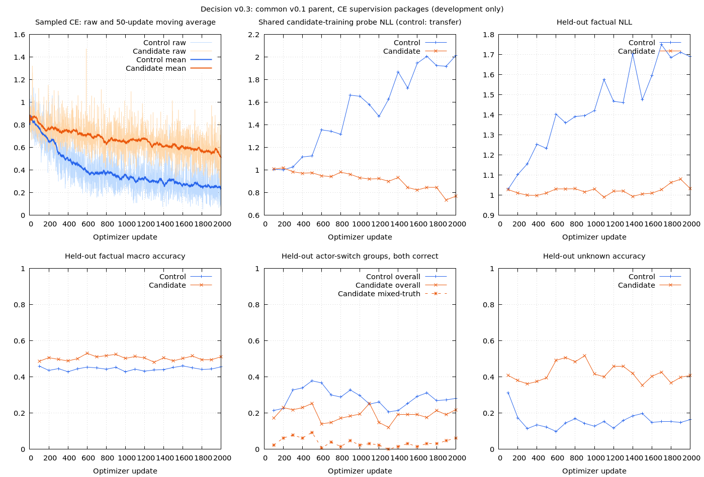

# Decision v0.3 — own-model robust factual scoring

Status: **completed, no promotion, 2026-10-03**. The user authorized completing [v03-plan.md](v03-plan.md). Implementation, fitting, both bounded pilots, calibration, one-time fresh evaluation, runtime checks and reports are complete. Neither arm has an eligible development checkpoint; confirmation is therefore skipped. **v0.1 remains delivered.** The v0.3 weights are diagnostics, not a factual-scoring release.

## What changes

The two arms start from the exact delivered own v0.1 weights and tokenizer. The control retains v0.2 supervision; the candidate adds independently varied actor/query/order supervision, reviewed question/candidate descriptions and explicitly sampled unknown examples. Both use ordinary candidate CE, unchanged architecture and 20% routing replay. This is a supervision-package comparison, not evidence isolating one data change.

```text
Own delivered v0.1: same tensors, tokenizer and model
                         |
         +---------------+----------------+
         |                                |
 Control: v0.2 supervision       Candidate: corrected v0.3 worlds
 50% natural/unknown            30% natural factual QA/NLI
 30% fact-flip pairs            30% known factual pairs
 20% routing replay             20% explicit unknown pairs
                                20% routing replay
         |                                |
         +----------- Development --------+
                         |
      Routing + known/unknown + mixed-actor + wording guards
                         |
          Conditional second-seed confirmation
                         |
          Calibration, one-time fresh evaluation
                         |
          Measured preview OR preserve delivered v0.1
```

The shared 6,627,841-parameter model is unchanged:

```text
State encoder ---------------------------+
                                         |
Question + each candidate encoder -------+--> cross-attention
             shared encoder x4                    |
             width 256, 4 heads            matching head 1024 -> 256 -> 1
             FFN 256 -> 768 -> 256                  |
             12k token embedding             one logit/candidate
                                                   |
                                            softmax / temperature
                                                   |
                                         Ruby assembles probability JSON
```

One checkpoint handles Chinese and English without an inference language argument. Other languages remain unvalidated. IDs can be numbers or strings; output JSON keys are strings. Two supplied choices cannot express an omitted unknown alternative. No Qwen preprocessing/distillation, external weights, MLM warm-up, RL, architecture growth or business integration is included.

## Frozen data and provenance

Active artifacts: `runs/decision/factual-v03/pilot/`. Runner: `benchmarks/decision/robust.rb`. Parent weights SHA: `a143ceacc22ae0d0184de7452554c68a7bfd71f029ef68d15f5dcd909234c135`, matching `runs/decision/release-v01-corrective/selected/weights.pt`. Tokenizer fingerprint: `5461faeec44b059b21cd8dc711877c39a92e3bb66422ce9ab460f1db045c8f87`.

| Material | Control train | Candidate train | Development | Calibration | Acceptance |
| --- | ---: | ---: | ---: | ---: | ---: |
| Public QA/NLI: BoolQ, OCNLI, DuReader-YesNo | 12,000 | 12,000 | 192 | 192 | 600 |
| v0.2 controlled facts/unknown | 11,520 | — | — | — | — |
| v0.3 controlled known/unknown | — | 13,312 | 1,664 | 1,664 | 10,400 |
| Routing replay or observed regression | 4,000 | 4,000 | 128 | 128 | 810 |
| Total | **27,520** | **29,312** | **1,984** | **1,984** | **11,810** |

Acceptance contains 200 controlled semantic families per language, across eight trained event domains and four withheld event domains. The natural panel has 200 English BoolQ rows and 400 Chinese rows across the other two sources, reported separately rather than weighting Chinese twice in the headline macro. Shared-question answer components can have multiple rows; the independent units and intervals are semantic groups, not row count alone. An additional 7,144-row v0.2 panel is preserved as factual/routing regression only.

Each generated family includes same-state actor/question changes, fact flips, both fact orders, irrelevant facts, absent queried actors and candidate wording/count variants. Both same-truth and mixed-truth worlds occur. Targets follow recorded facts; missing evidence is unknown, not false. Metadata never enters neural input. Generated expressions are reviewed finite templates, not unrestricted natural paraphrases or evidence of broad semantic understanding.

Remaining controlled-data limits are explicit: a family uses one event predicate, two primary actors and an optional appended third actor's irrelevant fact. Questions about present actors cover the first two; generated unknowns query an absent third actor. This does not establish arbitrary many-actor binding, missing-event uncertainty for a present actor, conflicting/time-dependent records, modality or code-switching. The independent distractor draw removes one deterministic correlation, not every possible dataset shortcut. Public QA/NLI must supply a separate view of natural-language transfer.

Training uses expression families 0/1 and candidate-description families 0/1; development/calibration use expression 2 and descriptions 2/3; acceptance uses expression 3 and descriptions 4/5. New name/world allocations alone do not establish generalization: the expression/domain separation and fresh natural panel are essential. Whole historical public components are excluded, including the preliminary rejected preparation's reserved material. All translations/world variants remain in one split; invariant transformations need not flip labels.

`protocol.json` freezes source hashes, parent/config/tokenizer, data fingerprints, schedules, budgets and selection/publication criteria. `baseline-snapshot.json` protects the unchanged development reference and protocol. `acceptance-opened.json` pins protocol, calibration and confirmation before final predictions. Data, downloads, weights and logs stay ignored by Git.

## Implementation audits and preserved corrections

The preliminary generator coupled irrelevant-fact truth to the opposite of the first actor's truth. Gold labels were internally correct, but the input correlation allowed a shortcut. The preliminary control was stopped at logged update 256 (committed checkpoint 200), before candidate training or acceptance; preserve `runs/decision/factual-v03/rejected-correlation/`. Its fitting check passed at updates 700/800, which does not validate that generator's generalization. The corrected `factual-v03-r2` family namespace uses independent irrelevant-fact draws and new allocations. A regression test checks all four relevant/irrelevant polarity combinations per language.

A deterministic actor-blind predictor exposes a second trap: it can achieve 50% overall actor-switch group correctness by solving same-truth worlds while scoring 0% on mixed-truth worlds. Retain the 40% overall binding floor and require 40% specifically on mixed-truth groups. This clarification is documented in `protocol-before-mixed-guard.json` and the current protocol amendment during the control pilot, before candidate training or acceptance. Primary factual/route metrics, thresholds already present, training data and optimization are unchanged. The control's formerly eligible checkpoints are screened against this narrower conjunction before candidate training; formerly ineligible ones cannot become eligible through an added guard.

The corrected 228-row fitting check reaches 100% individual and complete-family correctness at updates 600/700 and stops at 700. It uses dropout 0/LR 0.0003 for debugging; those fitted weights never initialize the pilots. The shared fixed fitting probe contains candidate-training examples, not the control's generated training examples. Its control NLL measures transfer, not training fit; chart labels must make that distinction explicit.

Necessary tests cover gold from explicit worlds, actor/query/order variation, expression isolation, actual sampler proportions, incomplete-group rejection, group/material leakage under different IDs, mixed-truth metric validity, actor-blind gate rejection, resume equivalence and CE effective-update equivalence across microbatch sizes with mixed candidate counts. These checks reduce implementation uncertainty; they are not a proof that no bug remains.

Implementation verification on 2026-10-03: `bundle exec rake test` passes **208 tests / 2,531 assertions**; `bundle exec rake lint` reports **184 files, no offenses**. The independent learning suite also passes 13 tests / 56 assertions. CUDA fitting, bounded pilots and inference parity/memory checks supplement the CPU unit tests; their measured outcomes belong in the experiment results, not the unit-test count.

## Training, selection and completion procedure

Pilot configuration: CUDA first with 4,096 MiB process budget on the 6 GiB RTX 3000; FP32; microbatch 4/accumulation 8; LR 0.0001 with 100-update warm-up; dropout 0.1; seed 1337; 2,000 updates per arm; development checks every 100. Both arms have the same effective example budget and replay allocation, but their rows, random draws and token exposure differ. Report actual visits/unique groups/tokens rather than claiming identical token budgets.

Development eligibility requires per-language routing no more than 3 percentage points below the unchanged baseline, known accuracy at least 60%, unknown at least 50%, overall and mixed-truth actor-switch groups at least 40%, and candidate-wording accuracy at least 50%. These are bounded preview floors, not universal 80% or 95% guarantees. Rank eligible checkpoints by equal-language source-macro factual accuracy, breaking ties by factual NLL. A candidate gain of at least 3 points over the parent and 1 point over the control's best development macro triggers seed-2027 confirmation. No final-test result selects a checkpoint or seed.

After selection/confirmation, independently calibrate all evaluated models, open acceptance once and retain raw logits/predictions. Positive temperature cannot repair wrong argmax choices. Natural QA/NLI, controlled known/unknown, mixed/same binding, candidate wording, withheld events and old regressions remain separate in reports. Probability calibration across a predominantly controlled panel does not establish calibration for arbitrary natural requests.

## Completed results

Both arms finish **2,000 CUDA updates / 64,000 visits**. The control's best development macro is 46.13% at update 1,600; the candidate's is 53.13% at update 600, versus 44.29% for the unchanged parent. Neither is eligible. No seed-2027 run is launched. With no selected checkpoint, final update-2,000 weights are evaluated for diagnostics; they are not selected retrospectively from acceptance.

The fresh panel below is common to all three checkpoints. EN/ZH entries are percentages. Factual macro averages sources within each language, then languages equally; row accuracy counts individual factual decisions. Different weighting can move these measures in opposite directions.

| Fresh-panel measure | Own v0.1 | Control | Candidate |
| --- | ---: | ---: | ---: |
| Factual source/language macro | 41.63 | 42.70 | **52.23** |
| Factual row accuracy | 35.52 | 35.69 | **31.99** |
| Natural QA/NLI, EN / ZH | 48.50 / 48.00 | 61.00 / 56.00 | **64.50 / 56.75** |
| Controlled row accuracy, EN / ZH | 38.90 / 30.67 | 35.73 / 33.12 | **29.13 / 31.69** |
| Known accuracy, EN / ZH | 47.35 / 16.30 | 40.43 / 32.55 | **15.43 / 16.88** |
| Unknown accuracy, EN / ZH | 10.75 / 78.58 | 20.08 / 35.00 | **74.83 / 81.08** |
| Actor-switch groups, both correct, EN / ZH | 22.38 / 3.50 | 17.75 / 8.75 | **1.00 / 2.75** |
| Mixed-truth actor-switch groups, EN / ZH | 7.21 / 0.00 | 5.53 / 2.88 | **0.72 / 0.00** |
| Same-truth actor-switch groups, EN / ZH | 38.80 / 7.29 | 30.99 / 15.10 | **1.30 / 5.73** |
| Candidate-wording rows, EN / ZH | 38.08 / 56.33 | 36.67 / 44.50 | **53.83 / 57.42** |
| Withheld event domains, row accuracy, EN / ZH | 37.02 / 30.10 | 35.10 / 32.84 | **30.29 / 31.63** |
| Routing regression, EN / ZH | 78.43 / 81.09 | 79.17 / 80.10 | **78.68 / 79.85** |

Natural source details: candidate BoolQ 64.50%, OCNLI 45.00%, DuReader 68.50%; control 61.00%, 43.00%, 69.00%; unchanged v0.1 48.50%, 37.50%, 58.50%. These are useful task-supervision gains against v0.1, not proof of general factual reasoning. Routing on the observed regression panel is retained reasonably, although Chinese development routing at the final checkpoint is 78.13% versus the parent's 82.81%, outside the frozen development tolerance. The binding/known failures independently prohibit promotion.

The candidate's aggregate gain is largely an unknown-prediction trade-off. Each language has 4,000 controlled known rows and 1,200 unknown rows; source macro gives those two sources equal weight. Unknown improvements can therefore raise macro while many more known rows become wrong. All three models have **0% completely correct 26-row worlds**. The candidate is below the analytical uniform-guessing controlled-row reference of 35.90% in both languages. Do not present 52.23% as a reliable judgment capability.

`reference-baselines.json` records reporting-only position references, computed after policy freeze: first option 35.12%, last option 43.96%, uniform expected accuracy 37.08% under the same factual macro. First/last use only option position, never gold/source metadata; uniform is an expectation, not a sampled predictor. These references do not alter selection or release rules. The last option is often unknown here; candidate permutation tests remain necessary for a real predictor.

Group bootstrap uses 300 whole-semantic-group resamples. Candidate per-language factual-macro 95% percentile intervals are **49.25–54.37% EN / 50.16–55.40% ZH**; natural intervals are **58.62–71.43% / 51.38–61.57%**. These are individual-checkpoint intervals, not paired gain intervals or multi-seed evidence. Full intervals, contrast axes, target confusion and each domain are in `report.json`. On the previously observed 7,144-row v0.2 regression panel, factual macro is 46.33% parent, 67.62% control and 53.96% candidate. Old-template performance and fresh expression performance differ sharply; the earlier v0.2 headline is not directly comparable to the new panel.

| Factual probability measure | Own v0.1 | Control | Candidate |
| --- | ---: | ---: | ---: |
| Fitted temperature | 2.09236 | 4.78032 | 2.05843 |
| Raw → calibrated NLL | 1.0994 → 1.0451 | 1.3874 → 1.0431 | 1.5988 → 1.2042 |
| Raw → calibrated Brier | 0.6861 → 0.6495 | 0.7899 → 0.6468 | 0.9275 → 0.7538 |
| Raw → calibrated ECE | 0.1444 → 0.0732 | 0.2636 → 0.0732 | 0.3692 → 0.2281 |

Calibration improves each model's probability metrics, but candidate probability quality remains worse than the control and parent. ECE depends on the evaluation mixture/binning; do not treat it as a universal guarantee. The evaluated parent temperature is a new factual-panel diagnostic policy, not an overwrite of the delivered v0.1 calibration.

## Exposure, loss and runtime

| Pilot exposure | Control | Candidate |
| --- | ---: | ---: |
| Visits | 64,000 | 64,000 |
| Unique visited rows / groups | 24,242 / 8,897 | 24,805 / 8,313 |
| Valid input tokens | 9,329,604 | 8,967,820 |
| Explicit generated unknown visits, EN / ZH | 2,271 / 1,143 | 6,340 / 6,460 |
| First 100 → last 100 sampled CE mean | 0.7995 → 0.2498 | 0.8441 → 0.5500 |
| GPU process memory at validation boundaries | 650–696 MiB | 652–690 MiB |

The 20% candidate unknown bucket supplies exactly 12,800 visits; OCNLI additionally contributes 1,622 Chinese neutral/unknown visits. The control contributes 2,498 such OCNLI visits. Increased and balanced explicit unknown exposure is verified, but is insufficient for joint known/unknown/binding reliability under this recipe. This is a package comparison, not an isolated causal estimate of sampling.



Training loss really decreases; held-out loss does not improve sustainably. Candidate fitting-probe NLL falls modestly, while its mixed-truth curve stays near zero. Control probe NLL is transfer on candidate-training worlds, not control training fit. The control process began before the mixed-truth metric clarification, so its historical trace lacks that field; the chart does not invent a control mixed-truth curve. Final evaluation computes both models' mixed/same metrics with the corrected evaluator. Raw losses, 50-update smoothing, pre-clip gradient norms and full-precision values are retained in JSONL/TSV; accuracy axes use 0–1.

Both runtime workers pass CPU/CUDA parity (candidate maximum probability delta below `1.8e-7`), option permutation, chunk size 1, numeric IDs, probability sums and JSON serialization. Repeated CUDA inference memory remains **164 MiB at all five measured boundaries** in each worker; the earlier cached-call check is 162 → 162 MiB. All 2,000 logged updates in each arm use CUDA; no training/evaluation CPU fallback is observed. Validation-boundary memory is not a measurement of peak training allocation.

Candidate warm cached local mean latency is 27.67 ms CPU / 49.47 ms CUDA, ten calls each in a separate worker. For these small requests, GPU dispatch overhead can outweigh its compute benefit; this is not a throughput or tail-latency benchmark. CUDA remains the configured first choice. Runtime checks use diagnostic checkpoints' stored temperature, while acceptance probability metrics use the separately frozen factual calibration policies.

## Artifacts, use and conclusion

```text
runs/decision/factual-v03/
|-- rejected-correlation/       # excluded first preparation/fit/partial control
`-- pilot/
    |-- protocol*.json, baseline*.json, confirmation.json
    |-- data/                   # both trains, development, calibration, test, regression
    |-- fit/                    # completed debugging fit; not the pilot parent
    |-- control-1337/choice/     # final diagnostic checkpoint, optimizer and raw loss
    |-- candidate-1337/choice/   # final diagnostic checkpoint, optimizer and raw loss
    |-- calibration.json, acceptance-opened.json
    |-- predictions-*.jsonl, regression-*.jsonl, evaluation*.json
    `-- report.json, runtime-*.json, reference-baselines.json, comparison.*
```

Diagnostic inference, with no language argument:

```ruby
require "easy_ai"

predictor = EasyAI::Decision::Predictor.load(
  "runs/decision/factual-v03/pilot/candidate-1337/choice", device: :auto
)
result = predictor.probabilities(
  state: "小林买了票，小周没有买票。",
  question: "以下说法成立吗：小周买了票？",
  options: [
    { id: 0, text: "成立" },
    { id: 1, text: "不成立" },
    { id: 2, text: "信息不足" }
  ]
)
puts JSON.pretty_generate(result)
```

The candidate weights SHA is `9c31c418d2377205124a3558e3a965c1eba50b338e79a1418f8607cecbef7a6d`; control is `b8ddeaa435c40bd76be80536f241127c3f3490fb3281c24038da1e7d5345c55e`. These loads use **temperature 1**, not the separate evaluated calibration policy. There is no `v0.3-factual-preview` directory and no `Release.load` v0.3 API. The delivered model remains `EasyAI::Decision::Release.load("runs/decision/v0.1-preview", device: :auto)` for its documented request-domain scope.

This iteration improves natural-task scores and makes data/metric errors testable, but fails to produce useful shared factual judgment. Small fitting success, lower training CE, more unknown visits and higher source macro are each insufficient on their own. Unseen expressions coincide with a large unknown bias; expression, domain and wording shifts are bundled here, so their individual causes remain unresolved. The result does not establish that merely adding parameters, data or updates would solve it.

Stop this bounded round. Preserve its predictions as observed regression, and require a new independently reserved protocol before more optimization. The original stop condition points toward a separately authorized foundational-representation comparison, rather than another unbounded supervision sweep. Path C remains an option, not an implementation started here. Path B remains removed; RL, capacity growth and business integration remain outside this goal.

## Next-round prerequisite: training-data quality

User follow-up (2026-10-03): explicitly investigate whether the training supervision itself is good enough. **Audit data quality before choosing the next training or foundational-representation intervention.** The v0.3 result does not establish that the architecture or semantic representation is the primary cause. Correct program-derived targets, balanced visits and a large row count are insufficient evidence of useful supervision.

The next plan should include:

1. **Gold and answerability review.** Independently review a stratified sample (initially about 200 examples, plus complete contrast families) across languages, sources, targets, actors and candidate counts. Review state, question and all options before revealing the stored target. Record relabeling, ambiguity and missing-context rates; preserve original labels and adjudication reasons. A shared-question answer component may need its full source context to review correctly.
2. **Annotation compatibility.** Check whether support/contradiction, missing evidence, public NLI neutral and conditional “depends” retain their annotated meanings under each adapter's question/options. They need not describe the same uncertainty. Check negation scope, query referents, natural translation and semantic equivalence of candidate descriptions. Class names alone cannot establish compatibility.
3. **Shortcut and diversity audit.** Inspect joint actor/query/order/polarity/distractor/target distributions and near-duplicate template families, not just individual frequencies. Count independent propositions, contexts and construction families separately from names and rows. Use deliberately weak references and input-removal diagnostics on development material; removing relevant state can make the original target unanswerable, so this is a sensitivity probe, not newly labeled accuracy. No semantic keyword rules enter inference.
4. **Coverage and learning difficulty.** Include reviewed single-fact and two-actor cases, both assertion polarities, true and false evidence, absent relevant evidence, and answer-preserving transformations. Review both same-truth and mixed-truth worlds. Measure training fit by subtype and actual repeated exposure; more nominal data can dilute learning under a fixed update budget. Controlled worlds test specific logic, while varied natural gold examples test transfer.
5. **A controlled quality comparison.** Only after the audit, freeze a bounded original-supervision versus reviewed-supervision experiment from identical own parent weights and architecture, with matching update budget and declared language/target/replay allocation. Keep counts comparable where possible and disclose token/unique-example differences. Avoid changing capacity, objective and initialization simultaneously. Judge known/unknown balance, mixed binding, natural transfer and probability quality together, rather than just macro accuracy.
6. **A reviewed independent evaluation.** Reserve complete source components/world families and genuinely new expressions before training. Use all observed v0.1–v0.3 panels only as regression. Record label-review and exclusion policies before final predictions; do not silently repair an opened test to improve a score.

Deliver an audit with representative accepted/rejected cases, error/ambiguity rates, source-meaning checks, diversity/exposure counts and the prospective comparison protocol. Quality is a testable hypothesis, not a preselected explanation. If reviewed supervision improves the same model, that supports the intervention under the measured conditions; if it does not, distinguish failure to fit from failure to transfer before considering representations, capacity or additional compute. This follow-up is documented planning, not a new training run or authorization to resume Path B.

## Reproduction and resumption

Prerequisites are the own v0.1 checkpoint, frozen v0.2 control dataset/protocol/tokenizer and public caches referenced above; see [v01.md](v01.md) and [v02.md](v02.md) to reconstruct missing parents/data. Reconstructing historical weights is separate from this bounded pilot. No system tool or new gem installation is currently required locally.

First-time preparation/execution on a workspace without these v0.3 panels in its history:

```bash
bundle exec ruby benchmarks/decision/robust.rb --phase all --output runs/decision/factual-v03/new-run
```

On this workspace the completed/prepared allocations are already historical. To reproduce the recorded recipe in a new directory, explicitly replay the frozen data:

```bash
bundle exec ruby benchmarks/decision/robust.rb --phase replay --source runs/decision/factual-v03/pilot --output runs/decision/factual-v03/replay
```

Replay reruns fitting, both pilots, conditional confirmation, calibration, evaluation and charts. It is **regression**, not new blind acceptance; replay cannot authorize independent promotion. A new output name or training seed cannot make observed expression families fresh. A future optimization must reserve a new protocol/panel.

Individual phases are `prepare`, `baseline`, `fit`, `train --arm control`, `train --arm candidate`, `confirm`, `evaluate`, `report`. `train` can resume an interrupted arm from its latest committed checkpoint, preserving sampler/dataset/config metadata; completed summaries are not silently overwritten. `evaluate` rejects an already opened panel. `report` derives charts/intervals from saved predictions and repeats runtime smoke checks in separate Ruby processes; it does not retrain or reopen acceptance. The first corrective preparation has its own preserved rejection record; never resume it as the active pilot.

Runtime checks compare CPU/CUDA probabilities, candidate permutation and chunk size 1 with numeric IDs, JSON validity and repeated-inference memory. Latency is measured in separate reporting workers to avoid the large report heap, but remains a small warm-cache local smoke measurement rather than a production throughput claim.
