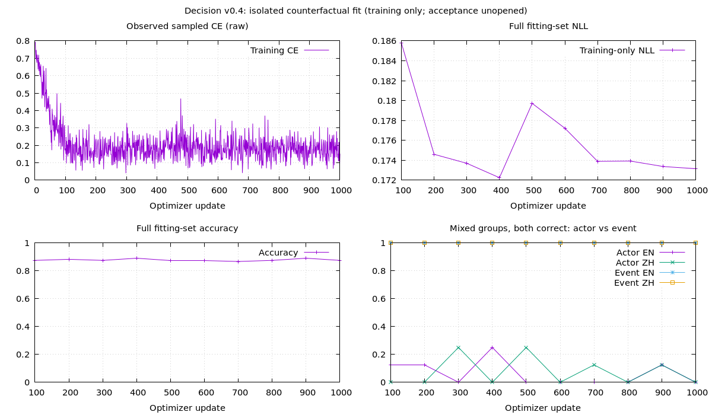

# Decision v0.4 — reviewed supervision and counterfactual fitting

Status: **completed bounded implementation, 2026-10-03; fitting failed, no promotion**. The authorized [v04 plan](v04-plan.md) is implemented. Its first training check identifies a specific actor-binding failure on training examples. The prescribed stop applies: no mixed pilots, unknown stage, confirmation, calibration or acceptance predictions. **v0.1 remains the delivered scoring preview.** The new fitting weights are diagnostic only.

## Outcome and its meaning

The 128-row fitting set contains two complete bilingual frames: two people performing the same event, and one person performing two different events. Each frame includes all four truth assignments, both queried facts, both claim polarities and both record orders. It uses training material only, own v0.1 initialization, unchanged 6,627,841 parameters, dropout zero, plain candidate CE and a fixed 1,000-update maximum.

| Final training-only result | English | Chinese |
| --- | ---: | ---: |
| Decisions | 64 | 64 |
| Accuracy / balanced known accuracy | 87.50% | 87.50% |
| Same-truth actor cases | 100% | 100% |
| Mixed-truth actor cases, individual decisions | 50% | 50% |
| Mixed-truth actor complete groups | 0% | 0% |
| Different-event cases, individual decisions | 100% | 100% |
| Mixed-truth event complete groups | 100% | 100% |
| Mixed actor/event complete groups combined | 50% | 50% |

The combined group result conceals the important distinction: event groups pass, whereas mixed actor groups cannot reliably identify **which person did or did not perform the event**. A representative training counterfactual is:

```text
Quinn Hall bought a train ticket. Taylor Chen did not buy a train ticket.
Quinn Hall did not buy a train ticket. Taylor Chen bought a train ticket.

Claim in both cases: Quinn Hall bought a train ticket.
Expected judgment:    supported                     contradicted
```

Every same-event mixed counterfactual pair has the same multiset of tokenizer IDs. Correct answers therefore require using the relations/order, not only the presence of names and negative words. Absolute change in the supported-minus-contradicted logit margin is only **0.0282–0.0628 EN / 0.000266–0.0130 ZH** across these swaps. The different-event counterparts have different token multisets and margin changes of **25.04–28.93 EN / 25.84–37.01 ZH**. This supports a weak relational-binding diagnosis under this representation/optimization recipe; it does not prove one architectural cause or universal inability of this network.

The model does use both inputs: replacing record or claim content with a valid constant reduces fitting accuracy to 50%. Input dependence alone does not establish correct use of the evidence. These perturbed requests retain original labels and are sensitivity diagnostics, not additional gold data.

Sampled CE decreases: first 100-update mean **0.423529**, last 100 **0.175739**. Full fitting-set NLL moves from **0.185784 at update 100** to **0.173146 at update 1,000**. The latter is close to `0.25 * ln(2) = 0.173287`: 75% of examples are nearly certain/correct while the remaining 25% are near binary chance. A low average loss can hide the entire difficult relation slice. This is training fit, not an 87.5% generalization result.



The raw sampled loss is unsmoothed. The other three plots evaluate the complete fitting set every 100 updates; **none is held-out acceptance**. Source: `DecisionJudgment.failed_fit_report` in `benchmarks/decision/judgment/report.rb`; raw traces, TSV and Gnuplot script remain in the ignored run directory. No loss curve is manufactured from a desired trend.

## Supervision review

An assistant reviewed rendered record/question/options with stored targets hidden, then imported the decisions against an export manifest. This is **one assistant reviewer**, not independent native-human adjudication, teacher verification or inter-reviewer agreement. Rates below indicate agreement with source gold under the declared record-evidence reading; disagreements do not automatically establish wrong source annotations.

| Initial screen | Reviewed | Excluded | Proposed disagreement | Agreement with stored target |
| --- | ---: | ---: | ---: | ---: |
| Controlled known | 34 | 0 | 0 | 100% |
| Controlled unknown | 16 | 0 | 0 | 100% |
| BoolQ | 50 | 18 | 2 | 60% |
| OCNLI | 50 | 3 | 13 | 68% |
| DuReader-YesNo | 50 | 11 | 10 | 58% |

Useful distinctions:

- A non-bank **financial** institution is not a **non-financial** institution. Similar words can conceal different referents.
- Being unaware now does not establish that a character never learns something later; advertising ending does not establish manufacturing ending.
- “No negative reports” is not proof that no problem occurred. Absence and explicit negative evidence need different labels.
- DuReader conditional `depends` is not factual `unknown`. The original adapter already preserves the `depends` ID; this review did **not** discover an adapter that wrongly merged them.
- Some NLI annotation conventions admit broader pragmatic inferences than the initial explicit-record profile. Unresolved disagreements are excluded, not replaced with assistant labels.

Only reviewed, nonexcluded, agreement-known BoolQ/OCNLI rows enter natural training: **30 EN / 22 ZH**. All DuReader, disputed labels and neutral judgments are excluded from the binary-stage natural mixture. This small public subset is qualified supervision, not sufficient multilingual semantic pretraining.

A separate history-excluded 100-example target-blind short-public-record review reserves natural acceptance:

| Fresh source screen | Reviewed | Excluded | Disagreement | Retained |
| --- | ---: | ---: | ---: | ---: |
| BoolQ | 50 | 16 | 2 | 32 |
| OCNLI | 50 | 6 | 9 | 35 |

Retained English labels: 16 supported / 16 contradicted. Chinese: 12 supported / 8 contradicted / 15 insufficient-evidence. Binary evaluation would use only the 20 genuinely known Chinese cases. **This falls well short of the proposed 200 eligible natural decisions per language.** Source questions/components are excluded from historical exposure, but labels were reviewed for scope before training; “closed acceptance” means no checkpoint predictions or test-driven choices, not an uninspected annotation file. The subset was not evaluated after fitting failed. Its small size would limit publication confidence even if a later independent protocol succeeded.

The first screen is stratified by source/language/target; candidate count and assertion polarity are represented but not independently quota-matched. Individual decisions/reasons, original targets and hashes are preserved locally. A transcription offset detected by import validation was corrected against the blind queue before successful import; the original transcription remains `reviews-before-transcription-fix.jsonl`. This is not a model-label correction.

An independent stored-fact oracle also audits **all 13,312 controlled v0.3 training rows / 256 bilingual family IDs**: zero gold mismatches, but **1,024 stale `truth_pattern` values** on fact-flip rows. This supports the previous distinction between reporting metadata and labels. It does not prove every rendered public example correct. v0.4 integrity checks additionally compare rendered clauses/claims with explicit facts and reject stale truth or mixed-world metadata.

Review files: `runs/decision/judgment-v04/review/` and `review-natural/`; source caches/licenses remain as documented in [semantics.md](semantics.md). Downloads, datasets, reviews, logs and weights are ignored by Git.

## Implemented procedure and frozen preparation

```text
200-row existing-supervision screen + full controlled-family oracle
                         |
100-row fresh short-public-record review
                         |
Freeze own parent, profiles, families, exposure and checks
                         |
128-row isolated known counterfactual fit (max 1000 CUDA updates)
                         |
                  FAILED actor binding
                         |
Training-cell / token-multiset / gradient / runtime diagnostics
                         |
Stop; preserve v0.1 and unused acceptance families

Implemented but NOT executed after that stop:
 common-parent control / reviewed-data pilots
 known stage -> mastery -> joint unknown stage
 development selection -> conditional second seed
 profile calibration -> one-time acceptance -> scoped preview
```

Both prepared arms have **11,220 rows**: 3,584 controlled decisions per language, 52 reviewed natural decisions and 4,000 shared routing rows. Control retains 128 prior base-world families; candidate has 32 complete lexical frames, each reusing identities across all four truth assignments. Equal rows do not mean equal independent semantic coverage. Control has only absent-actor unknown cases; candidate adds present-actor/unrecorded-event cases. Their raw profile/class counts differ and are frozen in `protocol.json`.

Candidate controlled rows per language: 512 supported + 512 contradicted + 1,024 unknown with three options; 1,024 two-option multi-fact rows; 512 two-option single-fact rows. The complete generator checks either actor/event flip, both claim polarities and both record orders. Current controlled records have one or two propositions; four-proposition and multi-step competence is not demonstrated.

Canonical profiles are fixed before training:

```text
EN: supported by the record / contradicted by the record /
    insufficient evidence in the record
ZH: 记录支持该陈述 / 记录否定该陈述 / 记录信息不足，无法判断
```

Binary omits insufficient evidence **only for known training/evaluation cases**. Its probabilities are conditional on that two-choice set and cannot determine answerability. Numeric/string IDs remain identifiers only; question and option text carry neural meaning. One shared bilingual checkpoint needs no inference language argument; Ruby assembles JSON.

The staged trainer uses deterministic 32-row batches with 4-row microbatches / 8 accumulation steps. Over five updates, exposure is exactly 96 controlled / 32 natural / 32 routing decisions, equally allocated between EN/ZH. Joint controlled visits are balanced supported/contradicted/unknown within each language. Natural binary rows retain their reviewed source meanings; routing retains its 18 candidates.

Known stage: 200 single-fact updates, then multi-fact pairs, at most 1,000 updates. Advancement requires training-probe balanced accuracy ≥95%, mixed groups ≥90%, independent canonical development ≥55% in each language for two consecutive checks. Joint stage uses the remainder of the 2,000-update ceiling. It preserves the pre-unknown checkpoint. Failed known mastery stops that arm. Ordinary CE, unchanged own parent/model, LR `0.0001`, warmup 100; the isolated fit uses dropout zero, LR `0.0003`, no warmup. Fitting weights never initialize pilots.

Development/calibration/acceptance reserve **100 / 40 / 200 complete bilingual controlled frames**, respectively. Canonical development has 1,600 binary and 3,200 joint decisions per language. The unchanged parent measures 51.88% EN / 51.00% ZH binary balanced accuracy, with mixed groups 6.75% / 7.00%. Three-state class macro recall is 35.69% / 36.29%. These are development references, not v0.4 improvements. Held-expression/options views share the same acceptance frames and must not be counted as independent examples. Historical public/routing panels remain regression only.

Preview selection ranks worst-language class macro recall, then NLL. Binary floors: 75% balanced known accuracy and 50% mixed groups; joint: each known/unknown recall 70% and mixed groups 50%. The implementation additionally checks **actor and event groups separately**: perfect event performance must not hide zero actor binding. That narrowing guard was added during implementation review after the training-only failure, before any pilot or acceptance predictions; no fitted or publication result is rescued by it. A negative-fixture test shows the misleading aggregate explicitly. Confirmation requires five-point parent gains in both languages and qualifying development. Fresh natural accuracy must be ≥65% and no worse than parent by over three points. No profile is selected in this round.

## Correctness, runtime and local artifacts

Tests cover rendered gold, both fact flips, missing-event versus absent-actor evidence, complete groups and leakage, deliberately broken labels/metadata/text, exact mixture/class/language exposure, 18-option replay, metric shortcut baselines, acceptance guards, and deterministic optimizer/coverage resume across a stage transition. Validation preserves live parameter objects. An integration preflight caught a sampler incorrectly assuming routing also had two choices; it was fixed and the fixture now uses real 18-candidate shape before training. No loss/kernel bug was demonstrated by the failed fit.

Final validation: **221 tests / 6,214 assertions, zero failures/errors/skips**; RuboCop inspects 195 files with no offenses. The mixed-candidate accumulation test compares effective gradients and probability behavior, rather than requiring identical Adam updates on analytically shift-invariant, near-zero biases: FP32 reduction noise can be amplified by Adam's epsilon without changing the predicted distribution. Sparse valid sampling buckets are tested to retain a full 32-row effective batch. Parent and fitting tokenizer fingerprints match `5461faeec44b059b21cd8dc711877c39a92e3bb66422ce9ab460f1db045c8f87`.

All **1,000 fitting updates use CUDA**, with no CPU fallback. Logged preclip gradient norms span **0.01850–12.20506**; embedding maximum absolute change from parent is **0.0293792**. Weights updated and sensitivity remains nonzero. CPU/CUDA probability differences are below **9e-10** in the bilingual runtime smoke; permutation differences are zero. Chunked numeric-ID requests produce valid normalized JSON. Five repeated-inference process-memory samples are **192 / 192 / 192 / 192 / 192 MiB**. Warm cached single-call latency is roughly 32 ms CPU / 58 ms CUDA on this machine; these two requests are not a throughput benchmark.

Local evidence:

```text
runs/decision/judgment-v04/
|-- review/                  # blind export, original/proposed decisions, full-family audit
|-- review-natural/          # separate history-excluded source qualification
`-- pilot/
    |-- protocol.json        # data, parent, config, counts and gates
    |-- baseline.json        # development references only
    |-- data/                # frozen prepared arms and unused evaluation panels
    |-- fit/
    |   |-- choice/          # latest pointer, checkpoints and training.jsonl
    |   |-- measurements.json
    |   |-- predictions.jsonl
    |   |-- diagnostics.json
    |   `-- result.json
    |-- runtime-fit.json
    |-- comparison.png
    `-- report.json
```

Diagnostic loading, without retraining:

```ruby
model = EasyAI::Decision::Predictor.load(
  "runs/decision/judgment-v04/pilot/fit/choice", device: :auto
)
result = model.probabilities(
  state: "小林买了车票。小周没有买车票。",
  question: "根据记录判断陈述：小周买了车票。",
  options: [
    { id: 0, text: "记录支持该陈述" },
    { id: 1, text: "记录否定该陈述" }
  ]
)
```

This example demonstrates the API; the diagnostic model still fails actor binding. Use `EasyAI::Decision::Release.load("runs/decision/v0.1-preview", device: :auto)` for the existing delivered routing preview.

Runner: `benchmarks/decision/judgment.rb`. It expects local public caches, completed review manifests and the own parent. `all` prepares a new protocol and stops/reports when fitting fails. Fresh preparation rejects historical evaluation material: changing only the output directory cannot turn this fixed generator into fresh acceptance. To reproduce the bounded procedure using existing frozen data **as regression**, use:

```bash
bundle exec ruby benchmarks/decision/judgment.rb --phase replay \
  --source runs/decision/judgment-v04/pilot \
  --output runs/decision/judgment-v04/replay-1
```

Replay cannot publish a new preview. `--phase report --output runs/decision/judgment-v04/pilot` regenerates this failed-fit diagnostic and plot without training or opening acceptance. Separate actor/event curves are retrospectively collected from each saved fitting checkpoint on the same training set. Do not resume fitting or expand steps to change this round's outcome.

Protocol SHA256: `b87e79a6e740d7e0d19964915eac22414ca11ea5ac28defe850d9616dd78552e`. Final fitting weights SHA256: `5eb3272e26eb09ff5e4c42d2df39995dfcc97bca41edf28b968fef96b6ddaaf3`. Parent remains unchanged. The loss plot is the sole new tracked image; reviews/data/weights stay ignored.

## Next decision

Do not respond to this result with a larger mixture, unknown balancing or calibration. The first relation check already fails on repeatedly visited, consistent training examples. The most useful separately authorized next comparison is **representation/relational encoding with this reviewed core held fixed**: own-weight joint record/claim encoding versus the current separate/cross-attention path, with explicit positional-signal checks. The repository already exposes joint encoding; that does not establish it will work. Start with the same counterfactual fitting diagnostic, verify the token-order/actor slice, then reserve a new protocol for generalization. Only after those relations learn should corpus scale, language breadth and unknown supervision become the next interventions. No new architecture sweep, external model, Path B, RL or business work starts here.
