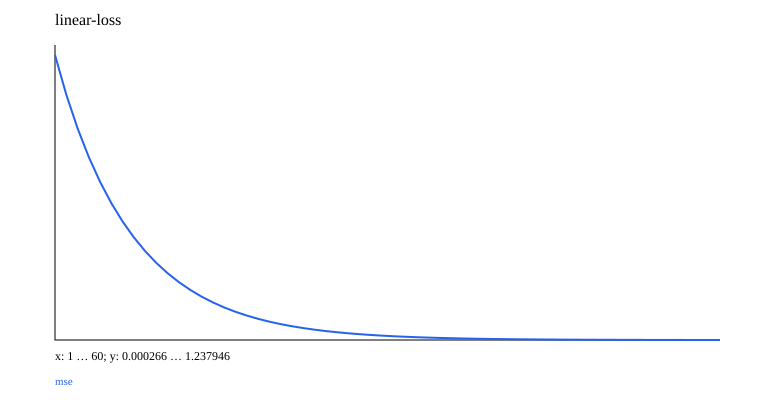

# 00 · Mathematics, data, and classical baselines

A minimal teaching experiment is implemented and runnable. Prerequisites: none. Next chapter: [01_basic_nn](../01_basic_nn/README.md).

Start with scalars, vectors, matrices, shapes, matrix multiplication, and the chain rule, then calculate one squared-error update by hand. The probability examples use stable sigmoid, softmax, and log-sum-exp cross-entropy to avoid exponentiating large logits directly.

| Implementation | Mathematics and purpose | Experiment |
| --- | --- | --- |
| Linear | `ŷ=w·x+b`; MSE gradient: `2 Xᵀ(ŷ-y)/N` | Fit `y=2x+0.3` |
| Logistic | `p=sigmoid(w·x+b)`; BCE gradient: `Xᵀ(p-y)/N` | Fit XOR quadrants with a linear baseline without feature interactions |
| PCA | Center using the training mean → covariance → orthogonal power iteration → projection/reconstruction | Compress four-dimensional data into two dimensions; use an orthogonal complement for zero eigenvalues |
| KMeans | Assign to the nearest center → update cluster means | Two groups of 2D points; retain the previous center for an empty cluster |
| CART / Forest / Boosting | Squared-error splits; bootstrap + feature sampling at each node; residual fitting | Compare nonlinear classification with Logistic |

Each generator uses a local Random instance without consuming global random state. Training and validation use seed and seed+1; standardization statistics must be computed from the training set alone. Read the confusion matrix before precision and recall: precision=TP/(TP+FP), recall=TP/(TP+FN). Define behavior explicitly when a denominator is zero. Accuracy is not the only useful metric for imbalanced tasks.

```ruby
model = EasyAILearning::Foundations::Linear.new(features: 1)
model.fit([[0.0], [1.0]], [0.3, 2.3], steps: 60, lr: 0.1)
model.predict([0.25])
```

PCA's linear subspace provides a baseline for the later Autoencoder lesson. Tree ensembles remind us to compare classical baselines before adding neural complexity. These examples demonstrate synthetic tasks rather than reproducing large-dataset benchmarks.

## Data, training, and independent inference

Run commands from the repository root and install dependencies with `bundle install`. Training and model inference default to `auto`: prefer CUDA and fall back to CPU when unavailable. You can also select `--device cpu` explicitly. These experiments use small synthetic datasets and require no model downloads. Limiting threads reduces CPU overhead for tiny tensors:

```bash
export OMP_NUM_THREADS=1 MKL_NUM_THREADS=1
bundle exec ruby learning/00_foundations/data.rb
bundle exec ruby learning/00_foundations/train.rb --steps 60
bundle exec ruby learning/00_foundations/predict.rb
bundle exec rake test:learning
```

Use `--seed` to change the random seed and `--output` to separate experiment directories. Training also accepts `--device cpu/cuda/auto`. The default output is `runs/learning/00_foundations/default/`; rerunning overwrites artifacts with the same names. `data.rb` exports samples from the data recipe for inspection. The training entry point calls the generators directly and does not depend on that JSON file. Experiment-specific shifts and masks are documented in the experiment source and the actual `data.json`.

For inference, `--model PATH` selects a saved model. `--value 0.25` supplies an input to the linear regression model.

## Results and correctness

The [recorded run](results.json) includes the seed, step count, environment, and metrics. The figure below comes from that run; it is not a test acceptance threshold.



[Experiment code](../lib/easy_ai_learning/foundations/experiment.rb) connects the steps; shared data generators are in [course/data.rb](../lib/easy_ai_learning/course/data.rb). Core checks are in the [tests](../test/course/foundations_test.rb), with additional gradient comparisons in [derivatives_test.rb](../test/course/derivatives_test.rb). Tests check deterministic formulas, shapes, masks, gradients, state, and parameter updates. They do not train toward a required accuracy or weight distribution.

Artifacts include the actual data, JSON inference state, history, diagnostics, and SVG figures. Full local parameters and histories remain under the ignored `runs/` directory; the repository contains only compact result summaries and figures. The non-neural experiments in 00/07 and the interactive training in 15 use task-specific records rather than forcing every result into a classification-loss format.
