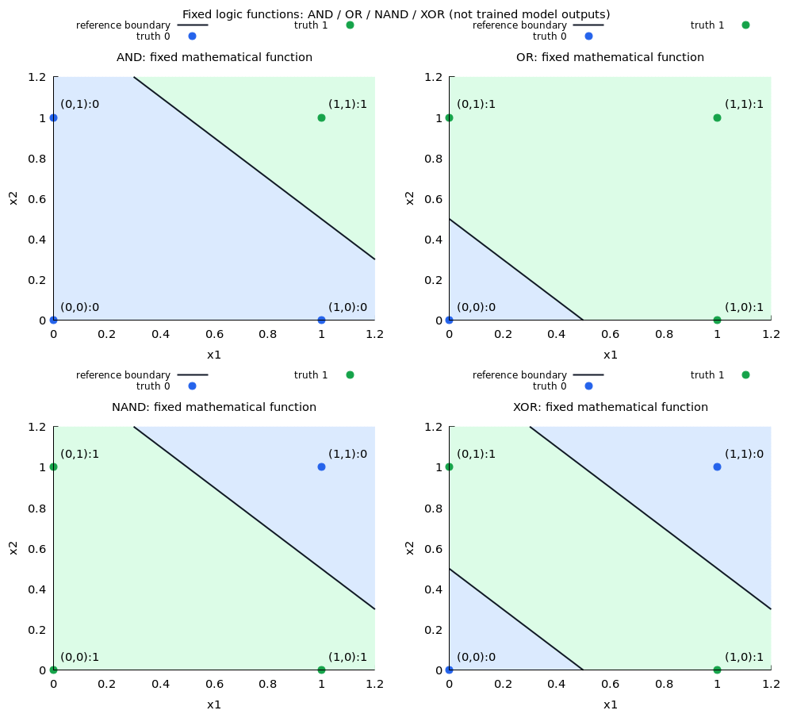
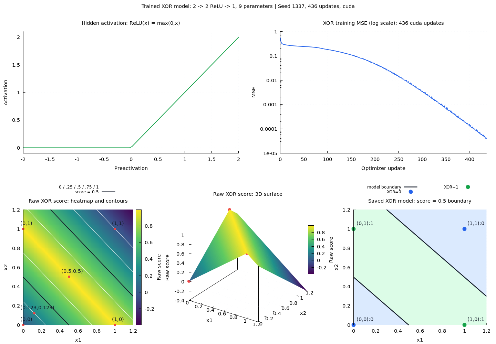
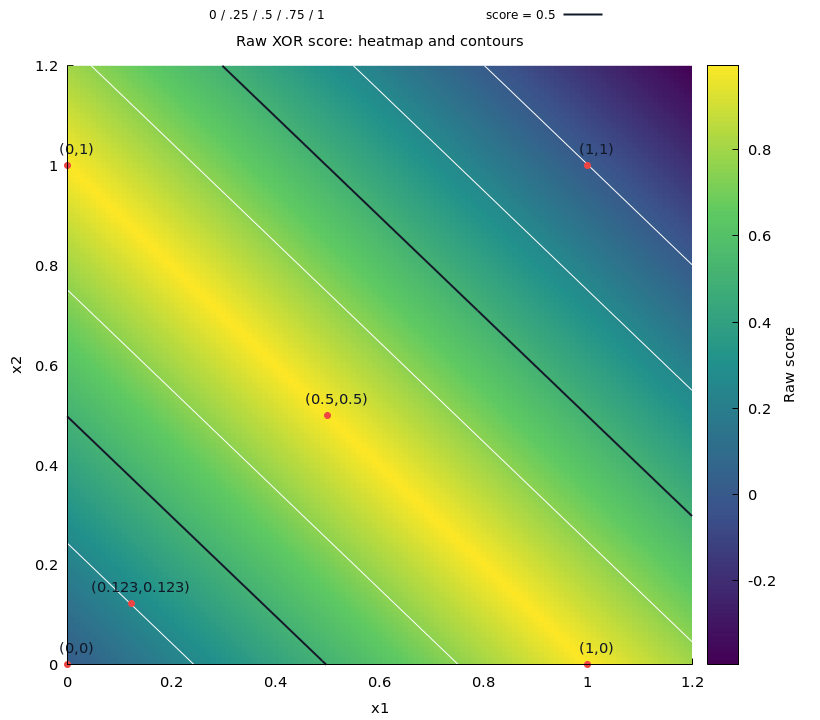
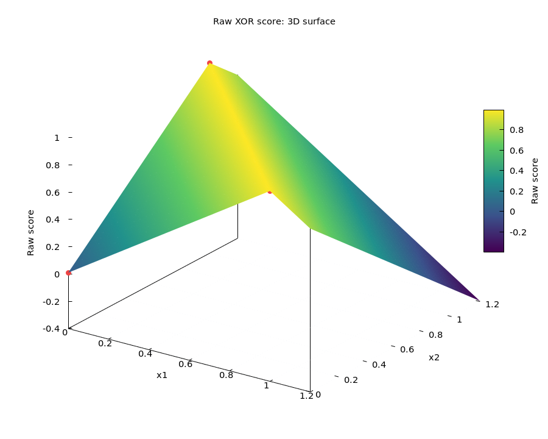

# Basic neural networks: XOR

Course position: [00 · Foundations](../00_foundations/README.md) → this lesson → [02 · Training](../02_training/README.md) → [03 · Diagnostics](../03_diagnostics/README.md). The implemented XOR/SGD experiment is the starting point; optimizer/dropout comparisons use a larger held-out task in the planned training lesson.

The trained model does one task: XOR. AND, OR and NAND remain fixed `if/else` and perceptron demonstrations in `logic.rb`; they are not neural outputs or training objectives.

## Architecture and parameters

```text
x1 ----+
       +--> Dense(2,2) --> ReLU --> Dense(2,1) --> XOR score --> >= 0.5 --> 0/1
x2 ----+

hidden: 2*2 weights + 2 biases = 6
output: 2*1 weights + 1 bias   = 3
                              ---
                                9 independently trainable parameters
```

Two hidden ReLU units suffice. One hidden ReLU with a linear output cannot separate the XOR corners with a threshold. Nine parameters describes this ordinary dense network with trainable biases and no skip connections; it is not a universal minimum if fixed weights or parameter sharing are allowed.

An exact construction demonstrates that a solution exists:

```text
h1 = ReLU(x1 + x2)
h2 = ReLU(x1 + x2 - 1)
XOR score = h1 - 2*h2
```

This construction is a separate demonstration. Training starts from seeded random coefficients, never these exact weights. Positive initial hidden weights and one initially negative bias help avoid dead ReLU units; not every seed is guaranteed to converge.

## Train and predict

From the repository root:

```bash
bundle exec ruby learning/01_basic_nn/logic.rb
bundle exec ruby learning/01_basic_nn/train.rb
bundle exec ruby learning/01_basic_nn/predict.rb
```

Training prefers Torch.rb CUDA, falling back to CPU when CUDA is unavailable. `--device cpu` forces CPU. Ruby defines the architecture and training loop; Torch performs tensor forward calculation, autograd and SGD. No corpus, model download or teacher is needed.

The complete Boolean truth table is the training set:

```text
Input   Target
[0,0]   [0]
[0,1]   [1]
[1,0]   [1]
[1,1]   [0]
```

Targets have shape `[4,1]`. Full-batch training minimizes mean squared error across the four XOR scores:

```text
z = W1*x + b1
h = ReLU(z)
y = W2*h + b2
L = sum((y-target)^2) / 4

dy = 2*(y-target)/4
dW2 += dy outer h; db2 += dy
dz = (W2^T * dy) * (z > 0)
dW1 += dz outer x; db1 += dz

parameter -= learning_rate * accumulated_gradient
```

`ScalarLogicNetwork` implements these calculations explicitly for learning and gradient checks; the runnable `LogicNetwork` uses Torch autograd. Training stops when every score is within 0.01 of its target, or reports failure at the step limit. A score is not a probability and can be slightly negative or greater than one. The prediction threshold is explicitly chosen as 0.5; it is not a learned parameter.

Load the saved model without retraining:

```ruby
require_relative "learning/lib/easy_ai_learning/basic_nn/logic_network"
model = EasyAILearning::BasicNN::LogicNetwork.load(
  "runs/learning/basic_nn/logic-gates/model.json", device: :auto
)

model.score([1, 0])   # one continuous XOR score, approximately 1
model.predict([1, 0]) # => 1
model.predict([0, 0]) # => 0
model.predict([0, 1]) # => 1
model.predict([1, 1]) # => 0

model.scores([1, 0])  # lower-level API: one-element array [score]
```

`predict` thresholds the neural output; it does not call the hand-written XOR branch. The load snippet assumes repository-root IRB. The save format now requires architecture `[2,2,1]` and output label `["xor"]`; old four-output models are rejected, rather than silently adapted.

## Observed runs and plots

Two independent image groups distinguish mathematical logic references from the XOR-only neural model.

### Logic functions: AND / OR / NAND / XOR



These four panels use fixed mathematical functions, not learned coefficients. AND/OR/NAND use the affine perceptrons from `LogicGates::PERCEPTRONS`, thresholded at zero. XOR uses the exact ReLU construction, thresholded at 0.5. The four Boolean targets are marked in each panel; axes run from 0 to 1.2. These references never compute the trained model's prediction or initialize its weights.

### XOR model: ReLU / training loss / score / prediction



The second group contains five panels in reading order: **ReLU**, **training loss**, **raw-score heatmap**, **raw-score 3D surface**, **prediction boundary**. The top row contains ReLU/loss; the bottom row contains heatmap/surface/prediction. ReLU is the fixed activation function; the loss and boundary come from the saved XOR-only run. The loss panel records full truth-table MSE on an explicitly labelled logarithmic vertical axis. It shows loss during gradient descent, not the gradient values themselves.

Both score views use the same full-precision saved-model evaluations on a 121 × 121 grid, with input axes 0–1.2. The colorbar spans the actual sampled score minimum/maximum, including negative values; scores are not clipped or converted to probabilities. The heatmap adds contours at 0, 0.25, 0.5, 0.75 and 1 where those levels intersect the sampled surface; black highlights 0.5. The 3D view uses height and color to show the raw output and the ReLU-induced folds. Red points mark the four Boolean inputs and the two untrained probes `(0.5,0.5)` and `(0.123,0.123)`; their exact scores are saved in `score-points.dat`. Interior points illustrate the learned continuous extension, not additional verified XOR labels.

For larger independent comparisons, the same export also creates these two images:





In the prediction boundary panel, `(x1,x2)` axes run from 0 to 1.2. Green is score >= 0.5; blue is score < 0.5. Dots show the four Boolean targets. The black boundary is the actual saved model's score=0.5 contour.

The boundary is sampled on a 121 × 121 grid at 0.01 increments. Full stored coefficients are loaded without decimal rounding; contour coordinates are exported with 17 significant digits. Gnuplot interpolates sampled scores, so the contour is a numerical approximation. ReLU produces piecewise linear functions; two straight boundary components are a valid XOR solution. Only the four corners were trained, so their correct predictions do not uniquely determine the intermediate boundary.

Swapping the inputs leaves XOR targets unchanged. Training may therefore learn nearly symmetric input weights, although symmetry is not imposed on parameters and other solutions can exist. The trained XOR-only model's input weight pairs are unequal; differences too small for image resolution can still look symmetric.

Generate the image from saved parameters without retraining:

```bash
bundle exec ruby learning/01_basic_nn/plot.rb
# Reviewed representative snapshot:
cp runs/learning/basic_nn/logic-gates/figure/{logic-functions,model-functions,score-heatmap,score-surface}.png \
  learning/01_basic_nn/images/
```

PNG export optionally requires gnuplot and is implemented in `learning/lib/easy_ai_learning/basic_nn/logic_figure.rb`. Training uses `unicode_plot` for terminal raw/log10 MSE, ReLU and XOR function slices at x2=0 and x2=1, without needing gnuplot. The terminal report is implemented in `logic_report.rb`.

## Saved artifacts

```text
runs/learning/basic_nn/logic-gates/     ignored local XOR run
|-- model.json                         full-precision inference parameters and training metadata
|-- loss.json                          full training history, including step zero
|-- plots.txt                          terminal plots
`-- figure/                            optional PNG and gnuplot source/data

learning/01_basic_nn/images/
|-- logic-functions.png                 fixed AND/OR/NAND/XOR references
|-- model-functions.png                 ReLU/loss/heatmap/surface/prediction group
|-- score-heatmap.png                    standalone score heatmap for comparison
`-- score-surface.png                    standalone score surface for comparison
```

The root `/runs/` ignore rule covers all local weights, histories and generated figures. The JSON saves inference parameters, not optimizer state for resuming training. Running training again overwrites the default run. Choose a separate output directory for comparison:

```bash
bundle exec ruby learning/01_basic_nn/train.rb \
  --seed 2027 --output runs/learning/basic_nn/xor-2027
bundle exec ruby learning/01_basic_nn/plot.rb \
  --run runs/learning/basic_nn/xor-2027 \
  --output runs/learning/basic_nn/xor-2027/figure
```

The default seed remains 1337; rerunning without `--seed` is reproducible rather than choosing another random seed. CPU/CUDA numerical differences can remain.

## Simplification history and verification

The earlier teaching model jointly learned AND/OR/NAND/XOR with 18 parameters. This lesson now trains only XOR with 9 parameters and one output, making its prediction API and loss directly match the task. The previous local four-output seed-20261002 run is archived under `runs/learning/basic_nn/logic-gates-20261002-four-outputs/`; earlier plots and coefficients can be reviewed from Git history.

The CUDA-trained default seed-1337 XOR model converged in **436 updates**, with maximum absolute error **0.009843296371400356** and all **4/4** Boolean predictions correct. This fits the complete finite truth table, not a held-out generalization benchmark. Tests check every manual derivative against finite differences, Torch autograd against the manual chain rule, learning from random initialization, and save/load prediction parity.
