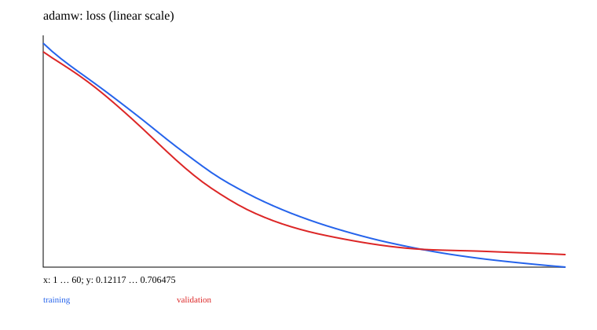

# 02 · Training: SGD → AdamW

A minimal teaching experiment is implemented and runnable. Prerequisite: 01_basic_nn. Next chapter: [03_diagnostics](../03_diagnostics/README.md).

Reuse the MLP idea from 01 with 96 continuous quadrant-classification samples and an independent validation set. All optimizers use the same architecture, split, initialization, and full-batch update budget. XOR's four-point truth table is useful for hand calculations, but unsuitable for comparing regularization and generalization.

Training order: forward → mean loss → zero_grad → backward → clipping/diagnostics → optimizer.step → eval/no_grad validation. The recorded training loss is computed in training mode before the update; validation loss is computed in evaluation mode after it. Dropout and timing differ, so the curves need not match point by point.

| Method | Implementation in this chapter |
| --- | --- |
| SGD / Momentum | `θ-=ηg`; `v=μv+g, θ-=ηv`; ordinary L2 is added to the gradient |
| Adam | First/second moments and bias correction; epsilon is added after the square root |
| AdamW | `θ=(1-ηλ)θ-η m̂/(sqrt(v̂)+ε)`; decay does not enter the moment estimates |
| Dropout / decay | Separate ablations; train/eval modes; improvement is not guaranteed |
| Schedule / warmup | Cosine decay after warmup; initial steps and the final endpoint can be checked by hand |
| Accumulation | Weight each microbatch mean loss by its actual sample/token count |
| EarlyStopping | Independent validation set, patience/min_delta, and restoration of the best model state |
| GradScaler | Explicit loss scaling, gradient unscaling, and skipped updates for non-finite gradients |

[Scalar reference](../lib/easy_ai_learning/training/scalar_optimizer.rb) → [tensor optimizer](../lib/easy_ai_learning/training/optimizer.rb) → [training loop](../lib/easy_ai_learning/training/loop.rb). Torch.rb 0.23 does not implement optimizer-state persistence, so this chapter saves moments, velocity, and per-parameter steps itself. Model state is saved separately. GradScaler is an explicit numerical teaching example; **it does not provide automatic autocast or a complete AMP setup**.

```ruby
loop = EasyAILearning::Training::Loop.new(model, kind: :adamw, lr: 0.02)
loop.run(steps: 60, validation: validation_loss) { training_loss.call }
state = loop.state_dict # JSON-serializable; save the model state_dict separately
```

The full-batch loop resets Torch's random seed to `seed+update_index`. Restoring the model and training state, using the same data/objective, and retaining the original total_steps reproduces the next dropout/corruption update exactly. This contract applies to these teaching loops; it does not automatically restore RL environments, replay buffers, the historical text batcher, or arbitrary external random state. EarlyStopping restores the best inference model. The final optimizer state is not rolled back and cannot be paired with that model as a checkpoint from the same training instant.

A fair optimizer comparison should also tune learning rates separately and use multiple seeds. This experiment is a comparison under a fixed teaching budget. Formula sources: [AdamW](https://arxiv.org/abs/1711.05101), [Dropout](https://www.jmlr.org/papers/v15/srivastava14a.html).

## Data, training, and independent inference

Run commands from the repository root and install dependencies with `bundle install`. Training and model inference default to `auto`: prefer CUDA and fall back to CPU when unavailable. You can also select `--device cpu` explicitly. These experiments use small synthetic datasets and require no model downloads. Limiting threads reduces CPU overhead for tiny tensors:

```bash
export OMP_NUM_THREADS=1 MKL_NUM_THREADS=1
bundle exec ruby learning/02_training/data.rb
bundle exec ruby learning/02_training/train.rb --steps 60
bundle exec ruby learning/02_training/predict.rb
bundle exec rake test:learning
```

Use `--seed` to change the random seed and `--output` to separate experiment directories. Training also accepts `--device cpu/cuda/auto`. The default output is `runs/learning/02_training/default/`; rerunning overwrites artifacts with the same names. `data.rb` exports samples from the data recipe for inspection. The training entry point calls the generators directly and does not depend on that JSON file. Experiment-specific shifts and masks are documented in the experiment source and the actual `data.json`.

For inference, `--model PATH` selects a saved model. `--input PATH` accepts a JSON file containing `{"input": ...}`; the default is a small example with the required shape. Seq2seq/EncoderDecoder perform free-running generation, GPT uses top-1 generation, and other models return scores or reconstructions. RL actor-critic models return policy logits and a value estimate.

## Results and correctness

The [recorded run](results.json) includes the seed, step count, environment, and metrics. The figure below comes from that run; it is not a test acceptance threshold.



[Experiment code](../lib/easy_ai_learning/training/experiment.rb) connects the steps; shared data generators are in [course/data.rb](../lib/easy_ai_learning/course/data.rb). Core checks are in the [tests](../test/course/training_test.rb), with additional gradient comparisons in [derivatives_test.rb](../test/course/derivatives_test.rb). Tests check deterministic formulas, shapes, masks, gradients, state, and parameter updates. They do not train toward a required accuracy or weight distribution.

Artifacts include the actual data, JSON inference state, history, diagnostics, and SVG figures. Full local parameters and histories remain under the ignored `runs/` directory; the repository contains only compact result summaries and figures. The non-neural experiments in 00/07 and the interactive training in 15 use task-specific records rather than forcing every result into a classification-loss format.
