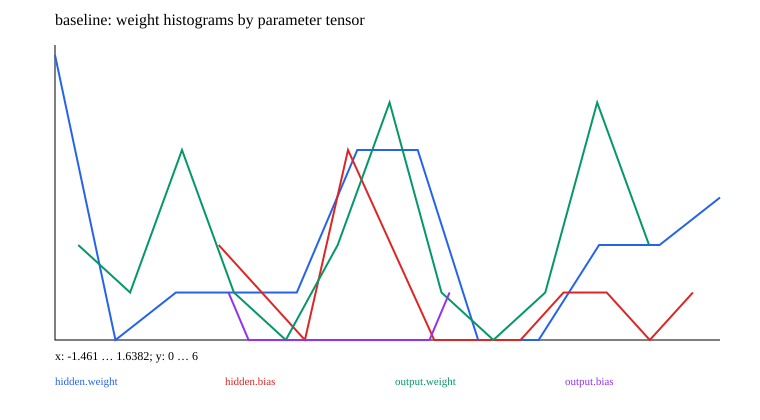

# 03 · Weights, activations, gradients, and training diagnostics

A minimal teaching experiment is implemented and runnable. Prerequisite: 02_training. Next chapter: [04_autoencoder](../04_autoencoder/README.md).

**There is no universally correct weight histogram; concentration near zero is not itself a failure.** Initialization, sparse tasks, weight decay, and normalization can all produce concentrated distributions. The goal is stable computation, effective learning, and independent validation performance rather than forcing weights to spread out.

Reuse the data and MLP from 02 to run a baseline, excessive decay, and a very small learning rate. Compare initial/final weights by layer, gradients, actual updates, activations on a fixed validation batch, and the singular values and effective rank of the hidden matrix.

| Observation | Method | Interpretation limits |
| --- | --- | --- |
| Weights | Mean/std/RMS, quantiles, extremes, near-zero fraction, and per-tensor histograms | Do not pool bias, normalization scales, and Embedding weights into one distribution |
| Activations | The same statistics + ReLU zero fraction | Many zeros do not mean every unit is dead on every sample |
| Gradients | Non-finite values, per-layer norms, and missing versus zero gradients | Frozen parameters or parameters outside the objective may also have no gradient |
| Actual updates | `||θ_after-θ_before||/(||θ_before||+ε)` | Also inspect absolute updates for near-zero parameters; AdamW updates are not simply ηg |
| Matrix structure | Singular values; `effective_rank=exp(-Σp log p)`, where p is the normalized singular-value distribution | Low rank may suit the task; there is no universal acceptance threshold |
| Validation/outputs | Classification metrics, failed samples, constant predictions, and output confidence | Training loss and weight plots cannot replace generalization evaluation |

Multiplying one ReLU layer by a positive factor and dividing the next by that factor can preserve the function while changing weight scales. Xavier's initial variance is approximately `2/(fan_in+fan_out)`; He's for ReLU is approximately `2/fan_in`. Neither is a required post-training variance. Sources: [Xavier](https://proceedings.mlr.press/v9/glorot10a.html), [He](https://openaccess.thecvf.com/content_iccv_2015/papers/He_Delving_Deep_into_ICCV_2015_paper.pdf).

```ruby
before = EasyAILearning::Diagnostics::Stats.snapshot(model)
# Perform one or more correctly computed parameter updates
weights = EasyAILearning::Diagnostics::Stats.model(model)
updates = EasyAILearning::Diagnostics::Stats.updates(model, before)
```

When parameters do not update, check registration, freezing, the computation graph, and labels first. For divergence, inspect input scales, numerical operations, and learning rates, then consider initialization, normalization, residual connections, and clipping where needed. When training succeeds but validation does not, compare augmentation, decay/dropout, early stopping, and capacity. Change one variable at a time and recheck validation. The experiment directly demonstrates excessive decay and small steps; tests cover deterministic detection of other failures.

## Data, training, and independent inference

Run commands from the repository root and install dependencies with `bundle install`. Training and model inference default to `auto`: prefer CUDA and fall back to CPU when unavailable. You can also select `--device cpu` explicitly. These experiments use small synthetic datasets and require no model downloads. Limiting threads reduces CPU overhead for tiny tensors:

```bash
export OMP_NUM_THREADS=1 MKL_NUM_THREADS=1
bundle exec ruby learning/03_diagnostics/data.rb
bundle exec ruby learning/03_diagnostics/train.rb --steps 60
bundle exec ruby learning/03_diagnostics/predict.rb
bundle exec rake test:learning
```

Use `--seed` to change the random seed and `--output` to separate experiment directories. Training also accepts `--device cpu/cuda/auto`. The default output is `runs/learning/03_diagnostics/default/`; rerunning overwrites artifacts with the same names. `data.rb` exports samples from the data recipe for inspection. The training entry point calls the generators directly and does not depend on that JSON file. Experiment-specific shifts and masks are documented in the experiment source and the actual `data.json`.

For inference, `--model PATH` selects a saved model. `--input PATH` accepts a JSON file containing `{"input": ...}`; the default is a small example with the required shape. Seq2seq/EncoderDecoder perform free-running generation, GPT uses top-1 generation, and other models return scores or reconstructions. RL actor-critic models return policy logits and a value estimate.

## Results and correctness

The [recorded run](results.json) includes the seed, step count, environment, and metrics. The figure below comes from that run; it is not a test acceptance threshold.



[Experiment code](../lib/easy_ai_learning/diagnostics/experiment.rb) connects the steps; shared data generators are in [course/data.rb](../lib/easy_ai_learning/course/data.rb). Core checks are in the [tests](../test/course/foundations_test.rb), with additional gradient comparisons in [derivatives_test.rb](../test/course/derivatives_test.rb). Tests check deterministic formulas, shapes, masks, gradients, state, and parameter updates. They do not train toward a required accuracy or weight distribution.

Artifacts include the actual data, JSON inference state, history, diagnostics, and SVG figures. Full local parameters and histories remain under the ignored `runs/` directory; the repository contains only compact result summaries and figures. The non-neural experiments in 00/07 and the interactive training in 15 use task-specific records rather than forcing every result into a classification-loss format.
