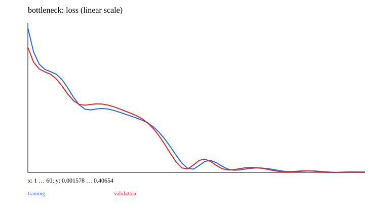

# 04 · Auto-encoding: compression, sparsity, and denoising

A minimal teaching experiment is implemented and runnable. Prerequisites: 01–03. Next chapter: [05_cnn](../05_cnn/README.md).

Reuse the MLP from 01 for the Encoder/Decoder, the trainer from 02, and diagnostics from 03. Inputs are `x=[cos t,sin t,0.5cos t,0.5sin t]`, with a two-dimensional bottleneck and independently sampled t values for training and validation.

`x → encoder → z → decoder → x̂`. The linear version is `4→2→4`; the nonlinear version is `4→12(tanh)→2→12(tanh)→4`. Reconstruction MSE averages over all samples and dimensions. The sparse variant adds `λ mean(|z|)`, constraining latent activations rather than weights. The linear AE has 22 parameters and the nonlinear AE has 174.

Experiment progression: linear AE/PCA comparison → nonlinear bottleneck → latent L1 sparsity → Denoising AE with random masking of 30% of the input. Corruption uses `x_corrupt=x*mask`; the target remains the clean x. Loss covers every position, not just masked positions.

```ruby
z = model.encode(x)
reconstruction = model.decoder.call(z)
loss = mse(reconstruction, clean_x) + sparsity * z.abs.mean
```

Denoising validation uses a fixed mask; training samples a new mask each step. Outputs include detailed reconstructions, loss curves, and latent statistics. Sparsity penalties may harm reconstruction, and good training reconstruction does not establish useful representations. This dataset has an exact two-dimensional linear structure, so PCA can achieve near-zero error; a nonlinear network need not outperform it in a short run.

An ordinary AE does not guarantee that random latent samples are meaningful. The VAE in 13 introduces a prior and KL. The convolutional AE in 05 reuses this reconstruction objective, and the MAE in 13 moves masking to patches. Source: [Denoising AE](https://www.jmlr.org/papers/v11/vincent10a.html).

## Data, training, and independent inference

Run commands from the repository root and install dependencies with `bundle install`. Training and model inference default to `auto`: prefer CUDA and fall back to CPU when unavailable. You can also select `--device cpu` explicitly. These experiments use small synthetic datasets and require no model downloads. Limiting threads reduces CPU overhead for tiny tensors:

```bash
export OMP_NUM_THREADS=1 MKL_NUM_THREADS=1
bundle exec ruby learning/04_autoencoder/data.rb
bundle exec ruby learning/04_autoencoder/train.rb --steps 60
bundle exec ruby learning/04_autoencoder/predict.rb
bundle exec rake test:learning
```

Use `--seed` to change the random seed and `--output` to separate experiment directories. Training also accepts `--device cpu/cuda/auto`. The default output is `runs/learning/04_autoencoder/default/`; rerunning overwrites artifacts with the same names. `data.rb` exports samples from the data recipe for inspection. The training entry point calls the generators directly and does not depend on that JSON file. Experiment-specific shifts and masks are documented in the experiment source and the actual `data.json`.

For inference, `--model PATH` selects a saved model. `--input PATH` accepts a JSON file containing `{"input": ...}`; the default is a small example with the required shape. Seq2seq/EncoderDecoder perform free-running generation, GPT uses top-1 generation, and other models return scores or reconstructions. RL actor-critic models return policy logits and a value estimate.

## Results and correctness

The [recorded run](results.json) includes the seed, step count, environment, and metrics. The figure below comes from that run; it is not a test acceptance threshold.



[Experiment code](../lib/easy_ai_learning/autoencoder/experiment.rb) connects the steps; shared data generators are in [course/data.rb](../lib/easy_ai_learning/course/data.rb). Core checks are in the [tests](../test/course/vision_test.rb), with additional gradient comparisons in [derivatives_test.rb](../test/course/derivatives_test.rb). Tests check deterministic formulas, shapes, masks, gradients, state, and parameter updates. They do not train toward a required accuracy or weight distribution.

Artifacts include the actual data, JSON inference state, history, diagnostics, and SVG figures. Full local parameters and histories remain under the ignored `runs/` directory; the repository contains only compact result summaries and figures. The non-neural experiments in 00/07 and the interactive training in 15 use task-specific records rather than forcing every result into a classification-loss format.
