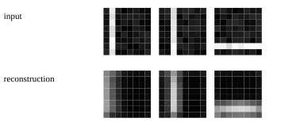

# 05 · CNN：卷积、共享参数与特征图

已实现可运行的最小教学实验。先修：01–03；卷积 AE 复习 04。 下一章：[06_resnet](../06_resnet/README.md)。

从手算二维 cross-correlation 到 Torch Conv2d，再把两层卷积接成分类器。复用 02 的分类 loss 和优化器；卷积 AE 复用 04 的重构目标。

数据是独立生成的 8×8 灰度图：随机位置的竖线/横线加轻微噪声，64 训练与 64 验证样本；标签为线方向。它是很简单的图形任务，不代表 MNIST/CIFAR 或真实视觉泛化。

```text
[B,1,8,8] → Conv(1,4,3,pad=1) → ReLU → MaxPool(2)
            → Conv(4,8,3,pad=1) → ReLU → mean(H,W) → Linear(8,2)
```

输出空间尺寸为 `floor((I+2P-K)/S)+1`；参数量为 `C_out*C_in*K_h*K_w+C_out`。当前分类 CNN 354 参数；加 BatchNorm 后 378；flatten MLP 806。模型使用 global average pooling；它是小型 LeNet 思路的教学网络，不是逐层复刻原始 LeNet/AlexNet/VGG。

BatchNorm 的 running mean/variance 用训练批次更新，eval 使用保存统计；这些 buffer 和推理权重一起保存。CNN/MLP 对照还需注意容量和初始化差异；本章任务可能所有模型都满分。

卷积 AE：`Conv(1,4)→ReLU→AvgPool(2)→nearest upsample→Conv(4,1)→sigmoid`。训练重构同一输入，输出原图/重构图。数据增强需仅用于训练，并保证变换不改变标签：这个任务的 90° 旋转会交换横竖类别，不能直接沿用标签。

AlexNet/VGG 的大图/多层结构作为历史结构阅读；感受野、局部连接与参数共享才是本章的核心实现。

## 数据、训练与独立推理

从仓库根目录运行；安装依赖用 `bundle install`。涉及训练与模型推理时默认 `auto`：优先 CUDA，不可用时回退 CPU；也可显式 `--device cpu`。使用小规模合成数据，无模型下载。限制线程能避免 tiny tensor 的 CPU 线程开销：

```bash
export OMP_NUM_THREADS=1 MKL_NUM_THREADS=1
bundle exec ruby learning/05_cnn/data.rb
bundle exec ruby learning/05_cnn/train.rb --steps 60
bundle exec ruby learning/05_cnn/predict.rb
bundle exec rake test:learning
```

`--seed` 改随机种子，`--output` 分开实验目录，训练还可用 `--device cpu/cuda/auto`。默认输出 `runs/learning/05_cnn/default/`，重跑会覆盖同名产物。`data.rb` 导出数据配方的样本用于查看；训练入口自行调用生成器，不依赖该 JSON 文件，训练中的特殊移位/遮挡在实验源码与实际 `data.json` 中记录。

推理 `--model PATH` 指向保存的模型。 `--input PATH` 可指定 `{"input": ...}` JSON；默认提供一个符合本章形状的示例。Seq2seq/EncoderDecoder 输出自由生成，GPT 输出 top-1 生成，其他模型输出 score/reconstruction；RL actor-critic 输出 policy logits 与 value。

## 结果与正确性

[实际运行记录](results.json) 保存 seed、步数、环境与指标；下图取自同一运行，不是验收阈值。



[实验代码](../lib/easy_ai_learning/cnn/experiment.rb) 串起各步骤；共享数据在 [course/data.rb](../lib/easy_ai_learning/course/data.rb)。核心验证见 [测试](../test/course/vision_test.rb)，梯度对照另见 [derivatives_test.rb](../test/course/derivatives_test.rb)。测试只检查确定性公式、shape、mask、梯度、状态与参数更新；不训练到某个准确率或权重分布。

产物包括实际数据、JSON 推理状态、history、诊断与 SVG；本地完整参数/历史留在忽略的 runs 下，仓库只收录小型结果摘要与图。00/07 的非神经实验和 15 的交互训练输出格式按任务分别记录，不强行统一为分类 loss。
