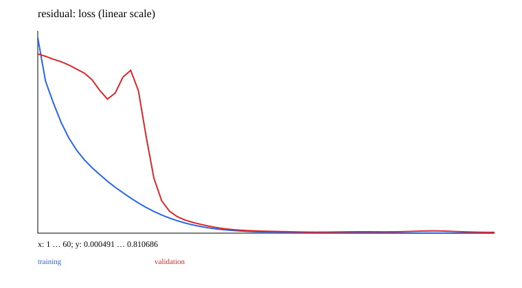

# 06 · ResNet: residual connections and deep optimization

A minimal teaching experiment is implemented and runnable. Prerequisite: 05_cnn. Next chapter: [07_tokenizers](../07_tokenizers/README.md).

Reuse CNN convolutions, BatchNorm, global pooling, and the same image data, while changing information flow through deep blocks: `y=ReLU(x+F(x))`. When shapes differ, align them with a 1×1 projection/stride first.

The plain and residual networks each stack three blocks with two 3×3 convolutions per block. They use the same channels, depth, initial weights, and BatchNorm settings. A residual model without normalization is another comparison. The plain branch actually removes the addition; setting shortcut parameters to zero alone would not establish equivalence.

```ruby
residual = norm2.call(conv2.call(relu(norm1.call(conv1.call(x)))))
y = relu(shortcut.call(x) + residual)
```

Basic blocks, projections, `1×1→3×3→1×1` bottlenecks, and pre-activation blocks are implemented. The latter three have shape/direct-gradient demonstrations and tests; default training comparisons use basic blocks. Pre-activation places BN/ReLU before convolutions and adds no extra ReLU after the final addition, so a zero residual can preserve negative inputs. The original basic block still applies its final ReLU when the residual is zero.

Residual connections provide a direct gradient path, but do not guarantee freedom from vanishing/exploding gradients or better validation performance in every run. This graphics task is easy: perfect scores neither disprove the value of residuals nor show that they always improve results. Read layer statistics together with comparisons under the same budget. The residual idea reappears in the Transformer in 11; BatchNorm and LayerNorm differ in their dimensions and mode behavior.

Source: [ResNet](https://arxiv.org/abs/1512.03385).

## Data, training, and independent inference

Run commands from the repository root and install dependencies with `bundle install`. Training and model inference default to `auto`: prefer CUDA and fall back to CPU when unavailable. You can also select `--device cpu` explicitly. These experiments use small synthetic datasets and require no model downloads. Limiting threads reduces CPU overhead for tiny tensors:

```bash
export OMP_NUM_THREADS=1 MKL_NUM_THREADS=1
bundle exec ruby learning/06_resnet/data.rb
bundle exec ruby learning/06_resnet/train.rb --steps 60
bundle exec ruby learning/06_resnet/predict.rb
bundle exec rake test:learning
```

Use `--seed` to change the random seed and `--output` to separate experiment directories. Training also accepts `--device cpu/cuda/auto`. The default output is `runs/learning/06_resnet/default/`; rerunning overwrites artifacts with the same names. `data.rb` exports samples from the data recipe for inspection. The training entry point calls the generators directly and does not depend on that JSON file. Experiment-specific shifts and masks are documented in the experiment source and the actual `data.json`.

For inference, `--model PATH` selects a saved model. `--input PATH` accepts a JSON file containing `{"input": ...}`; the default is a small example with the required shape. Seq2seq/EncoderDecoder perform free-running generation, GPT uses top-1 generation, and other models return scores or reconstructions. RL actor-critic models return policy logits and a value estimate.

## Results and correctness

The [recorded run](results.json) includes the seed, step count, environment, and metrics. The figure below comes from that run; it is not a test acceptance threshold.



[Experiment code](../lib/easy_ai_learning/resnet/experiment.rb) connects the steps; shared data generators are in [course/data.rb](../lib/easy_ai_learning/course/data.rb). Core checks are in the [tests](../test/course/vision_test.rb), with additional gradient comparisons in [derivatives_test.rb](../test/course/derivatives_test.rb). Tests check deterministic formulas, shapes, masks, gradients, state, and parameter updates. They do not train toward a required accuracy or weight distribution.

Artifacts include the actual data, JSON inference state, history, diagnostics, and SVG figures. Full local parameters and histories remain under the ignored `runs/` directory; the repository contains only compact result summaries and figures. The non-neural experiments in 00/07 and the interactive training in 15 use task-specific records rather than forcing every result into a classification-loss format.
