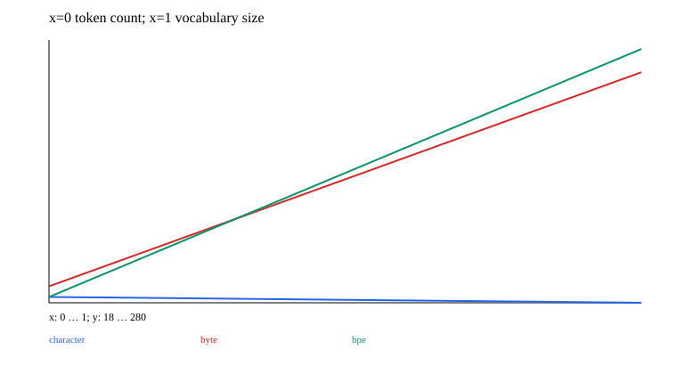

# 07 · Tokenizers, BPE, and Embedding

A minimal teaching experiment is implemented and runnable. Prerequisites: 00–02. Next chapter: [08_rnn](../08_rnn/README.md).

Progression: characters → UTF-8 bytes → frequent adjacent-pair merging/BPE → token IDs → Embedding. A tokenizer learns rules and a vocabulary; an Embedding learns vectors through gradients from a downstream task. These are different forms of training.

This chapter adds Character and ReversibleBpe. Character builds its vocabulary only from training text and maps unknown characters to UNK. The byte version uses 256 fixed base symbols. BPE learns 24 merges over integer byte IDs, preserving whitespace, newlines, and unseen UTF-8 bytes. The saved format contains all merges, which are applied in order after loading.

```ruby
pairs = tokens.each_cons(2).tally
best = pairs.max_by { |pair, frequency| frequency }.first
# Replace non-overlapping pairs from left to right; new ID=256+merge_index
```

Rules depend only on the training corpus. Validation text includes new symbols and emoji to demonstrate Character's OOV behavior and Byte/BPE reversibility. Compare vocabulary sizes, token lengths, and parameter counts for an 8-dimensional Embedding. Shorter token sequences do not automatically imply a better language model. A separate `[1,2,1]` lookup-gradient example adds the gradient twice to row 1 and once to row 2, with no updates to unqueried rows.

Historical `scratch.rb`, `sentence_piece.rb`, and word-splitting ByteBpe/WordBpe are retained for comparison. They have whitespace-normalization, Unicode/OOV, or algorithm-approximation limitations and are not the implementation of this chapter's reversible byte BPE. The SentencePiece approximation is also not a complete reproduction of the official algorithm.

The shared reversible BPE is independent of the production tokenizer. The minimal GPT in 12 uses an explicit six-symbol vocabulary; the historical custom-corpus entry point can still select the original Byte/Word/Qwen tokenizer.

## Data, training, and independent inference

Run commands from the repository root and install dependencies with `bundle install`. Training and model inference default to `auto`: prefer CUDA and fall back to CPU when unavailable. You can also select `--device cpu` explicitly. These experiments use small synthetic datasets and require no model downloads. Limiting threads reduces CPU overhead for tiny tensors:

```bash
export OMP_NUM_THREADS=1 MKL_NUM_THREADS=1
bundle exec ruby learning/07_tokenizers/data.rb
bundle exec ruby learning/07_tokenizers/train.rb --steps 60
bundle exec ruby learning/07_tokenizers/predict.rb
bundle exec rake test:learning
```

Use `--seed` to change the random seed and `--output` to separate experiment directories. Training also accepts `--device cpu/cuda/auto`. The default output is `runs/learning/07_tokenizers/default/`; rerunning overwrites artifacts with the same names. `data.rb` exports samples from the data recipe for inspection. The training entry point calls the generators directly and does not depend on that JSON file. Experiment-specific shifts and masks are documented in the experiment source and the actual `data.json`.

For inference, `--model PATH` selects a saved model. `--text "new text"` encodes and decodes text.

## Results and correctness

The [recorded run](results.json) includes the seed, step count, environment, and metrics. The figure below comes from that run; it is not a test acceptance threshold.



[Experiment code](../lib/easy_ai_learning/tokenizers/experiment.rb) connects the steps; shared data generators are in [course/data.rb](../lib/easy_ai_learning/course/data.rb). Core checks are in the [tests](../test/course/sequence_test.rb), with additional gradient comparisons in [derivatives_test.rb](../test/course/derivatives_test.rb). Tests check deterministic formulas, shapes, masks, gradients, state, and parameter updates. They do not train toward a required accuracy or weight distribution.

Artifacts include the actual data, JSON inference state, history, diagnostics, and SVG figures. Full local parameters and histories remain under the ignored `runs/` directory; the repository contains only compact result summaries and figures. The non-neural experiments in 00/07 and the interactive training in 15 use task-specific records rather than forcing every result into a classification-loss format.
