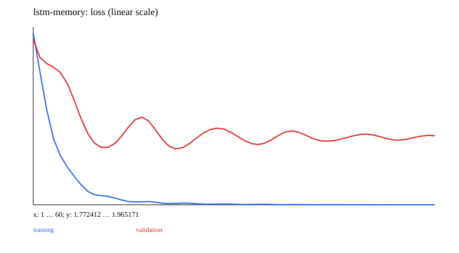

# 08 · RNN → LSTM/GRU and BPTT

A minimal teaching experiment is implemented and runnable. Prerequisites: 01–03; add 07 for text tasks. Next chapter: [09_seq2seq](../09_seq2seq/README.md).

Place the earlier Linear layers inside a time loop, sharing parameters across steps. RNN, LSTM, and GRU gating equations are implemented directly rather than treating built-in cells as black boxes.

```text
RNN: h'=tanh(Wx+Uh+b)
LSTM: i,f,o=sigmoid(gates), g=tanh(candidate)
      c'=f*c+i*g; h'=o*tanh(c')
GRU: r,z=sigmoid(gates); n=tanh(W_n x+b_n+r*(U_n h+b_h))
     h'=(1-z)*n+z*h
```

The GRU uses the reset-after equation common in PyTorch; the reset-before variant in some textbooks differs. Each Linear has its own bias; the input/recurrent biases in RNN/LSTM take effect in their summed projections.

The minimal experiment predicts the next token in a six-symbol cycle. A delayed-copy task follows: the first step supplies a symbol from 0–5, later steps contain filler 6, and the last step must predict the first symbol. Training defaults to length 10 and also evaluates length 20. Each cell uses its own initialization with the same seed for comparison. Short-run performance is not a test assertion.

Torch tracks BPTT through the loop unrolled in Ruby. `truncate:` detaches state at time boundaries, blocking gradients across them. `lengths:` preserves the previous hidden/cell state beyond a sequence's valid length; a padding loss mask alone does not prevent state updates. Independent forward calls initialize state by default; pass it explicitly only for a continuous stream.

Reuse gradient clipping, optimizers, and state persistence from 02. Outputs include token accuracy, memory performance at different lengths, training/validation curves, and norms before/after clipping. Tests use hand-calculated gates, finite differences, and first-step Embedding gradients to verify full and truncated BPTT.

## Data, training, and independent inference

Run commands from the repository root and install dependencies with `bundle install`. Training and model inference default to `auto`: prefer CUDA and fall back to CPU when unavailable. You can also select `--device cpu` explicitly. These experiments use small synthetic datasets and require no model downloads. Limiting threads reduces CPU overhead for tiny tensors:

```bash
export OMP_NUM_THREADS=1 MKL_NUM_THREADS=1
bundle exec ruby learning/08_rnn/data.rb
bundle exec ruby learning/08_rnn/train.rb --steps 60
bundle exec ruby learning/08_rnn/predict.rb
bundle exec rake test:learning
```

Use `--seed` to change the random seed and `--output` to separate experiment directories. Training also accepts `--device cpu/cuda/auto`. The default output is `runs/learning/08_rnn/default/`; rerunning overwrites artifacts with the same names. `data.rb` exports samples from the data recipe for inspection. The training entry point calls the generators directly and does not depend on that JSON file. Experiment-specific shifts and masks are documented in the experiment source and the actual `data.json`.

For inference, `--model PATH` selects a saved model. `--input PATH` accepts a JSON file containing `{"input": ...}`; the default is a small example with the required shape. Seq2seq/EncoderDecoder perform free-running generation, GPT uses top-1 generation, and other models return scores or reconstructions. RL actor-critic models return policy logits and a value estimate.

## Results and correctness

The [recorded run](results.json) includes the seed, step count, environment, and metrics. The figure below comes from that run; it is not a test acceptance threshold.



[Experiment code](../lib/easy_ai_learning/rnn/experiment.rb) connects the steps; shared data generators are in [course/data.rb](../lib/easy_ai_learning/course/data.rb). Core checks are in the [tests](../test/course/sequence_test.rb), with additional gradient comparisons in [derivatives_test.rb](../test/course/derivatives_test.rb). Tests check deterministic formulas, shapes, masks, gradients, state, and parameter updates. They do not train toward a required accuracy or weight distribution.

Artifacts include the actual data, JSON inference state, history, diagnostics, and SVG figures. Full local parameters and histories remain under the ignored `runs/` directory; the repository contains only compact result summaries and figures. The non-neural experiments in 00/07 and the interactive training in 15 use task-specific records rather than forcing every result into a classification-loss format.
