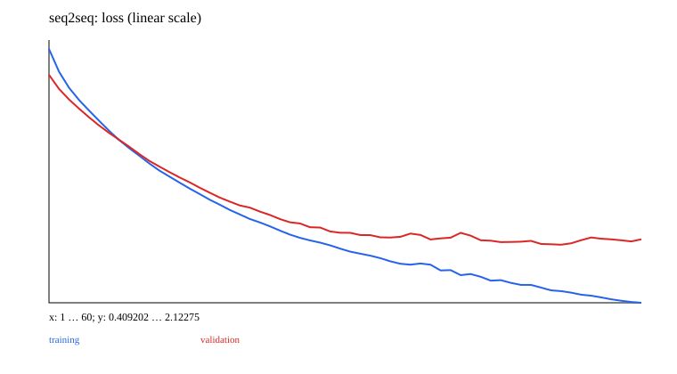

# 09 · Seq2seq and teacher forcing

A minimal teaching experiment is implemented and runnable. Prerequisite: 08_rnn. Next chapter: [10_attention](../10_attention/README.md).

Reuse the RNN cell from 08. The encoder reads the source, and the decoder starts from the encoder's final state. Embedding is shared; the task progresses from next-token prediction to reversing a four-symbol sequence.

Input: `[a,b,c,d]`; target: `[d,c,b,a,EOS]`; training decoder input: `[BOS,d,c,b,a]`. PAD=0, BOS=1, EOS=2, and ordinary symbols=3–6. The current data has fixed length, so padding need not be treated as a real token.

```ruby
state = encode(source)
decoder_tokens.each_step do |previous_token|
  state = decoder.call(embedding.call(previous_token), state)
  logits = head.call(state)
end
```

Teacher forcing supplies only the true previous token, never the target at the same position. Inference uses the model's own previous argmax. After EOS, it continues outputting EOS so finished samples do not generate random tokens. The default output is at most five steps. CLI inference reads the saved model without training it.

Report teacher-forced token accuracy, free-running token accuracy, and exact-sequence accuracy. The first can hide cascading errors, so free-running generation is essential. Variable-length tasks require separate attention-visibility and loss masks; this fixed-length implementation does not claim to support arbitrary padded training.

The core Model later adds `attention: true`, but defaults to false without constructing Attention components, preserving the prerequisite path for 09. Chapter 10 compares the same encoder/decoder rather than rewriting a model that would be harder to compare.

## Data, training, and independent inference

Run commands from the repository root and install dependencies with `bundle install`. Training and model inference default to `auto`: prefer CUDA and fall back to CPU when unavailable. You can also select `--device cpu` explicitly. These experiments use small synthetic datasets and require no model downloads. Limiting threads reduces CPU overhead for tiny tensors:

```bash
export OMP_NUM_THREADS=1 MKL_NUM_THREADS=1
bundle exec ruby learning/09_seq2seq/data.rb
bundle exec ruby learning/09_seq2seq/train.rb --steps 60
bundle exec ruby learning/09_seq2seq/predict.rb
bundle exec rake test:learning
```

Use `--seed` to change the random seed and `--output` to separate experiment directories. Training also accepts `--device cpu/cuda/auto`. The default output is `runs/learning/09_seq2seq/default/`; rerunning overwrites artifacts with the same names. `data.rb` exports samples from the data recipe for inspection. The training entry point calls the generators directly and does not depend on that JSON file. Experiment-specific shifts and masks are documented in the experiment source and the actual `data.json`.

For inference, `--model PATH` selects a saved model. `--input PATH` accepts a JSON file containing `{"input": ...}`; the default is a small example with the required shape. Seq2seq/EncoderDecoder perform free-running generation, GPT uses top-1 generation, and other models return scores or reconstructions. RL actor-critic models return policy logits and a value estimate.

## Results and correctness

The [recorded run](results.json) includes the seed, step count, environment, and metrics. The figure below comes from that run; it is not a test acceptance threshold.



[Experiment code](../lib/easy_ai_learning/seq2seq/experiment.rb) connects the steps; shared data generators are in [course/data.rb](../lib/easy_ai_learning/course/data.rb). Core checks are in the [tests](../test/course/sequence_test.rb), with additional gradient comparisons in [derivatives_test.rb](../test/course/derivatives_test.rb). Tests check deterministic formulas, shapes, masks, gradients, state, and parameter updates. They do not train toward a required accuracy or weight distribution.

Artifacts include the actual data, JSON inference state, history, diagnostics, and SVG figures. Full local parameters and histories remain under the ignored `runs/` directory; the repository contains only compact result summaries and figures. The non-neural experiments in 00/07 and the interactive training in 15 use task-specific records rather than forcing every result into a classification-loss format.
