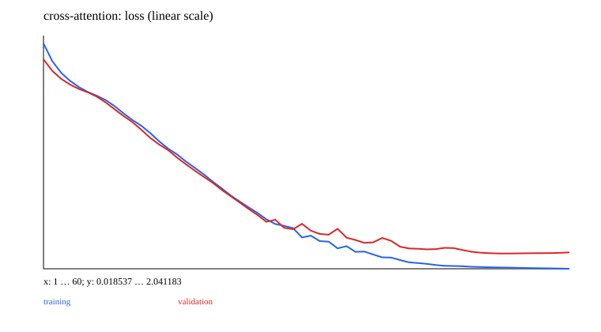

# 10 · Attention: alignment, retrieval, and masks

A minimal teaching experiment is implemented and runnable. Prerequisite: 09_seq2seq. Next chapter: [11_transformer](../11_transformer/README.md).

Start with additive attention to understand how a query retrieves encoder states, then study scaled dot-product, multi-head, and self/cross attention. Reuse the encoding/decoding states from 09. With `attention:true`, concatenate each decoder state with the retrieved context and fuse them.

`A=softmax(QKᵀ/sqrt(d_k))`, `output=A V`. Heads partition the feature dimension, concatenate their outputs, and apply an output projection. Inspect scores before softmax; A before dropout has a probability interpretation with each row summing to 1. Attention maps do not automatically provide causal explanations.

| Mask | Applied to | Correctness property |
| --- | --- | --- |
| Padding | Invalid keys in attention scores | Changing padding content does not change valid results |
| Causal | Future keys before softmax | Changing future tokens does not change past logits |
| Loss | Target loss | Invalid targets do not contribute; reduce by the number of valid positions |
| Dropout | Activations or attention weights after softmax | Random during training, disabled in eval; not a visibility constraint |

```ruby
scores = matmul(q, k.transpose(-2, -1)) / Math.sqrt(head_dim)
scores = scores.masked_fill(valid.logical_not, -Float::INFINITY)
weights = softmax(scores, dim: -1)
output = matmul(weights, v)
```

MultiHead supports a `[B,K]` padding key mask with true meaning visible; query and memory lengths may differ. CausalSelfAttention reuses it and requires equal lengths. If a query has no visible keys, the implementation raises explicitly to avoid softmax over all -Inf values. The caller handles invalid query outputs. A key mask alone does not also exclude padding from queries or loss.

The experiment compares fixed-state and cross-attention reversal and saves alignments. A separate exact demonstration changes future values and shows zero difference in past outputs. Tests also use identity projections to check softmax and weighted sums by hand. Source: [Attention Is All You Need](https://arxiv.org/abs/1706.03762).

## Data, training, and independent inference

Run commands from the repository root and install dependencies with `bundle install`. Training and model inference default to `auto`: prefer CUDA and fall back to CPU when unavailable. You can also select `--device cpu` explicitly. These experiments use small synthetic datasets and require no model downloads. Limiting threads reduces CPU overhead for tiny tensors:

```bash
export OMP_NUM_THREADS=1 MKL_NUM_THREADS=1
bundle exec ruby learning/10_attention/data.rb
bundle exec ruby learning/10_attention/train.rb --steps 60
bundle exec ruby learning/10_attention/predict.rb
bundle exec rake test:learning
```

Use `--seed` to change the random seed and `--output` to separate experiment directories. Training also accepts `--device cpu/cuda/auto`. The default output is `runs/learning/10_attention/default/`; rerunning overwrites artifacts with the same names. `data.rb` exports samples from the data recipe for inspection. The training entry point calls the generators directly and does not depend on that JSON file. Experiment-specific shifts and masks are documented in the experiment source and the actual `data.json`.

For inference, `--model PATH` selects a saved model. `--input PATH` accepts a JSON file containing `{"input": ...}`; the default is a small example with the required shape. Seq2seq/EncoderDecoder perform free-running generation, GPT uses top-1 generation, and other models return scores or reconstructions. RL actor-critic models return policy logits and a value estimate.

## Results and correctness

The [recorded run](results.json) includes the seed, step count, environment, and metrics. The figure below comes from that run; it is not a test acceptance threshold.



[Experiment code](../lib/easy_ai_learning/attention/experiment.rb) connects the steps; shared data generators are in [course/data.rb](../lib/easy_ai_learning/course/data.rb). Core checks are in the [tests](../test/course/attention_test.rb), with additional gradient comparisons in [derivatives_test.rb](../test/course/derivatives_test.rb). Tests check deterministic formulas, shapes, masks, gradients, state, and parameter updates. They do not train toward a required accuracy or weight distribution.

Artifacts include the actual data, JSON inference state, history, diagnostics, and SVG figures. Full local parameters and histories remain under the ignored `runs/` directory; the repository contains only compact result summaries and figures. The non-neural experiments in 00/07 and the interactive training in 15 use task-specific records rather than forcing every result into a classification-loss format.
