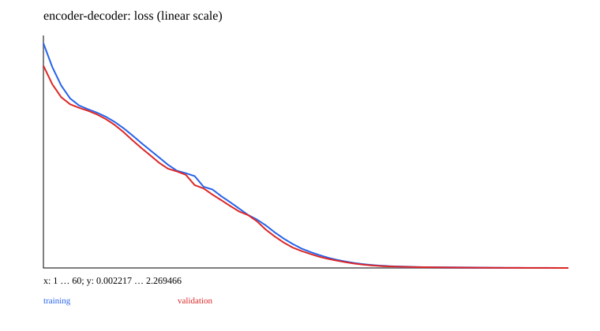

# 11 · Transformer: residuals, positions, and normalization

A minimal teaching experiment is implemented and runnable. Prerequisite: 10_attention; review 06 for residuals. Next chapter: [12_gpt](../12_gpt/README.md).

Reuse MultiHead from 10, the residual concept from 06, and the trainer from 02. Combine embedding/position, attention, FFN, and LayerNorm into a network.

EncoderBlock supports bidirectional pre-/post-LN; the causal Block uses pre-LN. EncoderDecoder combines a bidirectional encoder, a causal decoder, and cross-attention. The FFN is a position-wise shared `D→2D/4D→D` projection with GELU.

```ruby
x = x + attention.call(layer_norm1.call(x))
x = x + feed_forward.call(layer_norm2.call(x))
```

LayerNorm computes statistics over features at each sample/position. BatchNorm usually aggregates across batch/spatial dimensions and maintains running buffers. The current LayerNorm does not switch running statistics between train/eval modes, whereas dropout does switch behavior. Normalization does not require weights to have a fixed distribution.

Four-symbol reversal experiment: the Encoder directly predicts reversed positions, comparing learned positions, no positions, no residuals, no normalization, and post-LN. The full EncoderDecoder is trained separately with teacher forcing and evaluated with free-running generation. A bidirectional encoder without positions is permutation-equivariant and cannot infer index order without positional information; tests verify the permutation relationship.

Sinusoidal supplies positional-formula data, while learned positions are used in the default networks. RoPE/ViT/relative positions are further reading, not fully implemented variants in this experiment. On a shallow network and small task, removing residuals or normalization may still work well. These ablations do not imply that larger models do not need them.

Sources: [Transformer](https://arxiv.org/abs/1706.03762), [LayerNorm](https://arxiv.org/abs/1607.06450).

## Data, training, and independent inference

Run commands from the repository root and install dependencies with `bundle install`. Training and model inference default to `auto`: prefer CUDA and fall back to CPU when unavailable. You can also select `--device cpu` explicitly. These experiments use small synthetic datasets and require no model downloads. Limiting threads reduces CPU overhead for tiny tensors:

```bash
export OMP_NUM_THREADS=1 MKL_NUM_THREADS=1
bundle exec ruby learning/11_transformer/data.rb
bundle exec ruby learning/11_transformer/train.rb --steps 60
bundle exec ruby learning/11_transformer/predict.rb
bundle exec rake test:learning
```

Use `--seed` to change the random seed and `--output` to separate experiment directories. Training also accepts `--device cpu/cuda/auto`. The default output is `runs/learning/11_transformer/default/`; rerunning overwrites artifacts with the same names. `data.rb` exports samples from the data recipe for inspection. The training entry point calls the generators directly and does not depend on that JSON file. Experiment-specific shifts and masks are documented in the experiment source and the actual `data.json`.

For inference, `--model PATH` selects a saved model. `--input PATH` accepts a JSON file containing `{"input": ...}`; the default is a small example with the required shape. Seq2seq/EncoderDecoder perform free-running generation, GPT uses top-1 generation, and other models return scores or reconstructions. RL actor-critic models return policy logits and a value estimate.

## Results and correctness

The [recorded run](results.json) includes the seed, step count, environment, and metrics. The figure below comes from that run; it is not a test acceptance threshold.



[Experiment code](../lib/easy_ai_learning/transformer/experiment.rb) connects the steps; shared data generators are in [course/data.rb](../lib/easy_ai_learning/course/data.rb). Core checks are in the [tests](../test/course/attention_test.rb), with additional gradient comparisons in [derivatives_test.rb](../test/course/derivatives_test.rb). Tests check deterministic formulas, shapes, masks, gradients, state, and parameter updates. They do not train toward a required accuracy or weight distribution.

Artifacts include the actual data, JSON inference state, history, diagnostics, and SVG figures. Full local parameters and histories remain under the ignored `runs/` directory; the repository contains only compact result summaries and figures. The non-neural experiments in 00/07 and the interactive training in 15 use task-specific records rather than forcing every result into a classification-loss format.
