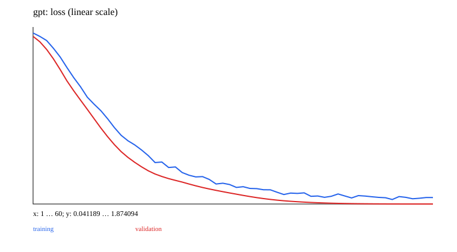

# 12 · GPT：因果 next-token 与生成

已实现可运行的最小教学实验。先修：07、11。 下一章：[13_generative](../13_generative/README.md)。

复用 11 的 causal pre-LN block 和 07 的 token ID 概念。默认实验无需外部语料：六符号循环语言，64×8 的输入/右移 target，独立 train/validation/test 起点样本。因为可能只有六种循环模式，这只是结构验证，不是自然语言或未见规则泛化。

网络：vocab 6、context 8、1 层、2 heads、width 8、dropout 0.1，共 1048 参数。训练使用 AdamW、梯度裁剪、warmup/cosine；test cross-entropy 转 perplexity=`exp(loss)`。默认预测 top-1，训练后另演示 temperature 0.7/top-2。

```ruby
logits = model.call(input_ids) # [B,T,V]
loss = masked_cross_entropy(logits, next_token_targets)
# 生成：截到 context 长度，取最后 logits，温度缩放后采样
```

Generate 自动进入 eval/no_grad 并恢复原 training 模式；验证 temperature>0、top_k 合法，窗口过长时截断上下文。Causal attention 的未来泄漏已有确定性测试；长生成仍可能重复，这是实际结果的一部分。

历史自定义语料入口保留在 `train_text.rb`：

```bash
bundle exec ruby learning/12_gpt/train_text.rb \
  --data data/learning/song.txt --tokenizer byte --iters 200 --device cpu
```

`train.rb` 收到显式 `--data/--tokenizer/--iters/--prompt` 等历史参数时转发。最小默认实验使用通用教学 Loop；历史 Trainer 保留 Torch AdamW，与本轮 JSON training-state 恢复约定不同，不能混称完整可恢复训练。

小 GPT 的学习目的：目标右移、因果约束、概率 loss、训练/生成差异与状态复用。事实正确性或语义能力需要另行评估。

## 数据、训练与独立推理

从仓库根目录运行；安装依赖用 `bundle install`。涉及训练与模型推理时默认 `auto`：优先 CUDA，不可用时回退 CPU；也可显式 `--device cpu`。使用小规模合成数据，无模型下载。限制线程能避免 tiny tensor 的 CPU 线程开销：

```bash
export OMP_NUM_THREADS=1 MKL_NUM_THREADS=1
bundle exec ruby learning/12_gpt/data.rb
bundle exec ruby learning/12_gpt/train.rb --steps 60
bundle exec ruby learning/12_gpt/predict.rb
bundle exec rake test:learning
```

`--seed` 改随机种子，`--output` 分开实验目录，训练还可用 `--device cpu/cuda/auto`。默认输出 `runs/learning/12_gpt/default/`，重跑会覆盖同名产物。`data.rb` 导出数据配方的样本用于查看；训练入口自行调用生成器，不依赖该 JSON 文件，训练中的特殊移位/遮挡在实验源码与实际 `data.json` 中记录。

推理 `--model PATH` 指向保存的模型。 `--input PATH` 可指定 `{"input": ...}` JSON；默认提供一个符合本章形状的示例。Seq2seq/EncoderDecoder 输出自由生成，GPT 输出 top-1 生成，其他模型输出 score/reconstruction；RL actor-critic 输出 policy logits 与 value。

## 结果与正确性

[实际运行记录](results.json) 保存 seed、步数、环境与指标；下图取自同一运行，不是验收阈值。



[实验代码](../lib/easy_ai_learning/gpt/experiment.rb) 串起各步骤；共享数据在 [course/data.rb](../lib/easy_ai_learning/course/data.rb)。核心验证见 [测试](../test/course/gpt_test.rb)，梯度对照另见 [derivatives_test.rb](../test/course/derivatives_test.rb)。测试只检查确定性公式、shape、mask、梯度、状态与参数更新；不训练到某个准确率或权重分布。

产物包括实际数据、JSON 推理状态、history、诊断与 SVG；本地完整参数/历史留在忽略的 runs 下，仓库只收录小型结果摘要与图。00/07 的非神经实验和 15 的交互训练输出格式按任务分别记录，不强行统一为分类 loss。
