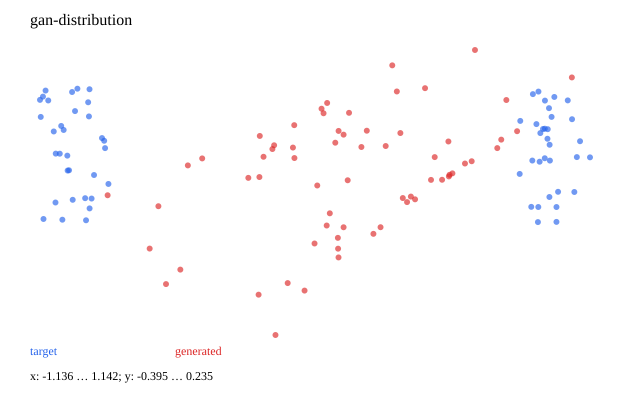

# 13 · VAE、GAN、Diffusion 与遮挡重构

已实现可运行的最小教学实验。先修：04；图像加 05；文本/patch 模型加 11。 下一章：[14_transfer_learning](../14_transfer_learning/README.md)。

复用 AE 的 encoder/decoder、MLP 的投影、Transformer 的表示学习以及 02 的训练基础。每个实验有自己的 loss，不能拿 loss 数值跨模型排名。

| 模型 | 本轮实际实现 | 目标与诊断 |
| --- | --- | --- |
| VAE | 4 维 manifold→μ/logvar→2 维 latent→重构 | sum-dimension reconstruction + β KL；验证重构与先验采样分开 |
| GAN | 2D 两团数据、MLP generator/discriminator | D 用 detach fake；G 用 non-saturating BCE；观察 mode collapse |
| DDPM | 12 步线性 beta、2D noise predictor、逐步反向采样 | noise MSE；最后一步 posterior variance 为零 |
| Masked language | 双向 Encoder，token 7 为 MASK，只计遮挡位置 | 随机训练 mask、固定验证 mask；不是完整 BERT 预训练复刻 |
| MAE | 8×8 图分 16 个 2×2 patch；encoder 只读 8 个可见 patch | mask token 恢复位置；decoder 重构，只算不可见 patch |

```text
VAE: z=μ+exp(logvar/2)*ε
KL = -0.5 mean_batch sum_dim(1+logvar-μ²-exp(logvar))
DDPM: x_t=sqrt(ᾱ_t)x_0+sqrt(1-ᾱ_t)ε
ε_θ=MLP(concat(x_t,t/(T-1)))
```

MAE 为便于手算，batch 内共享抽样的可见索引；不会把被遮挡图像像素送入 encoder。patchify/unpatchify 可精确往返。测试通过改变不可见 patch 检查预测不受其内容影响。

默认很短的小数据运行会有覆盖不足、坍缩或重构不理想；数据图/生成图和原始采样 JSON 都保留。VAE β=0.1 是教学加权变体，不等同于 β=1 的原始 ELBO；固定尺度 Gaussian 对应平方误差项，当前不估计输出方差。GAN 双方 loss 或 diffusion noise loss 下降不能单独说明样本质量。

来源：[VAE](https://arxiv.org/abs/1312.6114)、[DDPM](https://arxiv.org/abs/2006.11239)。

## 数据、训练与独立推理

从仓库根目录运行；安装依赖用 `bundle install`。涉及训练与模型推理时默认 `auto`：优先 CUDA，不可用时回退 CPU；也可显式 `--device cpu`。使用小规模合成数据，无模型下载。限制线程能避免 tiny tensor 的 CPU 线程开销：

```bash
export OMP_NUM_THREADS=1 MKL_NUM_THREADS=1
bundle exec ruby learning/13_generative/data.rb
bundle exec ruby learning/13_generative/train.rb --steps 60
bundle exec ruby learning/13_generative/predict.rb
bundle exec rake test:learning
```

`--seed` 改随机种子，`--output` 分开实验目录，训练还可用 `--device cpu/cuda/auto`。默认输出 `runs/learning/13_generative/default/`，重跑会覆盖同名产物。`data.rb` 导出数据配方的样本用于查看；训练入口自行调用生成器，不依赖该 JSON 文件，训练中的特殊移位/遮挡在实验源码与实际 `data.json` 中记录。

推理 `--model PATH` 指向保存的模型。 `--input PATH` 可指定 `{"input": ...}` JSON；默认提供一个符合本章形状的示例。Seq2seq/EncoderDecoder 输出自由生成，GPT 输出 top-1 生成，其他模型输出 score/reconstruction；RL actor-critic 输出 policy logits 与 value。

## 结果与正确性

[实际运行记录](results.json) 保存 seed、步数、环境与指标；下图取自同一运行，不是验收阈值。



[实验代码](../lib/easy_ai_learning/generative/experiment.rb) 串起各步骤；共享数据在 [course/data.rb](../lib/easy_ai_learning/course/data.rb)。核心验证见 [测试](../test/course/generative_test.rb)，梯度对照另见 [derivatives_test.rb](../test/course/derivatives_test.rb)。测试只检查确定性公式、shape、mask、梯度、状态与参数更新；不训练到某个准确率或权重分布。

产物包括实际数据、JSON 推理状态、history、诊断与 SVG；本地完整参数/历史留在忽略的 runs 下，仓库只收录小型结果摘要与图。00/07 的非神经实验和 15 的交互训练输出格式按任务分别记录，不强行统一为分类 loss。
