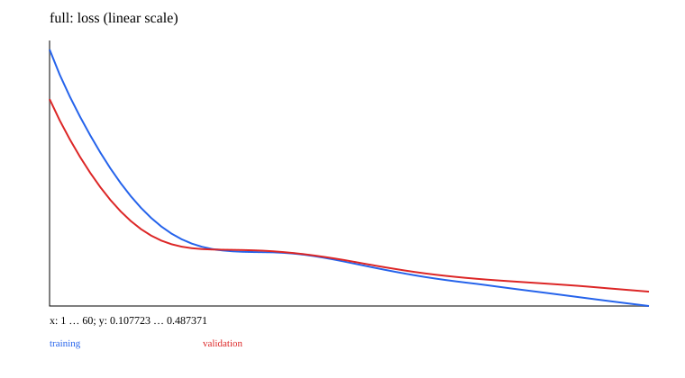

# 14 · Transfer learning, freezing, LoRA, and distillation

A minimal teaching experiment is implemented and runnable. Prerequisites: 02–03 and the chosen model. Next chapter: [15_rl](../15_rl/README.md).

Reuse the MLP, optimizer, and save format from 02 without downloading external models. Pretrain on 96 quadrant-classification samples, then adapt using 32 coordinate-shifted target-task samples and 96 independent validation samples. Labels depend on the original coordinates; observed inputs are shifted, creating a simple domain shift.

Comparisons: train from scratch → freeze hidden layers and train only the head → freeze hidden weights but unfreeze biases/head → full fine-tuning → low-rank head updates with a frozen base. A width-4 student also learns from the pretrained teacher's soft targets. Since the teacher was trained on source coordinates, it can be wrong in the target domain; distillation does not guarantee improvement.

```text
LoRA: y=Wx+b+(α/r) B(Ax)
Initialize A randomly and B=0; initial output exactly matches the base
merge: W_merged=W+(α/r)BA
```

Use LowRankLinear through call, just like the earlier Linear. This chapter applies low-rank adaptation only to the classification head, not a framework covering every Transformer projection. Saved base+A+B state loads independently; tests compare merged weights with the original forward pass.

Distillation uses detached `softmax(teacher/T)`, student log-softmax, and a T² multiplier, then mixes the result with true-label CE. The implementation computes soft cross-entropy. It differs from KL by the constant teacher entropy, so gradients are equivalent but numeric values are not.

Each result records trainable parameter counts, actual per-layer updates, and validation accuracy. Frozen layers must remain exactly unchanged. CNN transfer also involves BatchNorm running statistics: freezing gradients does not freeze buffers. This chapter uses an MLP to keep that distinction visible; extensions must handle buffers explicitly.

## Data, training, and independent inference

Run commands from the repository root and install dependencies with `bundle install`. Training and model inference default to `auto`: prefer CUDA and fall back to CPU when unavailable. You can also select `--device cpu` explicitly. These experiments use small synthetic datasets and require no model downloads. Limiting threads reduces CPU overhead for tiny tensors:

```bash
export OMP_NUM_THREADS=1 MKL_NUM_THREADS=1
bundle exec ruby learning/14_transfer_learning/data.rb
bundle exec ruby learning/14_transfer_learning/train.rb --steps 60
bundle exec ruby learning/14_transfer_learning/predict.rb
bundle exec rake test:learning
```

Use `--seed` to change the random seed and `--output` to separate experiment directories. Training also accepts `--device cpu/cuda/auto`. The default output is `runs/learning/14_transfer_learning/default/`; rerunning overwrites artifacts with the same names. `data.rb` exports samples from the data recipe for inspection. The training entry point calls the generators directly and does not depend on that JSON file. Experiment-specific shifts and masks are documented in the experiment source and the actual `data.json`.

For inference, `--model PATH` selects a saved model. `--input PATH` accepts a JSON file containing `{"input": ...}`; the default is a small example with the required shape. Seq2seq/EncoderDecoder perform free-running generation, GPT uses top-1 generation, and other models return scores or reconstructions. RL actor-critic models return policy logits and a value estimate.

## Results and correctness

The [recorded run](results.json) includes the seed, step count, environment, and metrics. The figure below comes from that run; it is not a test acceptance threshold.



[Experiment code](../lib/easy_ai_learning/transfer/experiment.rb) connects the steps; shared data generators are in [course/data.rb](../lib/easy_ai_learning/course/data.rb). Core checks are in the [tests](../test/course/transfer_test.rb), with additional gradient comparisons in [derivatives_test.rb](../test/course/derivatives_test.rb). Tests check deterministic formulas, shapes, masks, gradients, state, and parameter updates. They do not train toward a required accuracy or weight distribution.

Artifacts include the actual data, JSON inference state, history, diagnostics, and SVG figures. Full local parameters and histories remain under the ignored `runs/` directory; the repository contains only compact result summaries and figures. The non-neural experiments in 00/07 and the interactive training in 15 use task-specific records rather than forcing every result into a classification-loss format.
