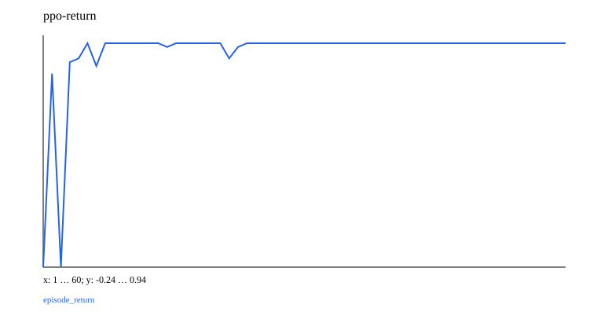

# 15 · 奖励驱动学习：Bandit → PPO

已实现可运行的最小教学实验。先修：01–03；不要求 GPT。 下一章：[16_capstone](../16_capstone/README.md)。

先用三臂 Bernoulli bandit 理解 epsilon-greedy、样本均值、期望 regret；再在五状态 chain 中学习左/右动作。到最右 goal 奖励 1，其余转移 -0.02；最多 12 步。环境全部本地实现，不需要 GPT 或生产 Decision。

| 方法 | 实现与复用 |
| --- | --- |
| Exact value iteration | 已知 transition/reward，Bellman reference |
| Tabular Q-learning | interaction 更新 Q；terminal 不 bootstrap |
| DQN | 01 的 MLP Q；有限 replay、每五 episode 同步 target；detach target |
| REINFORCE | 01 的策略 MLP；Monte Carlo return × log-prob；无训练 critic |
| Actor-critic | 策略 + value MLP；GAE advantage 与 value target |
| PPO | 同一 rollout 4 次更新；old logp detach、ratio clipping、value loss |

```text
Q ← Q+α[r+γ(1-terminal)max Q(next)-Q]
L_policy=-mean(logπ(a|s)*advantage)
L_PPO=-mean(min(ratio*A,clip(ratio,1-ε,1+ε)*A))
```

Terminated 与 time-limit truncated 分开：前者目标无下一状态价值；后者在 continuing-task 解释下可 bootstrap。GAE 对单条 rollout 反向计算，末端不把后续 episode 混入。REINFORCE 使用当前采样回报，不用未训练 value bootstrap；它的网络含 value 分支供统一接口，该分支不参与目标也不更新。

评估关闭更新，对四个非终止起点跑 greedy 策略，报告成功率、return 和路径。环境确定性，评估种子不能制造真实环境波动；训练策略采样依然随机。默认仅一个训练 seed，16 的多种子方法可用于进一步比较；不把 critic loss 当任务成功。

JSON 包含环境转移、replay 和历史，神经网络可独立推理；本章未提供 RL episode 中途全状态恢复 CLI，不将模型 JSON 误称完整 RL resume。来源：[PPO](https://arxiv.org/abs/1707.06347)。

## 数据、训练与独立推理

从仓库根目录运行；安装依赖用 `bundle install`。涉及训练与模型推理时默认 `auto`：优先 CUDA，不可用时回退 CPU；也可显式 `--device cpu`。使用小规模合成数据，无模型下载。限制线程能避免 tiny tensor 的 CPU 线程开销：

```bash
export OMP_NUM_THREADS=1 MKL_NUM_THREADS=1
bundle exec ruby learning/15_rl/data.rb
bundle exec ruby learning/15_rl/train.rb --steps 60
bundle exec ruby learning/15_rl/predict.rb
bundle exec rake test:learning
```

`--seed` 改随机种子，`--output` 分开实验目录，训练还可用 `--device cpu/cuda/auto`。默认输出 `runs/learning/15_rl/default/`，重跑会覆盖同名产物。`data.rb` 导出数据配方的样本用于查看；训练入口自行调用生成器，不依赖该 JSON 文件，训练中的特殊移位/遮挡在实验源码与实际 `data.json` 中记录。

推理 `--model PATH` 指向保存的模型。 `--input PATH` 可指定 `{"input": ...}` JSON；默认提供一个符合本章形状的示例。Seq2seq/EncoderDecoder 输出自由生成，GPT 输出 top-1 生成，其他模型输出 score/reconstruction；RL actor-critic 输出 policy logits 与 value。

## 结果与正确性

[实际运行记录](results.json) 保存 seed、步数、环境与指标；下图取自同一运行，不是验收阈值。



[实验代码](../lib/easy_ai_learning/rl/experiment.rb) 串起各步骤；共享数据在 [course/data.rb](../lib/easy_ai_learning/course/data.rb)。核心验证见 [测试](../test/course/rl_test.rb)，梯度对照另见 [derivatives_test.rb](../test/course/derivatives_test.rb)。测试只检查确定性公式、shape、mask、梯度、状态与参数更新；不训练到某个准确率或权重分布。

产物包括实际数据、JSON 推理状态、history、诊断与 SVG；本地完整参数/历史留在忽略的 runs 下，仓库只收录小型结果摘要与图。00/07 的非神经实验和 15 的交互训练输出格式按任务分别记录，不强行统一为分类 loss。
