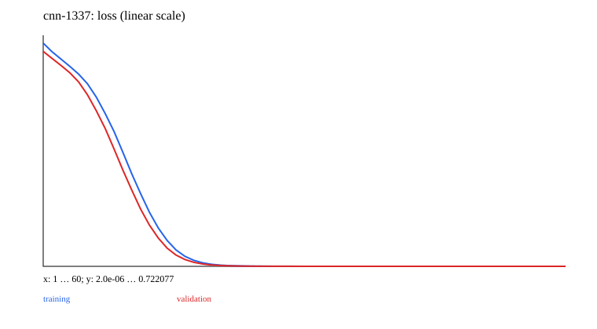

# 16 · 综合实验：数据到独立推理

已实现可运行的最小教学实验。先修：00–03、05–06。

本章实际完成视觉分支的完整闭环，复用 02 的训练/状态、03 的诊断、05 的 CNN 和 06 的 ResNet。MLP、CNN、两块 ResNet 在相同 64/64/64 train/validation/test 图像数据上，用 1337/1347/1357 三种初始化 seed 比较。

固定结构和超参数，不根据 test 结果挑模型。每次运行记录验证准确率、最终 test 准确率、参数量、曲线和逐层诊断；保存后新建同结构模型加载并比较推理，报告 reload 最大差。再汇总 test mean/std/min/max。三 seed 的参数变化是真实运行，训练准确率不设硬阈值。

```ruby
model.load_state_dict(saved_state)
# 同数据、eval/no_grad 下比较加载前后 logits
reload_difference = (original_logits - restored_logits).abs.max.item
```

生成器是容易分离的横竖线数据；全部达到 100% 仅说明这套任务已过简单，不是实际视觉鲁棒性或排名证据。下一步可以增加噪声、长度/位置变化或更难数据，再用验证集设计实验，最后一次独立测试。

课程其他分支也能按同一交付标准扩展项目：RNN/GPT 序列预测、PCA/AE/VAE 表示与生成、Bandit/Q-learning/MLP 策略。它们已有前章小实验；本章的默认可运行 capstone 是视觉 panel，不宣称还运行了所有分支的多种子项目。

完成标准：数据来源与划分、基线、shape/参数量、种子/预算、任务指标、失败证据、消融、独立推理加载；核心逻辑正确性仍由确定性测试保证，实验结果用于学习。

## 数据、训练与独立推理

从仓库根目录运行；安装依赖用 `bundle install`。涉及训练与模型推理时默认 `auto`：优先 CUDA，不可用时回退 CPU；也可显式 `--device cpu`。使用小规模合成数据，无模型下载。限制线程能避免 tiny tensor 的 CPU 线程开销：

```bash
export OMP_NUM_THREADS=1 MKL_NUM_THREADS=1
bundle exec ruby learning/16_capstone/data.rb
bundle exec ruby learning/16_capstone/train.rb --steps 60
bundle exec ruby learning/16_capstone/predict.rb
bundle exec rake test:learning
```

`--seed` 改随机种子，`--output` 分开实验目录，训练还可用 `--device cpu/cuda/auto`。默认输出 `runs/learning/16_capstone/default/`，重跑会覆盖同名产物。`data.rb` 导出数据配方的样本用于查看；训练入口自行调用生成器，不依赖该 JSON 文件，训练中的特殊移位/遮挡在实验源码与实际 `data.json` 中记录。

推理 `--model PATH` 指向保存的模型。 `--input PATH` 可指定 `{"input": ...}` JSON；默认提供一个符合本章形状的示例。Seq2seq/EncoderDecoder 输出自由生成，GPT 输出 top-1 生成，其他模型输出 score/reconstruction；RL actor-critic 输出 policy logits 与 value。

## 结果与正确性

[实际运行记录](results.json) 保存 seed、步数、环境与指标；下图取自同一运行，不是验收阈值。



[实验代码](../lib/easy_ai_learning/capstone/experiment.rb) 串起各步骤；共享数据在 [course/data.rb](../lib/easy_ai_learning/course/data.rb)。核心验证见 [测试](../test/course/training_test.rb)，梯度对照另见 [derivatives_test.rb](../test/course/derivatives_test.rb)。测试只检查确定性公式、shape、mask、梯度、状态与参数更新；不训练到某个准确率或权重分布。

产物包括实际数据、JSON 推理状态、history、诊断与 SVG；本地完整参数/历史留在忽略的 runs 下，仓库只收录小型结果摘要与图。00/07 的非神经实验和 15 的交互训练输出格式按任务分别记录，不强行统一为分类 loss。
